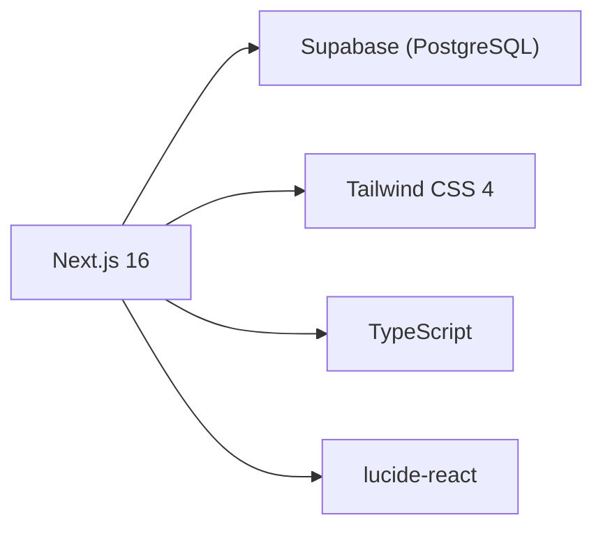

# TMMT Rentals

Vehicle rental management system — replacing Airtable with a custom Next.js app backed by Supabase.



## Features

- **Dashboard** — KPI stats (fleet, leads, customers, tickets, payments) with recent activity
- **18 Admin Pages** — Full CRUD with search, filters, status badges, and modals
- **8 Public Forms** — Customer-facing intake forms (lead, background check, waitlist, appointment, inspection, onboarding, handover, ticket)
- **Dark Mode** — Toggle with localStorage persistence and system preference fallback
- **Responsive** — Mobile sidebar with hamburger menu

## Quick Start

```bash
# Install dependencies
npm install

# Set up environment (copy and fill in your Supabase credentials)
cp .env.local.example .env.local

# Run development server
npm run dev
```

Open [http://localhost:3000](http://localhost:3000)

## Environment Variables

Create `.env.local` with:

```env
NEXT_PUBLIC_SUPABASE_URL=https://your-project.supabase.co
NEXT_PUBLIC_SUPABASE_ANON_KEY=your-anon-key
SUPABASE_SERVICE_ROLE_KEY=your-service-role-key
```

## Project Structure

```
src/
├── app/
│   ├── page.tsx                # Dashboard
│   ├── fleet/                  # Fleet management
│   ├── leads/                  # Lead pipeline
│   ├── background-checks/      # Background verification
│   ├── waitlist/               # Customer waitlist
│   ├── appointments/           # Scheduling
│   ├── customers/              # Active customers
│   ├── payments/               # Payment tracking
│   ├── tickets/                # Support tickets
│   ├── expenses/               # Expense tracking
│   ├── insurance/              # Insurance policies
│   ├── inspections/            # Vehicle inspections
│   ├── maintenance/            # Maintenance tracking
│   ├── contracts/              # Rental contracts
│   ├── vendors/                # Vendor directory
│   ├── operation-costs/        # Software & tools costs
│   ├── do-not-rent/            # Customer blacklist
│   ├── former-customers/       # Customer archive
│   └── forms/                  # 8 public intake forms
├── components/
│   ├── Sidebar.tsx             # Navigation (5 groups)
│   ├── ThemeToggle.tsx         # Dark/light mode
│   └── ui.tsx                  # Reusable UI library
└── lib/
    ├── supabase.ts             # Client initialization
    ├── queries.ts              # Data fetchers + CRUD
    └── utils.ts                # Formatting + status colors
```

## Database

- **44 tables** in Supabase (25 main + 19 junction)
- Migrated from Airtable (1,453 records, 368 junction links)
- See [docs/DATABASE-SCHEMA.md](docs/DATABASE-SCHEMA.md) for full ER diagram

## Documentation

| Doc | Description |
|-----|-------------|
| [Architecture](docs/ARCHITECTURE.md) | Tech stack, component design, data flow diagrams |
| [Status](docs/STATUS.md) | Migration status, record counts, feature checklist |
| [Pipeline Flow](docs/PIPELINE-FLOW.md) | Customer lifecycle, vehicle flow, status state machines |
| [Database Schema](docs/DATABASE-SCHEMA.md) | ER diagram, all tables, junction tables, status enums |

## Tech Stack

| Layer | Technology |
|-------|-----------|
| Framework | Next.js 16 (App Router) |
| Language | TypeScript |
| Styling | Tailwind CSS 4 |
| Database | Supabase (PostgreSQL) |
| Icons | lucide-react |
| Utilities | date-fns, clsx, tailwind-merge |
