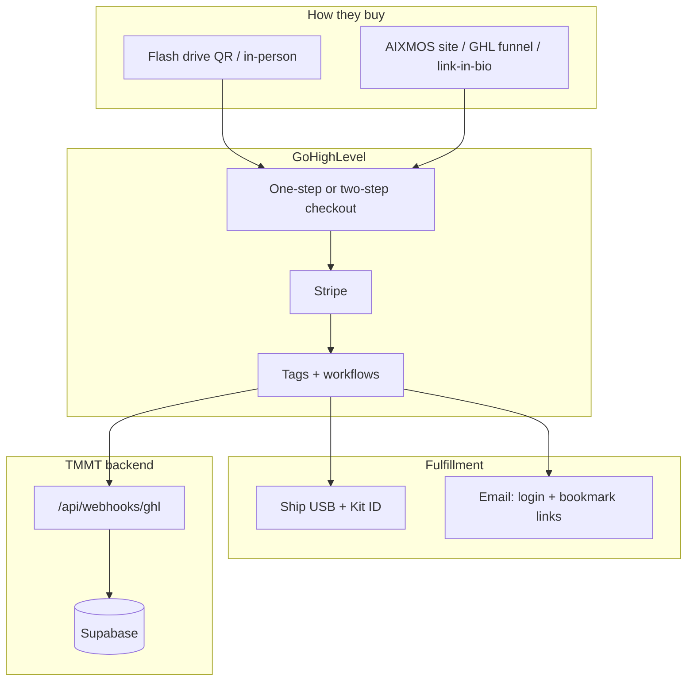

# Sales channels — USB + online checkout

Sell the three kits **two ways** (same SKUs, same price):

| Channel | Buyer experience | You fulfill |
|---------|------------------|-------------|
| **USB (physical)** | Pays → receives flash drive in mail | Build USB, print insert, ship |
| **Online (digital)** | Pays → instant email with links + login | GHL automation only — no USB |

Both channels use **GoHighLevel + Stripe** (recommended). GHL also supports PayPal, Authorize.net, NMI, and others under **Payments → Integrations**.

## Architecture



## Product catalog (create in GHL + Stripe)

Create **8 products** (4 setup + 4 subscription). Use the same Stripe Product IDs in GHL.

| SKU | GHL product name | Type | Price | Fulfillment |
|-----|------------------|------|-------|-------------|
| OPS-001-SETUP | TMMT Ops Kit — Setup | One-time | $997 | USB **or** digital |
| OPS-001-MO | TMMT Ops — Monthly | Subscription | $297/mo | Cloud access |
| CMD-001-SETUP | TMMT Command Kit — Setup | One-time | $2,997 | USB **or** digital |
| CMD-001-MO | TMMT Command — Monthly | Subscription | $497/mo | Cloud access |
| GRW-001-SETUP | AIXMOS Growth — First month | One-time | $97 | USB optional / usually digital |
| GRW-001-MO | AIXMOS Membership | Subscription | $97/mo | Digital |
| DLR-BND-SETUP | Dealer Bundle — Setup | One-time | $3,497 | **2 USBs** or digital |
| DLR-BND-MO | Dealer Bundle — Monthly | Subscription | $697/mo | Cloud access |

**Stripe best practice:** Use **Checkout** (hosted by GHL/Stripe). Do not embed raw card fields on TMMT unless you need a custom UI. Let GHL handle PCI.

## GoHighLevel setup (step-by-step)

### 1. Connect Stripe

GHL → **Settings → Payments → Integrations → Stripe** → Connect.

Use your **Stripe live** account when ready; **test mode** first.

### 2. Create products

GHL → **Payments → Products** → Add each row in the catalog above.

- **Setup products:** one-time payment  
- **Monthly products:** subscription, billing interval = month  
- Optional: add **Order bump** on Ops setup → “Add Command Kit for $2,000” (upgrade path to bundle)

### 3. Create checkout pages (one per SKU)

GHL → **Sites → Funnels** (or **Payments → Links**):

| Page | URL slug (example) | Products on page |
|------|-------------------|------------------|
| Ops Kit | `/checkout/ops-kit` | OPS-001-SETUP + OPS-001-MO |
| Command Kit | `/checkout/command-kit` | CMD-001-SETUP + CMD-001-MO |
| Growth / Member | `/checkout/join` | GRW-001-SETUP or GRW-001-MO only |
| Dealer Bundle | `/checkout/dealer-bundle` | DLR-BND-SETUP + DLR-BND-MO |

Paste URLs into [`GHL-CHECKOUT.env.example`](flash-drive-kits/GHL-CHECKOUT.env.example) and Vercel env.

### 4. Fulfillment question on checkout

Add custom field: **“Delivery”** — options:

- `Ship USB flash drive (+ 3–5 business days)`
- `Digital only (email setup link — no USB)`

Store in contact custom field `kit_delivery`.

### 5. Workflows (after payment)

**Trigger:** Order submitted / Payment received

| Condition | Actions |
|-----------|---------|
| Product contains Ops Setup | Tag `kit-ordered-ops` |
| Product contains Command Setup | Tag `kit-ordered-command` |
| Product contains Growth | Tag `member-97`, `kit-ordered-growth` |
| Product contains Dealer Bundle | Tag `kit-ordered-dealer-bundle` |
| Custom field = Ship USB | Tag `kit-ship-physical`, create ClickUp ship task |
| Custom field = Digital only | Tag `kit-digital-only`, send email (template below) |
| Any kit payment | Webhook → `POST /api/webhooks/ghl` (payment payload) |

**Webhook body (map in GHL):**

```json
{
  "email": "{{contact.email}}",
  "event": "payment_received",
  "amount": {{order.total}},
  "product": "{{product.name}}",
  "tags": ["kit-ordered-ops", "member-97"]
}
```

Header: `x-ghl-webhook-secret: <GHL_WEBHOOK_SECRET>`

See [`GHL-WEBHOOK-SETUP.md`](GHL-WEBHOOK-SETUP.md).

### 6. Email templates

**Digital fulfillment (no USB):**

> Subject: Your TMMT / AIXMOS access is ready  
> Body: Login: `https://tmmt-ops.vercel.app/login` (or Command Center URL)  
> Quick start: [link to PRINT-QUICK-START PDF on aixmos]  
> Support: {phone}

**Physical fulfillment:**

> Subject: Your kit is shipping  
> Body: Kit ID: {custom.kit_id} — tracking: {tracking}  
> When it arrives: plug in USB → START_HERE

## Online store surfaces

Put checkout links on:

| Surface | Link |
|---------|------|
| AIXMOS landing | `aixmos-landing.vercel.app` → “Get the kit” buttons |
| GHL `.com` site | Primary marketing domain when live |
| Printed ORDER-FORM | QR codes per SKU |
| USB envelope (upsell) | Dealer who bought Ops → Command checkout QR |

Open [`flash-drive-kits/BUY-ONLINE.html`](flash-drive-kits/BUY-ONLINE.html) in browser — button placeholders for each checkout URL (host on GHL or embed in AIXMOS).

## Alternative payment processors (via GHL)

| Processor | When to use |
|-----------|-------------|
| **Stripe** (default) | Cards, subscriptions, best docs — **use this first** |
| **PayPal** | Buyers who refuse card |
| **Authorize.net / NMI** | Existing merchant account |

Configure in GHL → Payments → enable alongside Stripe on the same checkout page.

**Direct Stripe (without GHL)** is possible via Stripe Payment Links (`buy.stripe.com/...`) but you lose GHL tags/automation unless you add Stripe webhooks separately — **not recommended** for your stack; keep GHL as the commerce hub.

## Env vars (Vercel + local)

Add to `.env.example` / Vercel Production:

```env
NEXT_PUBLIC_GHL_CHECKOUT_OPS_KIT=
NEXT_PUBLIC_GHL_CHECKOUT_OPS_MONTHLY=
NEXT_PUBLIC_GHL_CHECKOUT_COMMAND_KIT=
NEXT_PUBLIC_GHL_CHECKOUT_COMMAND_MONTHLY=
NEXT_PUBLIC_GHL_CHECKOUT_DEALER_BUNDLE=
NEXT_PUBLIC_GHL_CHECKOUT_DEALER_MONTHLY=
NEXT_PUBLIC_GHL_CHECKOUT_97=
NEXT_PUBLIC_GHL_CHECKOUT_OPERATOR_APPLY=
GHL_WEBHOOK_SECRET=
```

Run `npm run ghl:check` after filling values.

## USB vs online — same SKU matrix

| SKU | USB channel | Online channel |
|-----|-------------|----------------|
| OPS-001 | Ship flash drive | Email login + bookmarks only |
| CMD-001 | Ship flash drive | Email Command Center login |
| GRW-001 | Hand out at car return | QR to `/checkout/join` |
| DLR-BND | Ship 2 USBs | 2 emails / 2 login roles |

## Launch checklist

- [ ] Stripe connected in GHL (test → live)
- [ ] 8 products created
- [ ] 4 checkout pages live
- [ ] Workflows + tags tested with $1 test product
- [ ] Webhook hits TMMT (`npm run ghl:test-webhook payment`)
- [ ] ORDER-FORM + BUY-ONLINE QR codes updated
- [ ] Master USBs built for physical channel
- [ ] Support phone/email on all print HTML

## Related

- [`FLASH-DRIVE-PRODUCT-LINE.md`](FLASH-DRIVE-PRODUCT-LINE.md)
- [`flash-drive-kits/GHL-CHECKOUT.env.example`](flash-drive-kits/GHL-CHECKOUT.env.example)
- [`GHL-WEBHOOK-SETUP.md`](GHL-WEBHOOK-SETUP.md)
