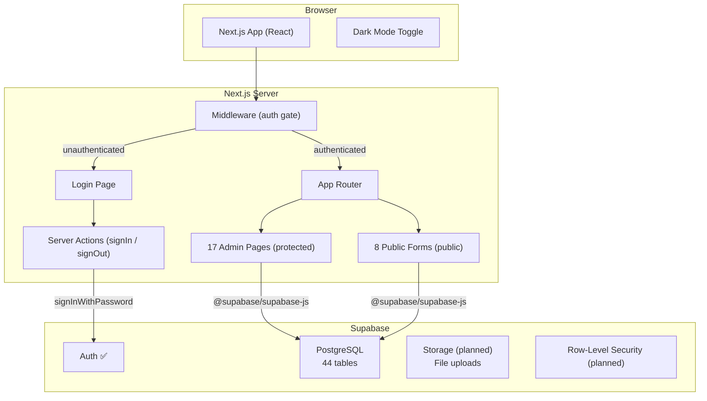
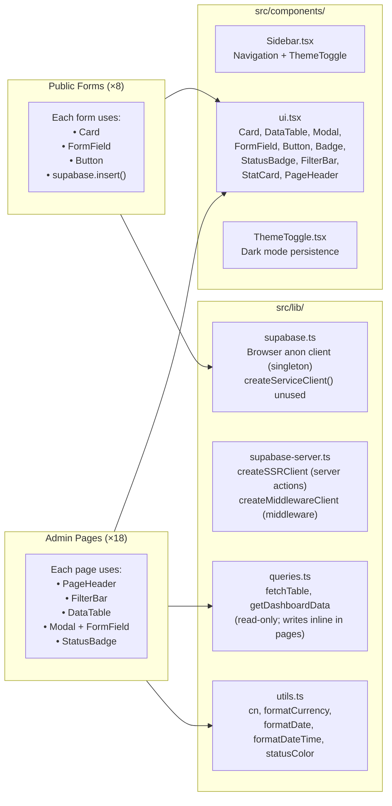
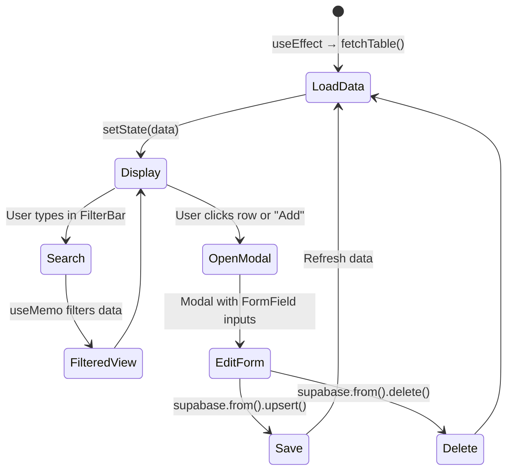
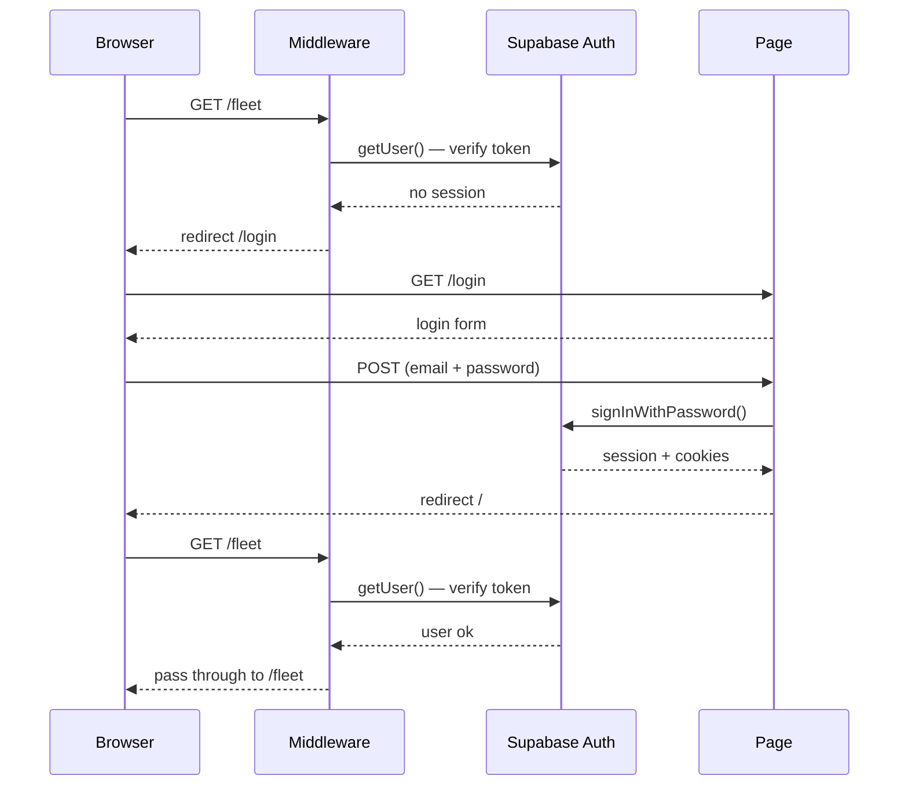
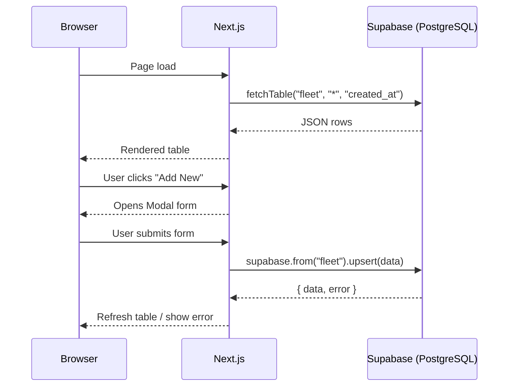

# TMMT Rentals — Architecture

## Tech Stack

| Layer | Technology | Version |
|-------|-----------|---------|
| Framework | Next.js (App Router) | 16.1.6 |
| Language | TypeScript | 5.x |
| Styling | Tailwind CSS | 4.1 |
| Database | Supabase (PostgreSQL) | — |
| Auth | Supabase Auth + `@supabase/ssr` | 0.9.0 |
| Icons | lucide-react | — |
| Utilities | date-fns, clsx, tailwind-merge | — |

## High-Level Architecture



## Directory Structure

```
TMMT/
├── docs/                          # Documentation
├── middleware.ts                  # Auth gate — checks session on every request
├── src/
│   ├── app/
│   │   ├── layout.tsx             # Root shell — blocking theme init script, suppressHydrationWarning required
│   │   ├── globals.css            # Tailwind v4 imports + dark mode variant
│   │   ├── (admin)/               # Protected route group (requires auth)
│   │   │   ├── layout.tsx         # Admin layout — renders Sidebar
│   │   │   ├── actions.ts         # signOut server action
│   │   │   ├── page.tsx           # Dashboard (KPI stats + recent activity)
│   │   │   ├── fleet/             # Fleet vehicle management
│   │   │   ├── leads/             # Incoming leads pipeline
│   │   │   ├── background-checks/ # Background verification tracking
│   │   │   ├── waitlist/          # Customer waitlist management
│   │   │   ├── appointments/      # Appointment scheduling
│   │   │   ├── customers/         # Active customer management
│   │   │   ├── payments/          # Payment tracking
│   │   │   ├── tickets/           # Support ticket management
│   │   │   ├── expenses/          # Expense tracking
│   │   │   ├── insurance/         # Insurance policy tracking
│   │   │   ├── inspections/       # Vehicle inspection records
│   │   │   ├── maintenance/       # Maintenance scheduling
│   │   │   ├── contracts/         # Contract management
│   │   │   ├── vendors/           # Vendor/shop directory
│   │   │   ├── operation-costs/   # Software & tools costs
│   │   │   ├── do-not-rent/       # Blacklisted customers
│   │   │   └── former-customers/  # Former customer archive
│   │   ├── (auth)/                # Public auth route group
│   │   │   ├── layout.tsx         # Minimal centered layout (no sidebar)
│   │   │   └── login/
│   │   │       ├── page.tsx       # Email + password login form
│   │   │       └── actions.ts     # signIn server action
│   │   └── forms/                 # Public-facing intake forms (no auth)
│   │       ├── lead-intake/
│   │       ├── background-check/
│   │       ├── waitlist/
│   │       ├── appointment/
│   │       ├── inspection/
│   │       ├── onboarding-inspection/
│   │       ├── handover/
│   │       └── ticket/
│   ├── components/
│   │   ├── Sidebar.tsx            # Navigation sidebar (5 groups + logout button)
│   │   ├── ThemeToggle.tsx        # Dark/light mode toggle
│   │   └── ui.tsx                 # Reusable UI component library
│   └── lib/
│       ├── supabase.ts            # Browser anon client (singleton); createServiceClient() exists but unused
│       ├── supabase-server.ts     # SSR clients: createSSRClient, createMiddlewareClient
│       ├── queries.ts             # Read fetchers only; writes use inline supabase.from().upsert() in pages
│       └── utils.ts               # Formatting + status colors
├── .env                           # Supabase credentials (gitignored)
├── package.json
├── tsconfig.json
└── next.config.ts
```

## Component Architecture



## Admin Page Pattern

Every admin page follows the same architecture:



## Auth Flow

- **Strategy**: Next.js middleware (`middleware.ts`) intercepts every request and calls `supabase.auth.getUser()` to verify the session token against the Supabase Auth server
- **Protected**: All routes except `/login` and `/forms/*`
- **Session storage**: Cookie-based via `@supabase/ssr` — tokens refreshed automatically on each request
- **Login**: Email + password via `supabase.auth.signInWithPassword()` in a server action
- **Logout**: `supabase.auth.signOut()` server action, triggered from sidebar button
- **Account management**: Admins created manually in Supabase dashboard (no signup flow)



## Dark Mode

- **Mechanism**: Class-based (`html.dark`) via Tailwind v4 `@custom-variant`
- **Persistence**: `localStorage.theme` = `"dark"` | `"light"`
- **Flash prevention**: Inline `<script>` in `<head>` applies class before first paint
- **Fallback**: Respects `prefers-color-scheme: dark` when no stored preference
- **Toggle**: Sun/moon button in sidebar header

## Data Flow


