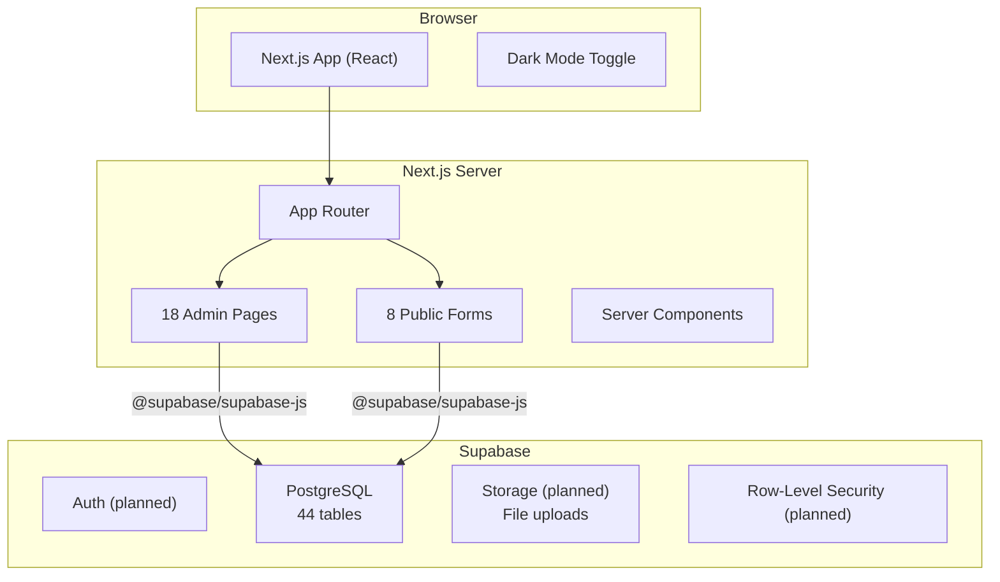
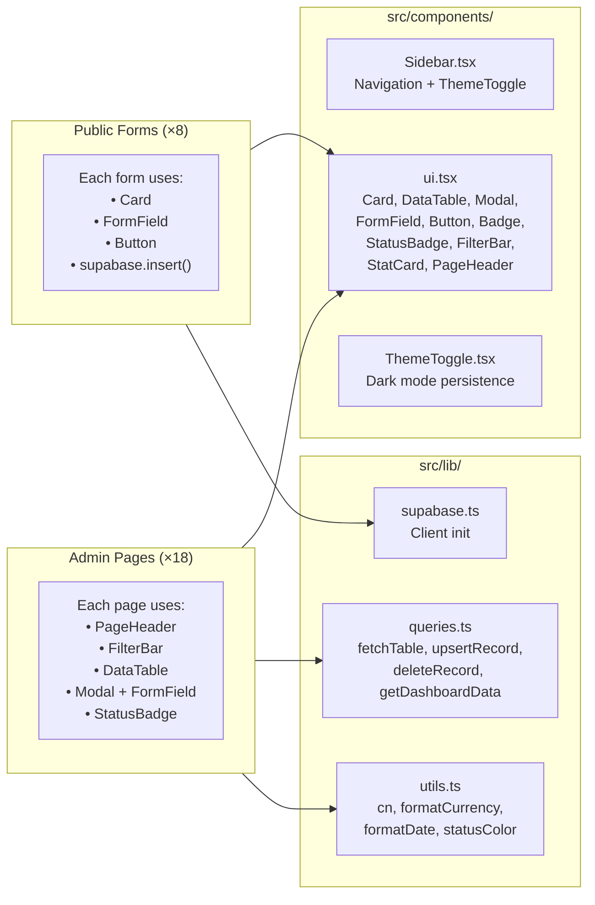
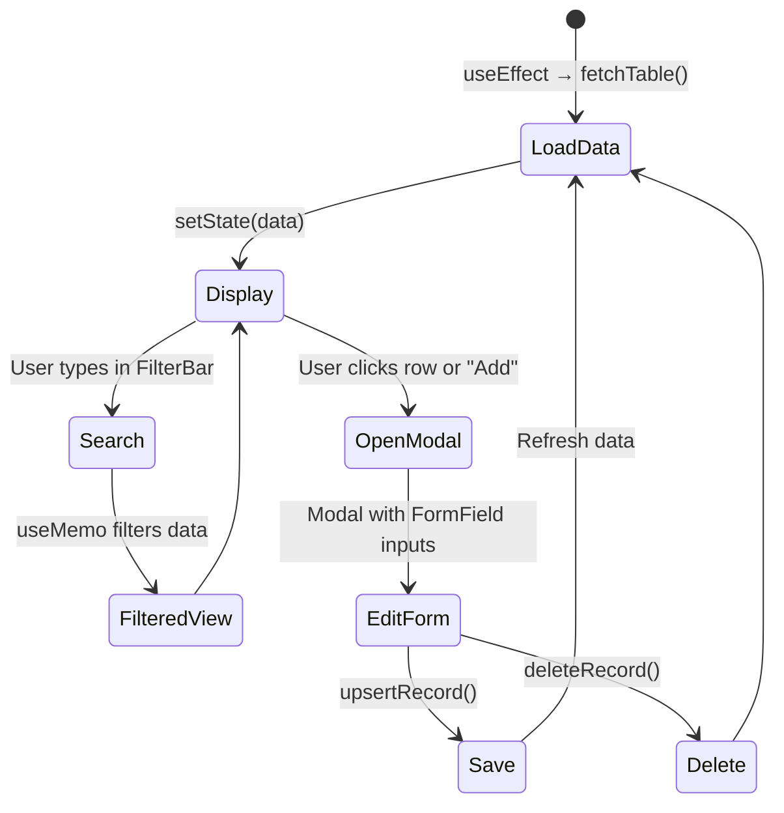
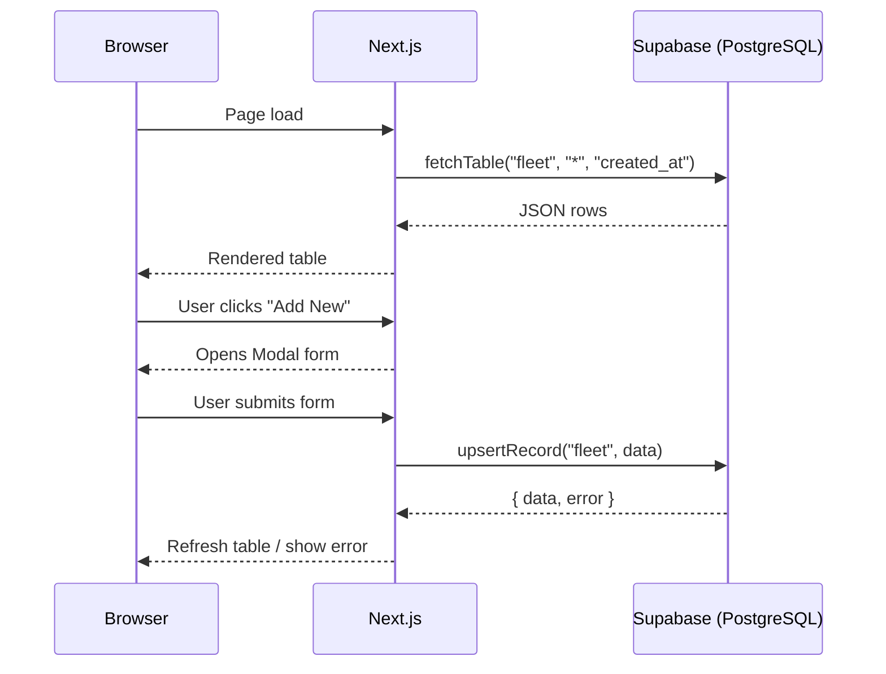

# TMMT Rentals — Architecture

## Tech Stack

| Layer | Technology | Version |
|-------|-----------|---------|
| Framework | Next.js (App Router) | 16.1.6 |
| Language | TypeScript | 5.x |
| Styling | Tailwind CSS | 4.1 |
| Database | Supabase (PostgreSQL) | — |
| Icons | lucide-react | — |
| Utilities | date-fns, clsx, tailwind-merge | — |

## High-Level Architecture



## Directory Structure

```
TMMT/
├── docs/                          # Documentation
├── src/
│   ├── app/
│   │   ├── layout.tsx             # Root layout + sidebar + dark mode script
│   │   ├── globals.css            # Tailwind v4 imports + dark mode variant
│   │   ├── page.tsx               # Dashboard (KPI stats + recent activity)
│   │   ├── fleet/                 # Fleet vehicle management
│   │   ├── leads/                 # Incoming leads pipeline
│   │   ├── background-checks/     # Background verification tracking
│   │   ├── waitlist/              # Customer waitlist management
│   │   ├── appointments/          # Appointment scheduling
│   │   ├── customers/             # Active customer management
│   │   ├── payments/              # Payment tracking
│   │   ├── tickets/               # Support ticket management
│   │   ├── expenses/              # Expense tracking
│   │   ├── insurance/             # Insurance policy tracking
│   │   ├── inspections/           # Vehicle inspection records
│   │   ├── maintenance/           # Maintenance scheduling
│   │   ├── contracts/             # Contract management
│   │   ├── vendors/               # Vendor/shop directory
│   │   ├── operation-costs/       # Software & tools costs
│   │   ├── do-not-rent/           # Blacklisted customers
│   │   ├── former-customers/      # Former customer archive
│   │   └── forms/                 # Public-facing intake forms
│   │       ├── lead-intake/       # New customer inquiry
│   │       ├── background-check/  # Background check submission
│   │       ├── waitlist/          # Join waitlist
│   │       ├── appointment/       # Schedule appointment
│   │       ├── inspection/        # Vehicle inspection checklist
│   │       ├── onboarding-inspection/ # Full 23-field onboarding
│   │       ├── handover/          # Vehicle handover checklist
│   │       └── ticket/            # Support ticket submission
│   ├── components/
│   │   ├── Sidebar.tsx            # Navigation sidebar (5 groups)
│   │   ├── ThemeToggle.tsx        # Dark/light mode toggle
│   │   └── ui.tsx                 # Reusable UI component library
│   └── lib/
│       ├── supabase.ts            # Supabase client initialization
│       ├── queries.ts             # All data fetchers + CRUD helpers
│       └── utils.ts               # Formatting + status colors
├── .env.local                     # Supabase credentials (gitignored)
├── package.json
├── tsconfig.json
└── next.config.ts
```

## Component Architecture



## Admin Page Pattern

Every admin page follows the same architecture:



## Dark Mode

- **Mechanism**: Class-based (`html.dark`) via Tailwind v4 `@custom-variant`
- **Persistence**: `localStorage.theme` = `"dark"` | `"light"`
- **Flash prevention**: Inline `<script>` in `<head>` applies class before first paint
- **Fallback**: Respects `prefers-color-scheme: dark` when no stored preference
- **Toggle**: Sun/moon button in sidebar header

## Data Flow


