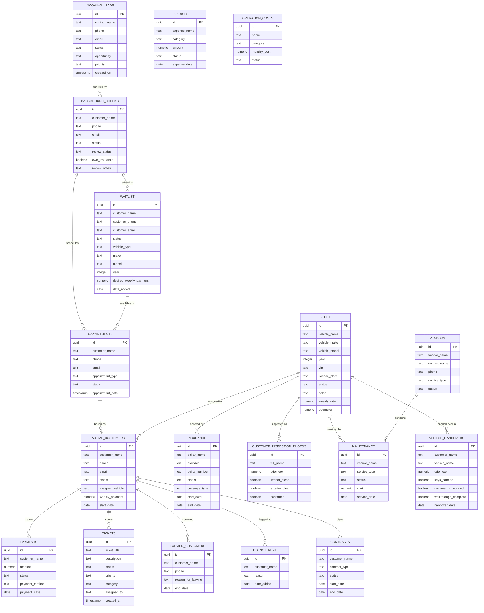

# TMMT Rentals — Database Schema

## Overview

- **Provider**: Supabase (PostgreSQL)
- **Total Tables**: 44 (25 main + 19 junction)
- **Migrated From**: Airtable (3 bases: TMMT Rentals, TMMT OS, TMMT Rentals Copy)

## Entity Relationship Diagram

## Junction / Link Tables (19)

These tables handle many-to-many relationships migrated from Airtable's linked record fields:

| Junction Table | Links |
|---------------|-------|
| `fleet_active_customers` | fleet ↔ active_customers |
| `fleet_background_checks` | fleet ↔ background_checks |
| `fleet_contracts` | fleet ↔ contracts |
| `fleet_customer_inspection_photos` | fleet ↔ inspection photos |
| `fleet_insurance` | fleet ↔ insurance |
| `fleet_maintenance` | fleet ↔ maintenance |
| `fleet_payments` | fleet ↔ payments |
| `fleet_tickets` | fleet ↔ tickets |
| `fleet_vehicle_handovers` | fleet ↔ vehicle_handovers |
| `active_customers_payments` | active_customers ↔ payments |
| `active_customers_tickets` | active_customers ↔ tickets |
| `active_customers_contracts` | active_customers ↔ contracts |
| `active_customers_inspection` | active_customers ↔ inspections |
| `background_checks_fleet` | background_checks ↔ fleet |
| `incoming_leads_appointments` | incoming_leads ↔ appointments |
| `waitlist_appointments` | waitlist ↔ appointments |
| `insurance_fleet` | insurance ↔ fleet |
| `maintenance_vendors` | maintenance ↔ vendors |
| `expenses_vendors` | expenses ↔ vendors |

## Common Columns

All main tables include:

| Column | Type | Description |
|--------|------|-------------|
| `id` | `uuid` | Primary key (auto-generated) |
| `airtable_id` | `text` | Original Airtable record ID (for migration reference) |
| `created_at` | `timestamptz` | Auto-set on insert |
| `updated_at` | `timestamptz` | Auto-set on update |

## Status Field Values

### Fleet Status
`Available` · `Rented` · `Under Maintenance` · `Needs Repair` · `Retired`

### Lead Status
`New Lead` · `Contacted` · `Qualified` · `Not Qualified` · `Closed`

### Background Check Status
`Pending` · `Under Review` · `Passed` · `Failed` · `Eligible` · `Not Eligible`

### Waitlist Status
`Waiting` · `Contacted` · `Scheduled` · `Completed`

### Ticket Priority
`Low` · `Moderate` · `High` · `Urgent` · `Critical`

### Ticket Status
`Open` · `In Progress` · `Resolved` · `Closed` · `Escalated`

### Payment Status
`Paid` · `Pending` · `Overdue` · `Failed`

### Insurance Status
`Active` · `Expired` · `Pending` · `Cancelled`

### Contract Status
`Draft` · `Active` · `Signed` · `Expired` · `Terminated`
