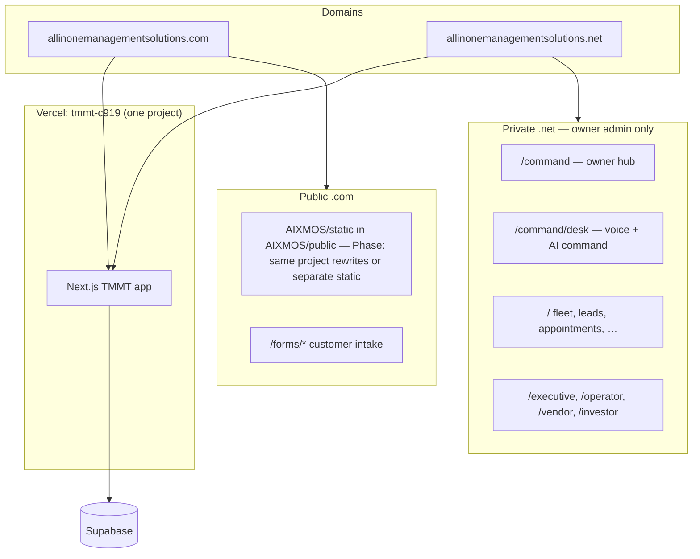

# One app: TMMT Ops + Command Center

**Canonical local folder:** `~/Documents/TMMT`  
**Branch (active work):** `cursor/aixmos-landing-ghl-intake-embed`  
**Deploy target:** Vercel project **`tmmt-c919`** → GitHub `AIXMOS537/TMMT` (repo root `./`)

`~/TMMT` (branch `master`) is the synced clone with `DEPLOY.md`; merge this work there before pushing to production, or push from `~/Documents/TMMT` on the feature branch and open a PR.

---

## What merges where

| Source | Role after consolidation |
|--------|-------------------------|
| **`~/Documents/TMMT`** (this repo) | **Single Next.js 16 app** — TMMT admin, forms, role portals, owner command hub |
| **`~/TMMT`** | Same GitHub repo; use for deploy docs / `master` sync |
| **`~/AIX-Command-Center`** | **Docs + SOPs + prompts only** — not a second Vercel app. Daily ops: `OWNER_DAILY_COMMAND.md`. App code lives in TMMT. |
| Vercel `tmmt-ops`, `tmmt-command-center` | **Unused** — delete or ignore; do not deploy |
| Vercel `tmmt` (duplicate) | **Avoid** — use **`tmmt-c919` only** |

---

## Architecture (one deployable)



### Domain rules (`middleware.ts` + `src/lib/site-domains.ts`)

| Host | Audience | Behavior |
|------|----------|----------|
| `.com` | Public + staff | Marketing/static (planned), `/forms/*`, staff admin at `/` when logged in |
| `.net` | **Owner (`app_metadata.role = admin`) only** | `/` → `/command`; `/forms/*` redirects to `.com` |

Set in Vercel env:

```env
NEXT_PUBLIC_PUBLIC_SITE_HOST=allinonemanagementsolutions.com
NEXT_PUBLIC_OWNER_HUB_HOST=allinonemanagementsolutions.net
```

---

## Routes (private ops)

| Path | Purpose |
|------|---------|
| `/command` | Owner navigation hub (fleet, leads, bookings, workflow, role portals) |
| `/command/desk` | Voice → AI refine → fact-check → dispatch to executive VAs |
| `/` | TMMT ops dashboard (KPIs) |
| `/fleet`, `/leads`, `/appointments` | Core rental ops |
| `/cases`, `/workflow-vendors` | Workflow |
| `/executive`, `/operator` | Role execution layers |

Auth: Supabase `app_metadata.role` — owner = `"admin"`. See `src/lib/auth-roles.ts`.

---

## AIX Command Center (reference, not deployed)

Keep using the GitHub repo for:

- `OWNER_DAILY_COMMAND.md`, `THIS_WEEK.md`, prompts under `AIX_AI_COMMAND_SYSTEM/`
- n8n / automation notes in `AIXMOSXTMMT-OPS/`
- Optional future: `AIX_COMMAND_API_URL` proxy pattern in `AIX_AI_COMMAND_SYSTEM/integrations/nextjs-command-proxy.example.ts`

Do **not** stand up a second Next.js deploy for `integrations/tmmt-os/` (archived prototype).

---

## AIXMOS × TMMT funnel docs

- [`docs/AIXMOS-TMMT-FUNNEL.md`](AIXMOS-TMMT-FUNNEL.md) — rental → $97 → credit → funding
- [`docs/GHL-PIPELINE-SETUP.md`](GHL-PIPELINE-SETUP.md) — tags, stages, automations
- [`docs/GHL-WEBHOOK-SETUP.md`](GHL-WEBHOOK-SETUP.md) — webhook → Supabase notes
- [`docs/sops/`](sops/) — credit guidance, operators, funding handoff

Static marketing: `public/aixmos/` served at `/aixmos/*`, `/apply`, `/operator-apply` (see `next.config.ts` rewrites).

## Cleanup backlog

- Remove duplicate files: `* 2.tsx`, `* 3.ts` under `src/` (merge artifacts)
- Unify `DOMAIN-SETUP.md` with single-project `tmmt-c919` (partially done)
- Phase 2: serve `AIXMOS/public` from same Vercel project via `next.config` rewrites
- Sync `~/Documents/TMMT` → `~/TMMT` / `master` via PR before production push

---

## Deploy checklist

1. Open **`~/Documents/TMMT`** in Cursor (canonical until merged to `master`)
2. `npm install && npm run build`
3. Commit on `cursor/aixmos-landing-ghl-intake-embed` (or merge to `master`)
4. Push to `AIXMOS537/TMMT` → Vercel **`tmmt-c919`** builds automatically
5. Vercel → **Domains**: attach `.net` (and `.com` when ready) to **`tmmt-c919` only**
6. Supabase → your user → `app_metadata`: `{ "role": "admin" }`
7. Visit `https://allinonemanagementsolutions.net` → login → `/command`
