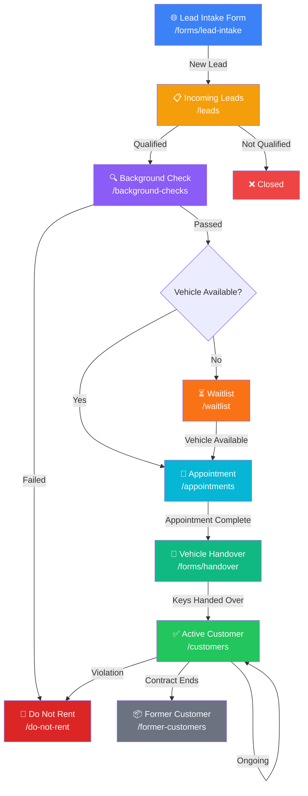
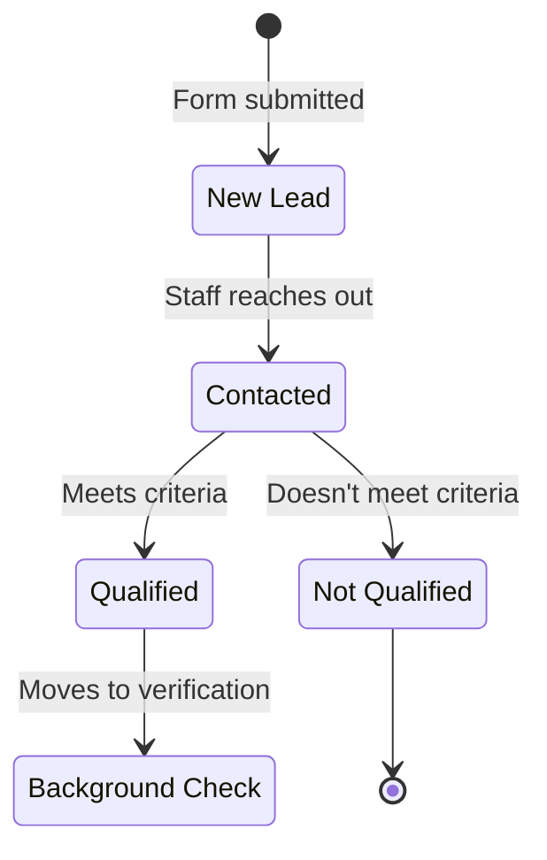
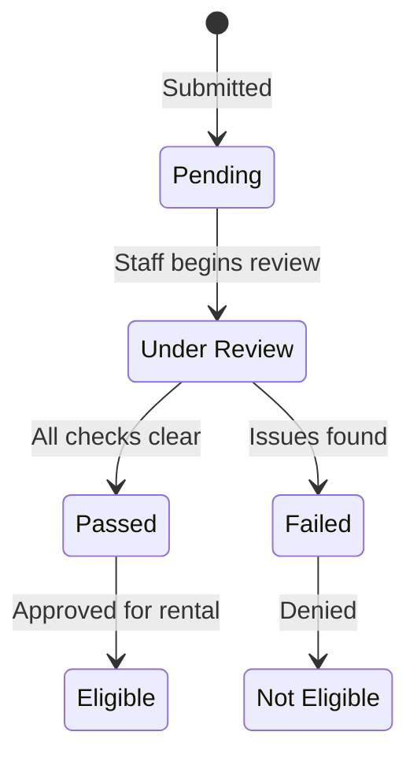
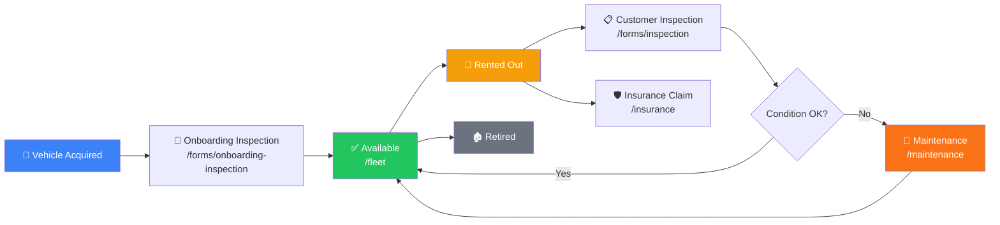
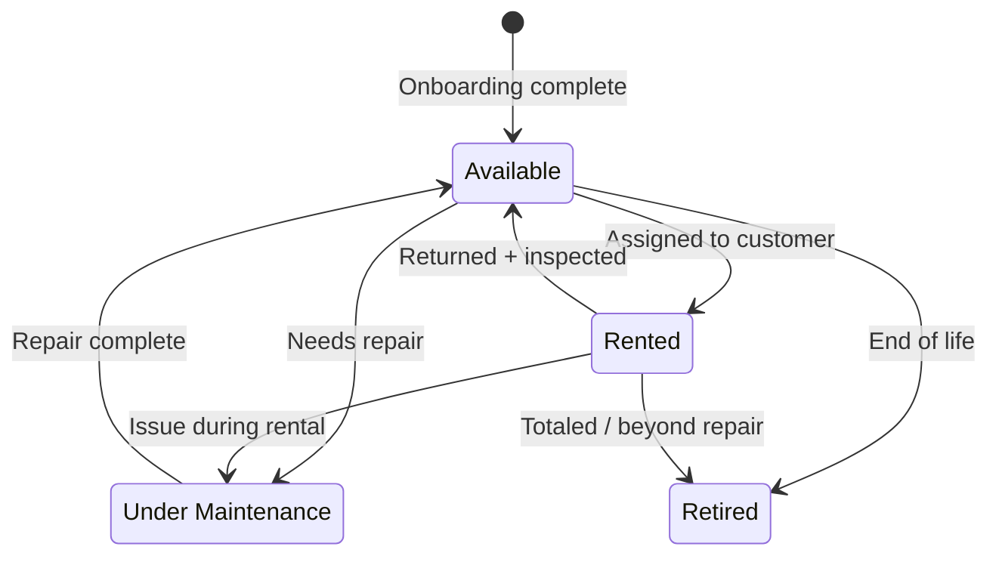
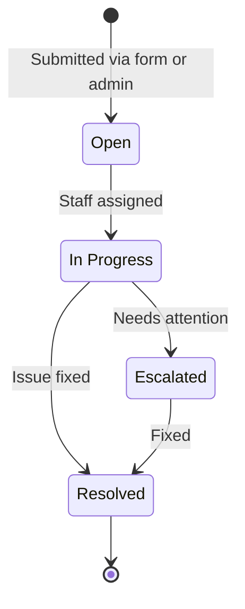
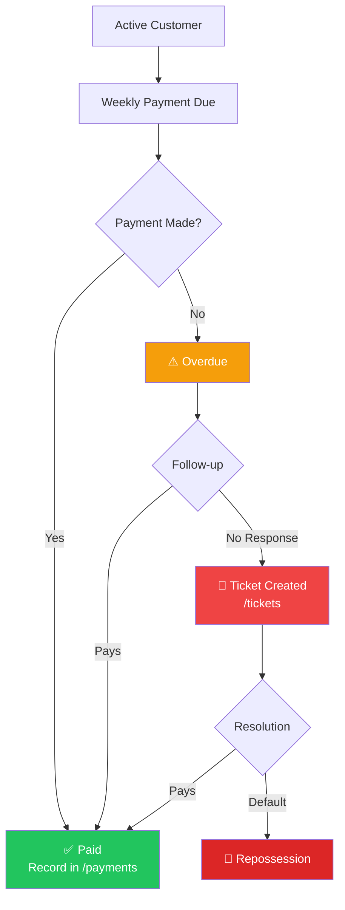
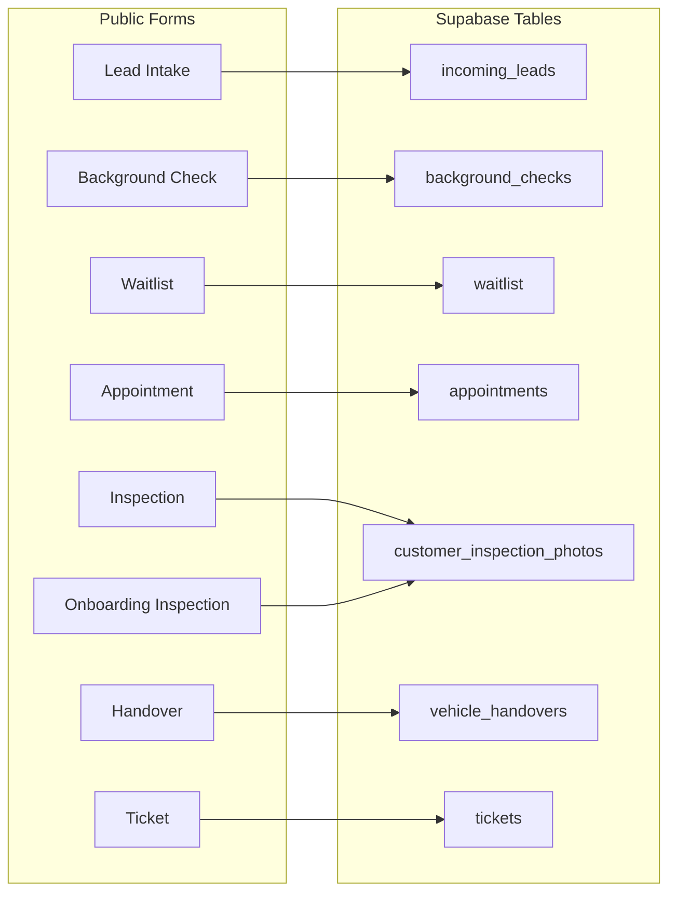

# TMMT Rentals — Business Pipeline Flow

## Customer Lifecycle

The full journey from initial lead to active customer (or exit):

## Lead Status Flow

## Background Check Flow

## Vehicle Lifecycle

## Vehicle Status States

## Ticket Flow

## Payment Flow

## Form → Table Mapping

