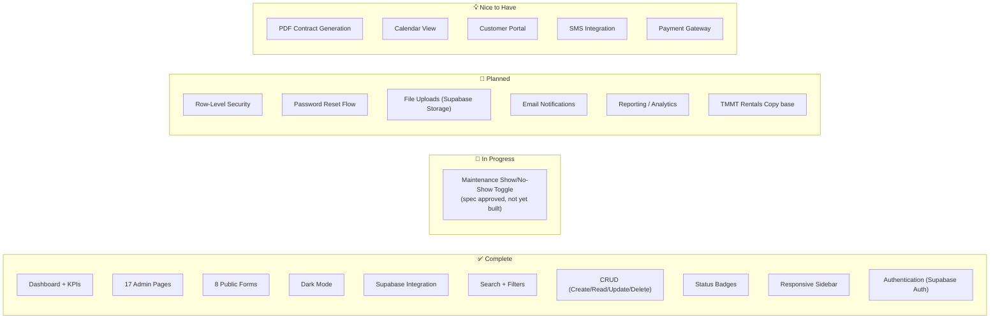

# TMMT Rentals — Project Status

> Last updated: May 17, 2026

## Business Context

TMMT Rentals ran its entire operation — fleet, leads, background checks, waitlist, appointments, contracts, payments, tickets, inspections, and more — out of Airtable. This system replaces that with a production-grade platform purpose-built for the rental workflow.

**What changed:**
- Staff use a custom admin UI instead of Airtable's generic spreadsheet interface
- Customers submit their own intake forms (lead, background check, waitlist, inspection, etc.) — no manual data entry by staff
- Auth-protected admin with Supabase PostgreSQL as the source of truth
- Full data migration: 1,453 records, 368 junction links, 0 errors
- Path to production features (RLS, file uploads, email notifications) that Airtable couldn't support

## Migration Status

| Phase | Status | Details |
|-------|--------|---------|
| Airtable Export | ✅ Complete | 2,713 records across 3 bases |
| Supabase Schema | ✅ Complete | 44 tables (25 main + 19 junction) |
| Data Import | ✅ Complete | 1,453 records, 368 junction links, 0 errors |
| Airtable Sync Script | ✅ Complete | `scripts/sync-airtable.mjs` — live + `--dry-run` mode, 18 main + 19 junction tables |
| App Build | ✅ Complete | 30 routes, all compiling |
| Dark Mode | ✅ Complete | Class-based with toggle + persistence |
| Authentication | ✅ Complete | Supabase Auth, email + password, middleware-protected |

## Current Record Counts

| Table | Records | Notes |
|-------|---------|-------|
| fleet | 41 | Active fleet vehicles |
| incoming_leads | 662 | Lead pipeline |
| background_checks | 237 | Verification records |
| waitlist | 78 | Customers waiting for vehicles |
| appointments | 1 | Scheduled appointments |
| active_customers | 37 | Currently renting |
| payments | 0 | Payment tracking |
| tickets | 257 | Support/issue tickets |
| expenses | 35 | Business expenses |
| insurance | 24 | Insurance policies |
| customer_inspection_photos | 1 | Inspection records |
| maintenance | 0 | Maintenance records |
| contracts | 1 | Rental contracts |
| vendors | 0 | Vendor/shop directory |
| operation_costs | 5 | Software & tools |
| do_not_rent | 0 | Blacklisted customers |
| former_customers | 1 | Archived customers |
| vehicle_handovers | 0 | Handover records |

## Feature Status

## Application Routes

### Admin Pages (17)

| Route | Page | Purpose |
|-------|------|---------|
| `/` | Dashboard | KPI stats, recent leads & tickets |
| `/fleet` | Fleet Vehicles | Vehicle inventory management |
| `/leads` | Incoming Leads | Lead pipeline with status cards |
| `/background-checks` | Background Checks | Verification tracking |
| `/waitlist` | Waitlist | Customer queue management |
| `/appointments` | Appointments | Scheduling |
| `/customers` | Active Customers | Current renters |
| `/payments` | Payments | Payment tracking |
| `/tickets` | Tickets | Support ticket management |
| `/expenses` | Expenses | Business expense tracking |
| `/insurance` | Insurance | Policy management |
| `/inspections` | Inspections | Vehicle inspection logs |
| `/maintenance` | Maintenance | Repair/service tracking |
| `/contracts` | Contracts | Rental agreement management |
| `/vendors` | Vendors / Shops | Vendor directory |
| `/operation-costs` | Software & Tools | Operational cost tracking |
| `/do-not-rent` | Do Not Rent | Customer blacklist |
| `/former-customers` | Former Customers | Customer archive |

### Public Forms (8)

| Route | Form | Inserts Into |
|-------|------|-------------|
| `/forms/lead-intake` | New Customer Inquiry | `incoming_leads` |
| `/forms/background-check` | Background Check Submission | `background_checks` |
| `/forms/waitlist` | Join Waitlist | `waitlist` |
| `/forms/appointment` | Schedule Appointment | `appointments` |
| `/forms/inspection` | Vehicle Inspection | `customer_inspection_photos` |
| `/forms/onboarding-inspection` | Full Onboarding (23 fields) | `customer_inspection_photos` |
| `/forms/handover` | Vehicle Handover Checklist | `vehicle_handovers` |
| `/forms/ticket` | Submit Support Ticket | `tickets` |

## Codebase Stats

| Metric | Value |
|--------|-------|
| Total source files | 36 |
| Total lines of code | ~4,100 |
| Admin pages | 17 |
| Public forms | 8 |
| Shared components | 3 files (Sidebar, ThemeToggle, ui) |
| Library modules | 4 files (supabase, supabase-server, queries, utils) |
| Supabase tables | 44 (25 main + 19 junction) |
| Migrated records | 1,453 |
| Junction links | 368 |

## Planned — Portfolio Command Center

Draft architecture spec (owner review pending): `docs/superpowers/specs/2026-05-17-command-center-architecture-design.md`

Multi-venture shell, per-team workspaces, unified scripts library, and NAS backup pipeline — see `docs/ROADMAP.md` phased table. No implementation started.

## Known Issues

- **Payments table empty** — May need re-import or manual entry
- **Maintenance show/no-show toggle** — Spec approved (`docs/superpowers/specs/2026-03-26-maintenance-toggle-design.md`); `StatusPill` component and inline save not yet implemented
- **Maintenance/Vendors/Handovers empty** — New tables awaiting data
- **No RLS** — Public forms rely on RLS being disabled for anon inserts; enabling RLS requires explicit anon INSERT policies for form tables
- **No password reset** — Admins must reset passwords via Supabase dashboard
- **No file uploads** — Airtable had attachment fields (photos, licenses, contracts) not yet migrated to Supabase Storage
- **TMMT Rentals (Copy) base** — Deferred; needs manager clarification
