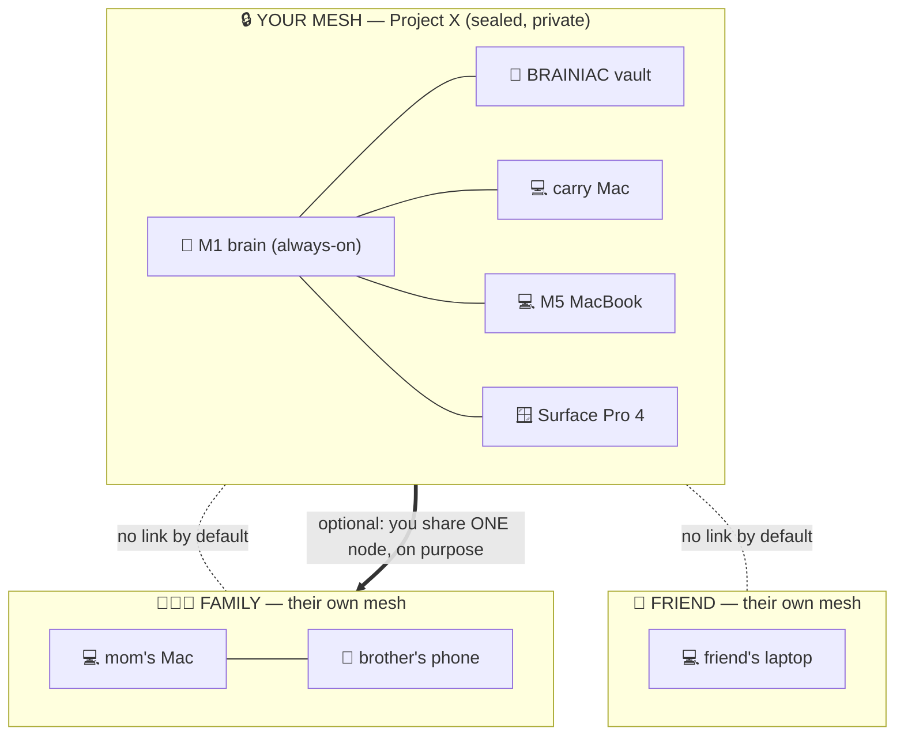
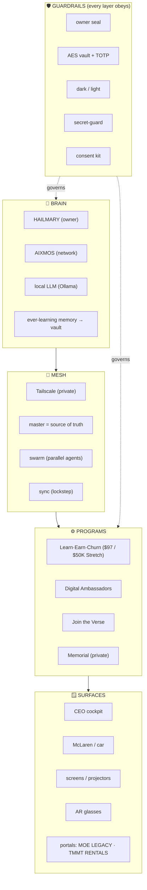

# THE ENGINE — full visual map + multi-tenant mesh + the versatile core

> The whole picture: what's been built, how YOUR mesh stays sovereign while
> family/friends run their OWN isolated meshes, and why this is one diverse-but-
> versatile engine. One-shot for any device: `scripts/one-shot.sh`.

## One-shot for any device, for anyone

```bash
# Owner's own device (joins YOUR mesh):
bash scripts/one-shot.sh mine

# Family / friend (their OWN private mesh, isolated):
bash scripts/one-shot.sh own
```

It asks one question and routes:
- **MINE** → `deploy owner` → joins your sealed mesh.
- **MY OWN** → sovereign setup: **their own Tailscale login → their own tailnet**,
  their own seal, their own node. It refuses to use your `.env` / vault / seal.

## The isolation guarantee (why theirs can't hurt yours)

Isolation is at the **Tailscale-account** level. Different account = different
tailnet = **no shared network at all**, by default. Nobody can see or touch your
nodes unless *you* explicitly share one node to them.



Each subgraph is a **separate Tailscale tailnet**. The dotted lines mean *no
connection exists* unless you draw a solid one by sharing a single node.

## What's been built (the layered engine)



## The two doors (never confused)
- **Project X HAILMARY** — invite-only. You + family + friends. Money never buys it.
- **Project X AIXMOS** — the public Learn·Earn·Churn engine ($97/mo). Anyone joins.

## Diverse, but versatile — one engine, many shapes

**Versatile** = the *same* core (brain + mesh + guardrails) powers everything;
you build once and reuse. **Diverse** = it expresses as many verticals, surfaces,
and personas without forking the engine:

| One core capability | Expresses as (diverse) |
|---|---|
| The **brain** (HAILMARY/AIXMOS + LLM + memory) | CEO cockpit · car companion · member coach · ambassador persona |
| The **scan/ingest** pipeline | memorial archive · Join-the-Verse digitization · client decode |
| The **mesh** (Tailscale + master + sync) | your sealed net · each family/friend's own net · operator nodes |
| The **ladder** (OFFER-STACK) | rentals · credit guidance · funding · marketing · ecommerce · creator |
| The **consent kit** | ambassadors · paid digitization · operator onboarding |

Why it stays versatile (the rules that prevent sprawl):
- **One source of truth** (`master`) — every node pulls the same engine.
- **Local-first + modular** — verticals/personas are configs on the core, not forks.
- **Multi-tenant by account** — new people = new isolated meshes, zero blast radius.
- **Guardrails are global** — seal/vault/dark/consent apply to every expression.
- **One-word interface** — `booyah` · `ceo` · `member` · `onboard` · `dark` — the
  surface stays simple no matter how diverse the inside gets.

## The full word map (the engine's controls)
```
  booyah   boot the whole base (owner)        ceo       executive cockpit
  member   Learn·Earn·Churn ($97 program)     onboard   decode a client
  deal     close paperwork                    watchtower the League + health
  hit N    dispatch the swarm                 sync      keep devices = 1
  vault    secrets (TOTP)                     dark/light kill-switch
  memorial private tribute (sacred)           one-shot  set up any device, anyone
```

---

_Companions: `docs/CEO-BRAIN.md` (always-on/ever-learning), `docs/PRIME-AND-SYNC.md`
(your 3 devices), `docs/LEARN-EARN-CHURN.md` (the program), `docs/AIXMOS-MESH-BLUEPRINT.md`
(the bridge), `docs/DEVICE-LOADING.md` (what runs where)._
