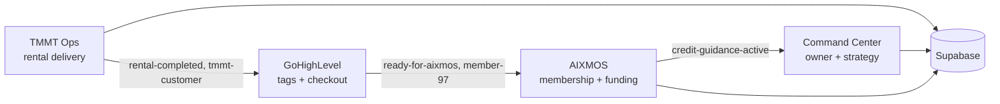

# TMMT × AIXMOS — Three-app Vercel ecosystem

Three **separate** Vercel apps. They share Supabase, GHL tags, and the `AIXMOS537/TMMT` codebase in places, but each has its own URL, audience, and deploy target. **Do not delete one thinking it is a duplicate of another.**

## The three apps

| App | Vercel project | Live URL | Audience | Primary job |
|-----|----------------|----------|----------|-------------|
| **TMMT Ops** | `tmmt-ops` | https://tmmt-ops.vercel.app | Staff / operators | Daily rental ops — fleet, customers, payments, tickets, VA workflows (“TMMT OS”) |
| **TMMT Command Center** | `tmmt-command-center` | https://tmmt-command-center.vercel.app | Owner + leadership | Portfolio hub, `/command`, role portals (`/executive`, `/operator`, `/investor`), owner desk |
| **AIXMOS** | `aixmos-landing` | https://aixmos-landing.vercel.app (+ `aixmos.com` on GHL) | Public + members | Marketing, $97 membership, credit guidance funnel, public intake embeds |

## How they work together



1. **Ops** runs the car business and marks customers in GHL.
2. **AIXMOS** converts qualified renters into members and credit-guidance clients.
3. **Command Center** is where the owner sees everything and publishes operator commands.

See [`AIXMOS-TMMT-FUNNEL.md`](AIXMOS-TMMT-FUNNEL.md) for the step-by-step funnel.

## What to delete (actual duplicates only)

These are **extra** Vercel projects hooked to the same repo — they cause five failed deploys per `git push`:

| Project | Action |
|---------|--------|
| `tmmt-c919` | **Retire** — legacy internal name; migrate env vars + domains to the correct app above, then delete |
| `tmmt` | **Retire** — unnamed duplicate |

**Keep:** `tmmt-ops`, `tmmt-command-center`, `aixmos-landing`.

## Per-app smoke tests

```bash
# TMMT Ops
curl -sS -o /dev/null -w "ops login: %{http_code}\n" https://tmmt-ops.vercel.app/login

# Command Center (operator canonical URL)
SMOKE_BASE_URL=https://tmmt-command-center.vercel.app bash scripts/smoke-prod.sh

# AIXMOS landing
curl -sS -o /dev/null -w "aixmos: %{http_code}\n" https://aixmos-landing.vercel.app/
```

## Repo layout

This GitHub repo (`AIXMOS537/TMMT`) is the **primary codebase**. Vercel projects may use:

- Repo root `./` with different env (`NEXT_PUBLIC_*_HOST`) and middleware host routing, or
- Different root directories / branches per project (check each project’s Vercel → Settings → Git).

Before changing deploy settings, confirm which root each of the three projects uses in the Vercel dashboard.

## Related

- [`DEPLOY.md`](../DEPLOY.md) — env vars, DNS, routine deploy
- [`FLASH-DRIVE-PRODUCT-LINE.md`](FLASH-DRIVE-PRODUCT-LINE.md) — **retail USB kits, print/ship, collect payment**
- [`ONE-APP-CONSOLIDATION.md`](ONE-APP-CONSOLIDATION.md) — historical merge notes (superseded by this doc for Vercel topology)
