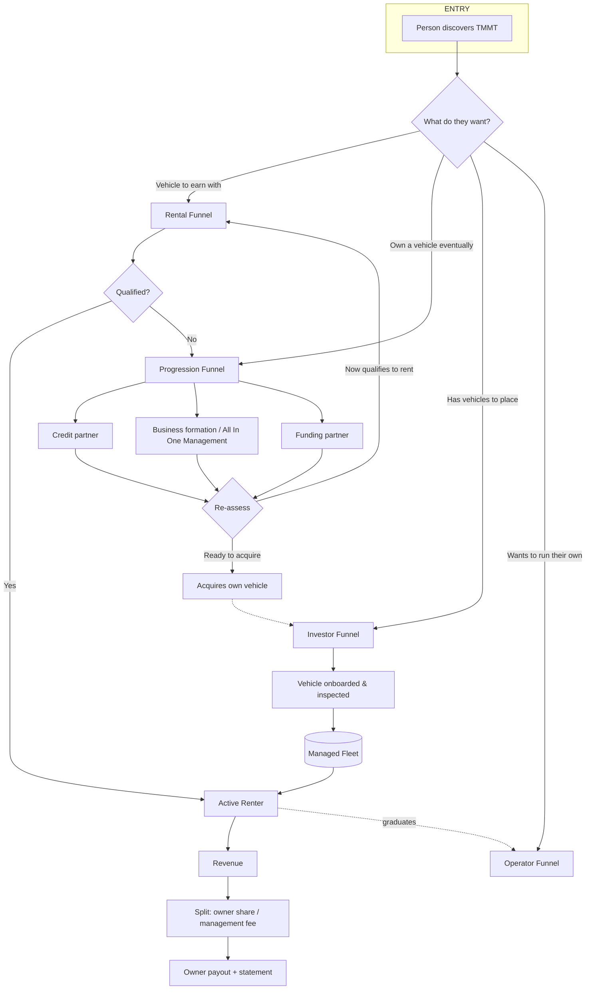

# 01 — Business Blueprint

The business model of record. Technology-neutral.

> ⚠️ **CORRECTED 2026-09-01.** This file previously opened with: *"Everything here is
> `[STATED]` by the owner unless marked `[RECOMMENDED]` or `[OPEN]`."*
>
> **That claim was not supportable and has been removed.** An audit of all seven context
> files found exactly four `[STATED]` tags across ~70 KB, and all four are the labelling
> convention being *defined* — not one business rule is actually marked as owner-stated.
> This document is a rewrite of a blueprint authored by an AI and pasted into a session;
> pasting a proposal does not convert it into policy, but that header silently did so for
> every unlabelled line in the file.
>
> **Read every unlabelled statement here as `[RECOMMENDED]`, not `[STATED]`.**
> For rules that genuinely are the owner's, see `docs/SYSTEM_OF_RECORD.md` §10 (decisions
> log) and `docs/BUSINESS-RULES-RECOVERED.md` (the real rules, recovered from the Drive
> data room). The specific example this file uses — *"Customer must have a 4.8 Uber
> rating"* — was confirmed to be a hypothetical. **No rating threshold exists anywhere.
> Do not build one.**

---

## 1. What the business is

TMMT connects **people**, **vehicles**, **rental income**, **vehicle owners**,
**financial readiness**, and **partners** into one managed ecosystem.

Three revenue-bearing sides:

1. **Rentals** — vehicles rented to qualified drivers who earn income with them
   (Uber, Lyft, delivery, other gig platforms).
2. **Vehicle management** — owner-investors hand vehicles to TMMT to manage; TMMT
   runs the whole operation and returns the owner's share.
3. **Progression** — people who don't qualify today are routed through partner-run
   credit, business-formation, and funding pathways toward eventually owning a vehicle.

The software is the operational brain over all three. It is **not** a car-rental website.

## 2. Ecosystem map



**The critical insight:** a denied applicant is not a lost lead. The dotted and
looping arrows above are the business — most systems only build the straight line.

### The same map, owner's version

```
                     ┌─────────────────────┐
                     │   LEADS / PEOPLE    │
                     └──────────┬──────────┘
                                │
                ┌───────────────┼────────────────┐
                ▼               ▼                ▼
         RENTAL PATH      OWNERSHIP PATH    INVESTOR PATH
                │               │                │
                ▼               ▼                ▼
         QUALIFICATION      IMPROVEMENT     VEHICLE OWNER
                │               │                │
          ┌─────┴─────┐         ▼                ▼
          ▼           ▼    PARTNERS       VEHICLE ONBOARDING
      QUALIFIED  NOT QUALIFIED  │                │
          │           │         ▼                ▼
          ▼           └──► CREDIT / BUSINESS  MANAGEMENT
    VEHICLE MATCHING          READINESS          │
          │                      │               ▼
          ▼                      ▼            RENTERS
    ACTIVE RENTAL          FUNDING / VEHICLE     │
          │                  ACQUISITION         ▼
          │                      │            REVENUE
          │                      ▼               │
          │                VEHICLE OWNER ◄───────┤
          │                                      ▼
          │                              EXPENSES / MAINTENANCE
          │                                      │
          └──────────────┬───────────────────────┤
                         ▼                       ▼
                    CUSTOMER                  OWNER
                    LIFECYCLE                 PAYOUT
```

### The shared operational layer

Running underneath every path above, and the thing that makes them one ecosystem
rather than separate processes:

```
CRM / PEOPLE  +  WORKFLOWS  +  DOCUMENTS  +  COMMUNICATION  +  PAYMENTS
              +  TASKS      +  PARTNERS   +  REPORTING      +  COMPLIANCE
```

Anything built for one path that cannot be reached from another path is a mistake.
A document uploaded during a rental application must be visible when the same person
later becomes a vehicle owner.

## 3. Actors and user types

| Actor | Definition | Primary need from the system |
|-------|-----------|------------------------------|
| **Prospect / Lead** | Anyone who has made contact, intent not yet classified | Get routed to the right pathway |
| **Rental applicant** | Wants a vehicle for gig income | Know their status and what's missing |
| **Active renter** | In a vehicle under contract | Payments, vehicle info, support, dates |
| **Progression client** | Did not qualify; in the readiness pathway | Milestones, tasks, honest progress |
| **Vehicle owner / investor** | Owns vehicles TMMT manages | Performance, revenue, expenses, payout |
| **Operator** | Capped network of 100; runs their own book on TMMT rails | Their pipeline, their clients, their split |
| **Student** | Everyone in the network below operator tier | Training, progression to operator |
| **Staff / VA** | Executes the daily work | Task queue, next actions, escalation path |
| **Admin / Owner** | Final decision-maker | Whole-business visibility + approval queue |
| **Partner** | External company performing a service | Referral handoff, status back, settlement |
| **Vendor** | Shops, mechanics, detailers, service providers | Job dispatch, status, invoicing |

A single person can hold several of these roles over time. **Identity is one record;
roles are attached to it.** Never create a duplicate person record for a new role.

## 4. Customer journeys

### 4.1 Pathway 1 — Qualified rental customer

```
Lead → Application → Identity & contact → Platform (Uber/Lyft/other)
  → Platform eligibility verified → Driver record & rating verified
  → Background check → Insurance verified (or insurance option presented)
  → Rental-requirement evaluation → APPROVED
  → Vehicle matching → Agreement → Payment & security requirements
  → Handover / inspection → ACTIVE RENTAL → Ongoing management
```

Every arrow is a state transition that must be recorded with **who, when, and why**.

`[OPEN]` The qualification rules themselves. See `05-OPEN-DECISIONS.md` §1.

### 4.2 Pathway 2 — Did not qualify

```
Application → NOT QUALIFIED
  → Record disqualification reason (mandatory, structured)
  → Assess fit for the progression pathway
  → Offer next step → Referral to partner → Partner engagement
  → Milestone tracking → Periodic re-assessment
  → Re-qualifies for rental  OR  continues toward ownership  OR  closed
```

**Nothing may exit this pathway silently.** A person leaves it only via an explicit
terminal state with a recorded reason.

`[RECOMMENDED]` Disqualification reason must be a controlled vocabulary, not free
text, because it drives the routing. Suggested starting set: `no_platform_eligibility`,
`driver_rating_below_threshold`, `background_check_adverse`, `no_insurance`,
`insurance_unaffordable`, `cannot_meet_deposit`, `cannot_meet_payment`,
`documentation_incomplete`, `on_do_not_rent_list`, `no_vehicle_available`,
`outside_service_area`, `withdrew`. `[OPEN]` — owner confirms the list.

### 4.3 Pathway 3 — Toward vehicle ownership

```
Not qualified → Credit / financial assessment → Credit improvement (partner)
  → Business readiness → LLC / structure where appropriate (partner)
  → Funding readiness → Financing product where appropriate
  → Vehicle financing → Customer acquires their own vehicle
  → May re-enter the ecosystem as owner / investor / operator / referral source
```

**Hard rule.** ~90 days is a *reference timeline for some clients*, never a promise.
The system must not display, imply, or send any message guaranteeing an outcome or a
timeline. Every progression surface tracks: starting condition, required actions,
progress, completed milestones, outstanding requirements, partner referrals, funding
readiness, vehicle readiness, final outcome — and nothing that reads as a guarantee.

### 4.4 Investor / vehicle owner journey

```
Inquiry → Owner application → Identity & business verification
  → Vehicle information → Inspection → Documentation → Management agreement
  → Vehicle onboarding → Available → Renter matched → Rental begins
  → Revenue generated → Expenses & maintenance tracked
  → Owner share calculated → Owner paid → Performance reported
```

This is the **least-built** side of the platform today. See `02-CURRENT-STATE-AUDIT.md` §4.

## 5. Lifecycles

### 5.1 Vehicle lifecycle

`Acquired/Onboarding → Inspection → Documented → Available → Matched → Rented →
(Maintenance | Repair | Incident) → Available → Retired / Sold / Returned to owner`

Each vehicle carries, for its whole life: VIN, year/make/model, mileage, status,
**owner**, management company, current renter, rental history, maintenance history,
repair history, revenue history, expense history, documents, insurance, inspections.

**History, not overwrite.** A vehicle's current renter is *not* a field that gets
overwritten. Six months later that person is no longer the renter, and the business
must still be able to answer: who rented this vehicle, when, under which rental
agreement, and what happened. Same for owner, insurance, and status — every one of
them is a record with a validity period, not a current value.

### 5.2 Rental lifecycle

The rental is its own object with its own lifecycle, **separate from the vehicle's**.
One vehicle has many rentals over its life; one person may have several rentals over
theirs. Neither owns the other.

`Potential match → Vehicle reserved → Customer approved → Rental onboarding →
Agreement completed → Payment & security requirements met → Vehicle delivered →
ACTIVE → (payment monitoring, maintenance, issues) → Renewal OR End →
Vehicle returned → Final inspection → Financial reconciliation → CLOSED`

Former customers are retained, never deleted.

### 5.3 Partner / referral lifecycle

`Partner onboarded → Agreement on file → Referral sent (who, when, why) →
Partner acknowledges → In progress → Outcome recorded → Compensation settled (if any)
→ Client returns to TMMT pathway`

The system must always be able to answer: **who was referred to whom, when, why, and
what happened afterward.**

### 5.4 Operator lifecycle

`Candidate → Assessed (rubric) → Activated → Tiered → Producing → (Capped at 100)`
Everyone outside the 100 is a student, not an operator.

## 6. Status model

Status is a first-class, **configurable** concept — not an enum baked into code. Two
independent tracks; a person can be in both simultaneously.

**Rental track** `[RECOMMENDED]` starting set:
`New Lead · Application Started · Application Submitted · Under Review ·
Verification Required · Pending Background Check · Pending Insurance ·
Pending Documentation · Qualified · Approved · Vehicle Matching · Rental Onboarding ·
Active Renter · Suspended · Completed · Not Qualified · Lost/Closed`

**Progression track** `[RECOMMENDED]` starting set:
`Not Qualified for Rental · Financial Assessment Needed · Referred to Credit Partner ·
Credit Improvement In Progress · Waiting on Customer · Business Formation Needed ·
Business Formation In Progress · Funding Preparation · Funding Application ·
Funding Approved · Vehicle Search · Vehicle Financing · Vehicle Acquired ·
Ready for Next Step · Converted · Closed/Inactive`

`[OPEN]` Final status lists. These are the owner's to confirm — but the *architecture*
requirement is fixed: statuses live in a config table, transitions are logged, and
adding a status must never require a code deploy.

## 7. Dashboards

| Dashboard | Must show |
|-----------|-----------|
| **Admin / Owner** | Total & available vehicles · active rentals · vehicles needing attention · revenue · expenses · outstanding payments · new applicants · applications awaiting review · progression-pipeline count · partner referrals · investor performance · upcoming maintenance · alerts · staff tasks · **approval queue** |
| **Customer** | Application & qualification status · required documents · required tasks · rental info · payment info · vehicle info · insurance · key dates · support contact · progression progress (where applicable) · **next recommended step** |
| **Investor** | Vehicles · current renters · revenue · expenses · net performance · utilization · maintenance · payouts · statements · documents · historical performance |
| **Staff** | Assigned tasks · new applications · customers needing follow-up · vehicle issues · maintenance · documentation gaps · partner referrals · deadlines · escalations |
| **Operator** | Their pipeline · their clients · their split · their scorecard |

Every dashboard is a **view over the same records**, never a separate data store.

## 8. Core workflows to support

1. Lead intake & routing (source-attributed)
2. Application & document collection
3. Verification (identity, platform, driver record, background, insurance)
4. Qualification decision + reason capture
5. Vehicle matching & availability
6. Agreement generation & signature
7. Payment / deposit / security collection
8. Handover with condition capture
9. Active-rental management (payments, tickets, incidents)
10. Maintenance & repair coordination
11. Vehicle onboarding from an owner
12. Owner revenue / expense / split / payout / statement
13. Partner referral & outcome tracking
14. Progression milestone tracking & re-assessment
15. Return, settlement, and former-customer retention
16. Task assignment & escalation
17. Owner approval queue

## 9. Automations — three categories

Every proposed automation must be classified as A, B, or C before it is built.

**A — Safe administrative automation.** The system acts; no judgment is exercised.
Application received confirmations · missing-document reminders · verification
reminders · appointment reminders · insurance expiration reminders · maintenance
reminders · rental renewal reminders · payment reminders · partner referral
notifications · investor statement generation · pipeline follow-ups · progress
notifications · re-assessment reminders · staff task creation · status roll-ups.
→ Build these freely.

**B — Human-assisted workflows.** The system prepares, routes, and surfaces; a person
decides. *"Application appears complete → create a staff review task"* is the pattern.
The system makes the employee faster; it does not make the call.
→ Build these, with the decision point always visible and always a person's.

**C — High-risk decisions.** Credit decisions · insurance eligibility ·
background-check interpretation · rental underwriting · use of consumer-report
information · financing decisions · any automated adverse decision · money movement ·
contract execution.
→ **Do not automate.** These require deliberate design and legal/compliance review
before any part of them is mechanized, and an owner gate even then.

Every automated outbound message must pass a consent/opt-out gate **that fails closed**.

## 10. Integrations (buy, don't build)

| Function | Posture |
|----------|---------|
| Payments | Integrate a processor. Do not build a wallet. |
| Accounting | Integrate. Do not build a general ledger. |
| Background checks | Integrate a FCRA-compliant provider. |
| Driver / platform verification | Integrate or document-based; never guess eligibility. |
| Insurance | Partner/affiliate placement; TMMT is not the carrier. |
| E-signature | Integrate. |
| Messaging (SMS/email/voice) | Integrate; centralize the log. |
| CRM / marketing automation | Currently GoHighLevel. |
| Credit improvement | Partner-performed. TMMT tracks referral + outcome only. |
| Business formation & funding | Partner-performed (All In One Management and funding partners). |

`[OPEN]` Specific vendors for each — see `05-OPEN-DECISIONS.md` §5.

### Communication is centralized

Email, SMS, calls, in-app notifications, internal notes, and automated messages all
land in one log. **Every important customer interaction must be visible from that
person's profile**, whichever channel it came through and whoever sent it. A message
that exists only in someone's inbox or phone does not exist to the business.

## 11. Documents

Central document store. Every document carries: owner (person/vehicle/investor),
type, upload date, expiration date where applicable, verification status, related
record, and access permissions.

Types: driver's licenses · insurance documents · rental agreements · management
agreements · titles · registration · inspection reports · background-check status ·
business formation documents · funding documents · customer agreements · investor
statements · compliance documents.

**Sensitive documents must be access-controlled at the record level, encrypted at
rest, and never stored in a system whose only access control is "who has the link."**

## 12. Financial concepts the system must represent

Rental payments · deposits · fees · insurance charges · maintenance expenses · repair
expenses · management fees · investor payouts · customer balances · refunds · failed
payments · payment methods · referral compensation.

The system holds the *relationships and the calculation*; the accounting platform holds
the books. Both must reconcile.

## 13. Lead attribution

Every person record carries a source: website · Google · social · referral · partner ·
advertisement · existing customer · investor referral · operator · other — plus
campaign detail where available. Attribution exists to answer one question: **which
channels actually produce customers**, measured at conversion, not at lead volume.

## 14. Compliance & risk posture

- Partner-performed services are never represented as TMMT-performed.
- Credit repair is CROA-regulated: disclosures, cancellation rights, and fee timing
  are legal requirements, not UX choices.
- Background checks are FCRA-regulated: permissible purpose, adverse action process,
  and data handling all apply.
- Outreach is TCPA-regulated: consent and opt-out are enforced at the send gate.
- Insurance placement and compensation are state-regulated.
- Rental liability sits under the Graves Amendment and state law; contracts already
  reflect this.
- PII (licenses, SSNs, financial account data) is minimized, encrypted, and
  access-controlled. Credentials are never stored in a business database.

Legal review is required before any of the above ships to real customers.

## 15. The governing architectural principle

**Do not build the system around "customers." Build it around relationships and
lifecycle events.**

```
PERSON
  │
  ├── applied to rent          →  APPLICATION
  ├── became a renter          →  RENTAL
  ├── was referred to a partner→  REFERRAL
  ├── later acquired a vehicle →  VEHICLE OWNER
  └── placed that vehicle with us → MANAGEMENT AGREEMENT
```

The platform must never need to ask *"what type of customer is John?"* It asks:
**what relationships does John hold right now, what has happened historically, and
which pathway is he currently on?**

A schema that forces a person into one type will have to be torn up the first time
someone moves between pathways — which, in this business model, is the expected
outcome, not the exception.

## 16. What "done" means

Every feature must answer: **does this actually help the business operate better?**
Not "is it impressive," not "is it complete." A feature that adds a screen but no
decision-quality is not done — it is debt.
