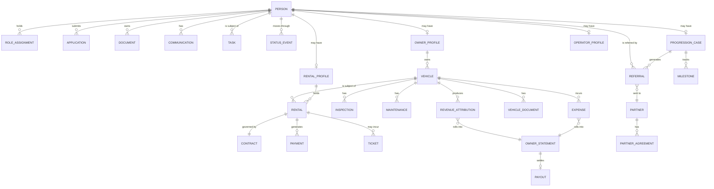

# 03 — Canonical Data Model

The entities the business requires, and where each one lives today. Read
`02-CURRENT-STATE-AUDIT.md` first — several of these already exist under different names.

---

## 1. Core principle: one person, many roles

**Rule:** a person is created once. Becoming a renter, then a progression client, then
an owner, then an operator adds *profiles* — it never creates a second person.

Today this rule is violated: the same human can appear in `incoming_leads`, `people`,
and `ghl_contacts`. Reconciling those three into one identity spine is the foundational
data task.

---

## 2. Entity catalogue

### 2.1 People

| Entity | Purpose | Exists today as |
|---|---|---|
| `person` | The identity spine. Name, contact, source, created, canonical IDs into GHL/Airtable. | ⚠️ Split across `people` (1,209), `incoming_leads` (875), `ghl_contacts` (1,642) |
| `role_assignment` | Which roles this person holds, and since when | 🔴 Missing |
| `status_event` | Append-only log of every status change: from, to, who, when, why | 🟡 `case_status_history` (12) covers cases only |
| `rental_profile` | Platform driven for, driver rating, eligibility, qualification outcome, **disqualification reason** | 🟡 Fields spread across `incoming_leads` + `background_checks`; **reason code missing** |
| `progression_case` | The Pathway 2/3 record: starting condition, track, milestones, next step, outcome | 🟡 `client_journey` (2 rows) |
| `owner_profile` | Vehicle owner / investor: identity, business entity, agreements, payout details | 🔴 **Missing** — currently `fleet.partner_name` free text |
| `operator_profile` | Network operator: tier, rubric score, activation stage | ✅ `operator_profiles` (19) |

### 2.2 Vehicles

| Entity | Exists today as |
|---|---|
| `vehicle` — VIN, year/make/model, mileage, status, **owner FK**, insurance, plate | ✅ `fleet` (43) / Airtable `Fleet`; ⚠️ owner is text not FK |
| `vehicle_document` — title, registration, inspection, emissions | 🟡 Airtable attachments |
| `inspection` — onboarding, periodic, handover, return | ✅ `fleet_car_inspections`, `vehicle_onboarding_inspections`, `customer_inspection_photos` |
| `maintenance` / `repair` | ✅ `maintenance_appointments`, `shops_mechanics_cleaning` |
| `expense` | ✅ `expenses` (34) |
| `vehicle_event` — append-only vehicle timeline | 🟡 `vehicle_events` (0 rows) |

### 2.3 Rentals & money

| Entity | Exists today as |
|---|---|
| `rental` — the placement of a person in a vehicle for a period | 🟡 `active_customers` (35) acts as this |
| `contract` — the signed agreement of record | 🔴 `contracts` = 2 rows vs 16 active renters |
| `payment` | 🟡 `customer_payments` (31); `payments` table empty |
| `deposit` / `fee` / `insurance_charge` | 🟡 Fields on contracts; not a ledger |
| `ticket` — citations and violations | ✅ `tickets` (308) |
| `revenue_attribution` — which revenue belongs to which vehicle/owner | 🔴 **Missing** |
| `owner_statement` — per period, per owner: revenue, expenses, fee, net | 🔴 **Missing** |
| `payout` — what was actually paid to an owner, when | 🔴 **Missing** |

### 2.4 Partners & referrals

| Entity | Exists today as |
|---|---|
| `partner` — name, type, contact, referral process, agreement | 🔴 `partners` = 1 row, deactivated |
| `partner_agreement` | 🔴 Missing |
| `referral` — who, to whom, when, why, status, outcome, compensation | 🔴 `partner_referrals` = 0 rows |
| `vendor` — shops, mechanics, detailers | ✅ `vendors`, `shops_mechanics_cleaning`, `vendor_jobs` |

**Partner types to model:** credit improvement · All In One Management (business
formation) · insurance provider/affiliate · funding providers · vehicle service
providers · repair facilities · future partners. Each with distinct responsibilities
recorded, so the system can always show who actually performs what.

### 2.5 Operations

| Entity | Exists today as |
|---|---|
| `task` — assigned work with owner, due date, escalation | ⚠️ `exec_va_tasks` (17,192), `tasks` (0), `clickup_tasks` (0) — three competing stores |
| `document` — typed, expiring, verified, permissioned | 🔴 `documents` = 0 rows; real docs are Airtable attachments |
| `communication` — email, SMS, call log, note, notification | 🟡 `comm_channels` (4), `outreach_touches` (0), `agent_messages` (0) |
| `approval` — the owner gate queue | 🟡 `audit_events` (10), `program_audit_log` (0) |
| `organization` / tenant | ⚠️ `organizations` (9) incl. a smoke-test tenant; two IDs for one real tenant |

---

## 3. The five schema changes that unlock the most

In priority order. Each needs a change request before execution.

1. **`disqualification_reason` on the rental application**, controlled vocabulary.
   *Unlocks:* Pathway 2 entirely. Today nothing can route a denied applicant because
   nothing records why they were denied.

2. **`vehicle_owners` entity + `fleet.owner_id` foreign key**, backfilled from the 23
   free-text `partner_name` spellings (which contain known duplicates, plus 7 vehicles
   with no owner recorded at all — needs human reconciliation, not a script).
   *Unlocks:* the entire investor side.

3. **`owner_agreements` carrying split terms per vehicle**, replacing the
   sparsely-populated `fleet.partner_percentage`.
   *Unlocks:* payout calculation.

4. **`owner_statements` + `payouts`**, computed from revenue attribution and expenses.
   *Unlocks:* the investor dashboard and, more importantly, correct money.

5. **A single `status_event` log across all tracks**, replacing scattered status
   fields as the source of truth for "where is this person."
   *Unlocks:* trustworthy pipeline reporting — currently impossible with 87% null status.

---

## 4. Configuration tables (already the right pattern)

These exist and should be extended rather than replaced. All business rules belong here:

`rental_pricing_rules` · `rental_insurance_products` · `credit_product_catalog` ·
`journey_checkpoints` · `programs` (routing) · `packages` / `entitlements` ·
`verticals` · `enforcement_settings` · `leadnet_config`

**Add to this pattern:** status definitions, disqualification reasons, owner split
templates, management fee structures, referral compensation terms, document type
definitions with expiry rules, and role permissions.

---

## 5. Naming and consistency rules

- Snake_case in Postgres; the Airtable display names are an interface concern.
- Every table carries `organization_id` and enforces tenant isolation in RLS.
  **Fix the two-org-ID problem first** — `AIXMOS` vs `TMMT RENTALS` currently split
  what should be one tenant's config.
- Money is stored in integer cents. (`rental_pricing_rules` already does this
  correctly; `Airtable Active Customers.Payment Amount` as text does not.)
- Phone numbers stored E.164. (`phone_e164` exists — use it, retire the numeric field.)
- Append-only logs never get deleted rows; supersede with a validity window.
- Timestamps are `timestamptz`, UTC.
