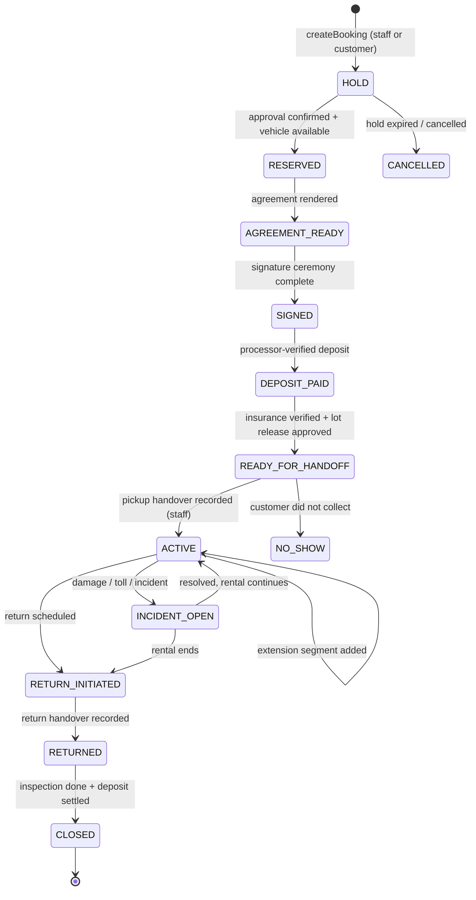

# 07 — Rental state machine

Source: SPEC §10 (+ E3 §2) · Snapshot 2026-09-21 · canon `4cca6835`

> **CURRENT** = "Verdict", "What exists", the "Existing equivalent / Who sets it today" columns, "Hazards" and "Transitions with no TMMT writer". **TARGET** = the state diagram, the vehicle-state machine, the "Rules" and "Acceptance" sections (PM-05, tasks TMMT-RENT-001…007). No transition function, event table or hold expiry exists on master or prod.

## Verdict

**There is no rental state machine.** There is a typed `bookings` table whose only written state is `hold` (0 rows). Several other status sources exist, and none of them is guarded. There is no transition function, no transition log, and no DB guard on status changes. The only DB checks are the overlap EXCLUDE and the CHECK list of allowed values.

## What exists (the foundation to keep)

- `bookings`: `ref_code` (unique), `status` CHECK `hold|confirmed|active|completed|cancelled|no_show`, `starts_at/ends_at`, `vehicle_id` → `vehicles`, `quoted_*_cents`, `pricing_rule_id`, `insurance_coverage_source`, `insurance_verified`, `lot_release_approved`, discount-approval columns, `org_id`. It has 4 policies, including `bookings_staff_all`.
- `bookings_no_overlap` EXCLUDE gist (`vehicle_id =`, `tstzrange &&`, for status in hold/confirmed/active). It is **live on prod** (prod version `20260917200051`, repo `20260916235900`). `create-booking.ts` treats SQLSTATE `23P01` as a conflict. The `BOOKING_GUARD_NOTE` comment ("until it is applied") is stale.
- Writers: `createBooking` (`src/lib/rental-pricing/create-booking.ts:152-157`, inserts `hold`) and the staff-gated `placeHold` (`src/app/(admin)/bookings/actions.ts:222`). `checkAvailability`, `enforceFloor` and `readFleetRate` are tested.
- Typed but unused: `vehicle_events` (enum), `vehicle_damage_reports`, `vehicle_media`, `contract_instances`, `documents`, `lto_agreements`, `payments`, `rental_ledger` entry types, `rental_insurance_selections`.
- Evidence-required pattern to copy: `payment_obligation_reconciliation` (CHECK: `verified_by` + `evidence_ref` when verified).

## Target states vs existing equivalents

| Target state | Existing equivalent | Who sets it today | Status |
|---|---|---|---|
| APPROVED | `background_checks.eligibility_status`, `decision_events` | staff decision RPC | EXISTING/PARTIAL |
| VEHICLE SELECTED | `bookings.vehicle_id` at hold | `createBooking` | merged into HOLD (keep merged) |
| HOLD | `bookings.status='hold'` | `createBooking`, `placeHold` | EXISTING/WORKING (0 rows); add expiry |
| RESERVED | `bookings.status='confirmed'` (allowed); `canonical_renter_stage='booked'` | nobody in TMMT; GHL stage | MISSING / GHL-only (violation) |
| AGREEMENT READY | `contract_instances.status` | nobody | ORPHANED |
| SIGNED | `contract_instances.signed_at`, `lto_agreements.signed_at` | nobody | MISSING |
| DEPOSIT PAID | `rental_ledger` deposit; `payments.status` | `post_ledger` writes `completed` immediately; `payments` never written | MISSING (no proof chain) → PM-06 |
| READY FOR HANDOFF | `bookings.insurance_verified`, `lot_release_approved` | always false | PLACEHOLDER |
| ACTIVE RENTAL | `bookings.status='active'`, `active_customers.status='Active'`, `fleet.vehicle_status='Rented'`, `canonical_renter_stage='active_renter'`, `partner_vehicle_rentals()` date stage | trigger / staff text / GHL / clock | **EXISTING/BROKEN (4 disagreeing sources)** |
| EXTENDED | `canonical_renter_stage='extended'` | GHL only | MISSING in TMMT |
| MAINTENANCE | `fleet.vehicle_status='Under Maintenance'` | staff text | LEGACY (a vehicle state, not a rental state) |
| INCIDENT | `vehicle_damage_reports` 0; `canonical_renter_stage='escalation'` | nobody / GHL | ORPHANED |
| RETURN INITIATED | `canonical_renter_stage='return_due'` | GHL only | GHL-only |
| RETURNED | `bookings.status='completed'`; handover 'Return'; lead text 'vehicle returned' (17) | public form / text / GHL | EXISTING/PARTIAL, unlinked |
| FINAL INSPECTION | `vehicle_events.return_inspection`; `fleet_car_inspections` | nobody / import | ORPHANED / LEGACY |
| RECONDITIONING | – | – | MISSING |
| AVAILABLE | `fleet.vehicle_status='Available'`, `vehicles.active` | staff text | EXISTING/PARTIAL, not tied to booking end |
| CANCELLED / NO_SHOW | `bookings.status` CHECK allows them | nobody (staff RLS can set them from any state) | unguarded |

## Target machine (direction, not schema)

The vehicle state is a separate, derived machine: AVAILABLE → ON_HOLD → RENTED → RETURNED → INSPECTION → RECONDITIONING / MAINTENANCE → AVAILABLE.

**Open design gap (OWNER DECISION, ADR in PM-05):** the target has more states than the `bookings.status` CHECK allows (for example AGREEMENT_READY, SIGNED, DEPOSIT_PAID, READY_FOR_HANDOFF, RETURN_INITIATED, INCIDENT_OPEN). An ADR must decide whether to widen the CHECK or keep the coarse status and carry the sub-states as events. Do not choose silently.

## Rules (binding direction)

1. **One transition function** (a DB function or a single server service) is the only writer of `bookings.status`. It writes an append-only event: actor, from, to, reason, evidence ref.
2. GHL may **raise** an event ("customer wants to extend"). Only the function changes state [SoR §5.2]. Coordinate with GHL M6/M7.
3. Money-gated transitions (DEPOSIT_PAID, CLOSED with a deduction) need processor evidence or a named human verifier + evidence ref.
4. LTO is two agreements (lease + separate sale promise). Late fees carry a charity disposition. There is no interest.
5. Staff RLS must no longer allow a direct UPDATE of `bookings.status`.

## Hazards to neutralise first

1. **`lead_to_active_customer_trg`** on `incoming_leads` — **exists and is enabled in production** (PRODUCTION DATABASE STATE; no repo file creates it). When the free-text `status` becomes `'Contracting'`, it inserts `active_customers` with `status='Active'`, with no booking, vehicle, contract or payment (KD-07). It is **not a rental lifecycle** (no reservation, deposit, agreement, assignment, handoff, return or closeout). Disable it before rental-state work lands (PM-00 prepares via TMMT-DATA-001, owner + baton applies). Whether `active_customers` becomes read-only history is an OWNER DECISION.
2. `adminUpsert` sets any string on `fleet.vehicle_status`, `active_customers.status` and `customer_payments.payment_status`.
3. `bookings_staff_all` allows a direct UPDATE of any status.
4. GHL stage → `crm_sync_records.canonical_stage` → auto-verified → `cases` status (V1; default on).
5. `vehicle_handover` anon INSERT `WITH CHECK (true)` creates 'Completed' pickups/returns.
6. `sweep_overdue_payments` (pg_cron 13:00) sets Overdue whenever `next_payment_due_date <= today`.

## Transitions with no TMMT writer today

RESERVED, SIGNED, DEPOSIT_PAID, ACTIVE (from TMMT), EXTEND, RETURN_INITIATED, INSPECTED, RECONDITIONING, CLOSED, and hold expiry.

## Acceptance (PM-05 exit)

- A rehearsal covers every allowed transition and rejects every forbidden one.
- The overlap guard holds.
- No code path or trigger writes a rental status outside the function (static check).
- `partner_vehicle_rentals()` reads status, not the clock.
