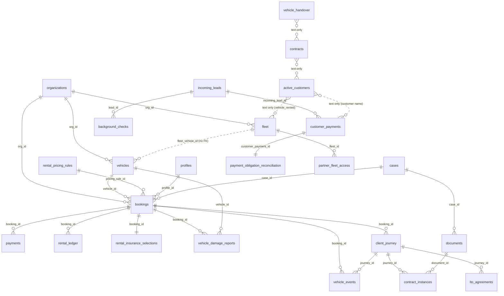
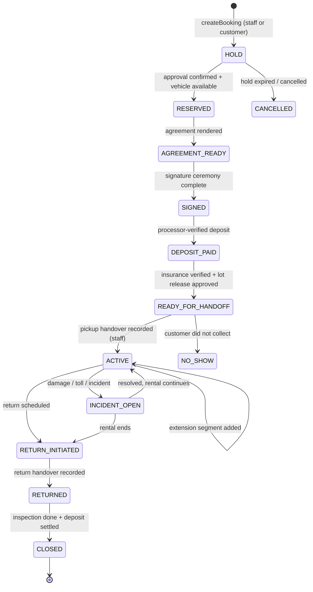

# TMMT MASTER BUILD SPEC

- **Document:** `docs/product/TMMT_MASTER_BUILD_SPEC.md` (synthesis S1 of the TMMT master product extraction)
- **Date:** 2026-09-21
- **Canon described:** `AIXMOS537/TMMT` `origin/master` @ `4cca6835` (PR #254), deployed as Vercel project `tmmt-ops` (`https://tmmt-ops.vercel.app`). Production Supabase project `uapxakmlwnpfsftfeezx`.
- **Companion documents:** `TMMT_FLAGSHIP_READINESS_REPORT.md` (what works / what is dangerous), `TMMT_ROADMAP.md` (PM- milestones), route registry `_evidence/E2_route_registry.csv`.
- **Nature:** extraction only. Nothing in this document has been implemented by writing it. No source file, schema, deploy or production row was changed to produce it.

## 0. How to read this document

### 0.1 Evidence and citations

Every factual claim cites one of six evidence files that were produced by read-only workers on 2026-09-21. Citation form is `[E3 §2]` or `[E4 §6 F3]`; where the evidence gives a source location it is repeated as `file:line`.

| Tag | File (under `docs/product/_evidence/`) | Covers |
|---|---|---|
| [E1] | `E1_BUILD_STACK_TESTS.md` | stack, commands, build/test baseline, CI, deploy, crons |
| [E2] | `E2_SCREENS_ROLES_DESIGN.md` + `E2_route_registry.csv` | 175 routes, roles/tiers, nav, admin surfaces, design system |
| [E3] | `E3_DATA_RENTAL_PAYMENTS_FLEET.md` | prod catalog, row counts, rental state, payments, e-sign, fleet, SoR |
| [E4] | `E4_GHL_INTAKE_COMMS_AUTOMATION.md` | GHL, 27 intake surfaces, comms, automations, failure states |
| [E5] | `E5_CREDIT_AIXMOS_SECURITY.md` | Credit Center, AIXMOS, security model and findings |
| [E6] | `E6_RESCUE_HISTORY_TRACKS.md` | 41 rescued pockets, git history, active tracks, merge controls |

Supporting canon (read-only reference, not rediscovered): `docs/SYSTEM_OF_RECORD.md` [SoR], `docs/ONE_PROJECT_PLAN.md` [OPP], Desktop `TMMT-GHL-ROUTER/*` [GHL-PLAN, GHL-BLOCKERS], Desktop `TMMT-PHASE-2/*` [2A-PLAN, CREDIT-MAP].

### 0.2 Status vocabulary (used exactly)

| Status | Meaning in this document |
|---|---|
| EXISTING/WORKING | Code path is complete and, where prod evidence exists, consistent with it. Not a claim of runtime health unless prod evidence is cited |
| EXISTING/PARTIAL | Real code, but part of the path is missing, unfed, env-gated or unused |
| EXISTING/BROKEN | Real code that fails at runtime or is unreachable (for example a ghost table or a middleware redirect) |
| PLACEHOLDER | Deliberate stub, demo or schema with no writer |
| ORPHANED | Exists, but nothing links to it, calls it, or deploys it |
| LEGACY | Airtable-era or retired-app surface kept for history |
| PLANNED ONLY | Exists only in docs, staged SQL or an unmerged branch |
| MISSING | Nothing exists |
| UNKNOWN | The evidence cannot settle it |

Tags on proposals: **EXISTING FOUNDATION** (cite files/tables it builds on) or **NEW BUILD REQUIRED**. Business assumptions are labelled **ASSUMPTION**. Owner decisions are labelled **OWNER DECISION**. Compliance items are flagged **⚖️ LEGAL REVIEW**.

### 0.3 Evidence conflicts resolved in this synthesis

| # | Conflict | Resolution (later / more specific evidence wins) |
|---|---|---|
| X1 | Brief/memory said PR #224 (credit compliance rails) is on HOLD | **MERGED** 2026-09-21 21:59Z as `e41b50e5`, ancestor of `4cca6835` [E5 corrections §1]. D-22b (perform vs refer) is still **OPEN**. |
| X2 | Memory/E6 said profiles self-escalation P0 fix "in draft / recorded" | **REMEDIATED on prod** 2026-09-21 23:41Z (prod baton 8), ledger `20260921234148 profiles_protect_access_columns`, trigger `profiles_block_protected_self_edits` enabled [E5 §C.2]. CI regression (2A-A3) still open. Do not describe it as open; do not re-apply. |
| X3 | E2 marks `/command/desk`, `/executive`, `/operator`, `/investor`, `/pocket/earn`, `/pocket/build`, `/operator/leads` as WORKING (code path complete) | E3's prod catalog shows their tables do not exist in prod (`ops_messages`, `ops_threads`, `investor_updates`, `pocket_referral_codes`, `pocket_referral_earnings`, `client_engagements`, `lead_pool`, `lead_routes`) [E3 §1.5]. This spec classifies those screens **EXISTING/BROKEN (ghost table)** at runtime. Whether any RPC path (`lead_claim`, `lead_assign`) still works on its own is **UNKNOWN**. |
| X4 | `partner_acquisition` authenticated `ALL true` — E5 rates HIGH (evidence taken 2026-09-21) | **HISTORICAL DEFECT / ROOT CAUSE**, treated as P0: policy `partner_acq_authenticated ALL USING (true)` for `authenticated`; migration `20260921233517` added anon insert; PR #255 (`feat/partner-acquisition`) open to feed it [E5 §C.7, E6 Task 2]. **STATUS (2026-09-22): REMEDIATED IN PRODUCTION + POST-APPLICATION VERIFIED** at 00:50Z — production ledger `20260922005007 partner_acquisition_least_privilege`, prod baton 9, approval `PARTNER-ACQ-RLS-P0-2026-09-21`, prepared commit `620e100e` on branch `sec/partner-acquisition-rls` (**not merged to master**). **Current behaviour on prod:** ordinary authenticated cannot read/update/delete; anon cannot read; a narrow intake INSERT is allowed (anon + authenticated); platform admin has management access; the view does not bypass; `internal_team` is intentionally denied; the table held 0 rows after the rolled-back verification. **Exposure window (~51 min): NO EVIDENCE FOUND**; logs cannot attribute direct SQL, so this spec does **not** claim that no access occurred. Follow-ups tracked separately (not the P0): land the branch (TMMT-SEC-008), `KNOWN_UNAPPLIED` 54→53 reconciliation, `internal_team` future access = product decision. This spec does not duplicate the fix. |
| X5 | Public signup open | Tracked as **AUTH-SIGNUP-001 — OPEN / OWNER ACTION REQUIRED** (Phase-2A A4a dashboard toggle; A4b server-side invite). Toggle state **unverified** as of 2026-09-22 [E5 §C.1]. Public-signup containment ≠ tenant authorization: RLS and server authz must stay safe for an already-authenticated hostile account regardless of the toggle. |
| X6 | [OPP] Phase 1 says middleware gained `/intake` as a public path | Code on master does **not** list `/intake` in `isPublicPath`; signed-out visitors are 307'd to `/login` [E2 §1.4 R3, `src/middleware.ts:47-67`]. Code wins. |
| X7 | "GHL M0–M4" in the brief | The GHL router plan is now **M0–M13**; M0–M6 are built on branches, none on master, none applied to prod [E6 Task 3]. |
| X8 | `fleet` / `active_customers` are "history" (SQUARE ONE, owner 2026-09-01) | The data disagrees: `fleet.vehicle_status` has 21 'Rented', and `bookings/actions.ts` still reads it as live availability [E3 §0]. Both facts are reported; the owner decision stands, the data has not been made to match it. |
| X9 | E5 says rate limiting is "STAGED" per the code comment | `rate_limit_hit` RPC **exists on prod**; the comment in `src/lib/rate-limit-durable.ts:10-20` is stale [E5 §C.5]. |
| X10 | `portal_role` "unused" | Unused by **app** code [E2 §2.1], but **read by DB helpers** `is_staff()` and `is_admin()` [E5 §C.2]. So it is an unmanaged privilege input, not dead vocabulary. |

### 0.4 Production vs repository — where they diverge (labels used throughout)

Repo and prod are not the same thing. Wherever this document describes something that is true in one place and not the other, it uses one of these six labels:

| Label | Meaning | Examples in this document |
|---|---|---|
| **CODE ON MASTER** | in `origin/master` @ `4cca6835`, deployed by Vercel | the 127 pages + 30 API routes; `ghl-payment-sync.ts`; middleware redirecting `/api/cron/*`; the `partner_acquisition` fix is **not** here |
| **CODE ON ACTIVE DEV BRANCH** | exists on an unmerged branch or an uncommitted worktree; not deployed; no prod effect | GHL router M0–M13 branches (`feat/ghl-router-m*`); Credit C1 (`wt-credit-c1`, uncommitted); Phase 2A `sec/2a-profiles-regression`; `sec/partner-acquisition-rls` @ `620e100e` |
| **PRODUCTION DATABASE STATE** | what the prod Supabase catalog/rows show, whether or not the repo has a matching file | `partner_acquisition` least-privilege policies (ledger `20260922005007`); `profiles` protected columns (ledger `20260921234148`); `lead_to_active_customer_trg` **enabled**; `bookings_no_overlap` live; 279 migrations vs 89 repo files; `automation_outbox` 35 queued / 0 sent |
| **PRODUCTION DEPLOYMENT STATE** | Vercel / GitHub / edge-function runtime configuration | 2 Vercel crons whose handlers never run (middleware 307); 7 deployed edge functions, 1 in repo; `session-autopilot.yml` latent; env kill switches unset; no branch protection |
| **DESIGN ONLY** | described in docs/plans/ADR proposals; no code anywhere | rental state machine §10.2; payment architecture §11.6; e-sign ceremony §12; PM-05…PM-19 new build; GHL M5–M13 design/planned rows |
| **PRESERVED-RESCUED HISTORICAL WORK** | exists only in rescue archives/bundles; not a route, not canonical, never auto-merged | customer portal `(client)/client/*`, dealer desk, Fast Track, T08 invite flow (§33) |

### 0.5 Security-defect status vocabulary

Every security finding (§20.3) and every numbered defect (§28) carries exactly one status: **OPEN** · **REMEDIATED** (fix applied where it matters; follow-ups may remain) · **MITIGATED** (risk reduced by a guard or control, root cause remains) · **BLOCKED** (waiting on another track/decision) · **OWNER ACTION** (only the owner can close it) · **ACCEPTED LIMITATION** (known, will not be fixed in this plan) · **UNKNOWN** (evidence cannot settle it). A fixed prod defect is REMEDIATED even if an evidence file predates the fix; an open defect stays OPEN even if a task file exists for it. The authoritative per-defect table is `docs/product/_review/DEFECT_TRACEABILITY.md`.

---

## 1. Product vision

TMMT is **one operating system for rental and rideshare fleet operators**. One app (`tmmt-ops`), one database (Supabase), one tenant model, serving three audiences through three faces:

1. **Customer Portal** — the renter (and credit client) sees their application, rental, vehicle, payments, documents, support and financial-readiness path.
2. **Operator Console** — the operator's staff run leads, bookings, fleet, payments, maintenance, documents and communications.
3. **Admin / Platform Console** — the platform owner provisions operator orgs, integrations (GHL, Stripe, Twilio, Cal), licences, AIXMOS agents and compliance gates.

Domains the OS must cover, with where canon stands today:

| Domain | One-line status today | Evidence |
|---|---|---|
| CRM / Leads | Lead store works (892 `incoming_leads`); one live feed (off-repo GHL poller) | [E3 §1.2], [E4 §3] |
| Rentals | No state machine; `bookings` = 0 rows, writer is hold-only | [E3 §2] |
| Fleet | Airtable-era data; `vehicles` all inactive; two vehicle tables | [E3 §5] |
| Payments | No processor-verified proof of payment anywhere | [E3 §3.5] |
| Maintenance | Legacy screens over 4 rows | [E3 §1.1] |
| Credit Center | Real owner-operated engine, CROA-gated shut; no customer face | [E5 §A] |
| Communications | Nothing customer-facing sends; outbox has no drainer | [E4 §4] |
| Documents / Agreements | No e-sign; 0 signed agreements in Supabase | [E3 §4] |
| AIXMOS | SMS agent built but never ran; several features depend on local machines | [E5 §B] |
| Analytics | Read-only revenue/scorecard screens; KPI cron dead since 2026-05-20 | [E2 §1.3], [E4 §5] |
| Admin / Integrations | Single env-token GHL; N-org registry only on unmerged branches | [E4 §0] |

**Guiding principles (binding, from canon and owner rules):**

- TMMT (Supabase) owns rental operational truth; **GHL never sets business state** [SoR §5.2]. GHL is conversations + attribution only.
- One writer per field; append, don't overwrite [SoR §5.1, §5.5].
- The opt-out gate fails closed [SoR §5.6].
- **No riba**: late fees are charity-only and never revenue; deposits are ʿarbūn; LTO is Ijārah Muntahia Bittamleek as two documents; payments never allocate to interest [SoR §5.7, D6]. Mercy in collections. No guaranteed credit-score or financing claims.
- Embedded agents get the same gates as people: may draft, route, remind, roll up; may not decide eligibility, move money, or send externally without the owner gate [SoR §5.4]. **AIXMOS acts only through authenticated, scoped TMMT services, never raw DB or shell.**
- Money, send, sign and prod deploy stay owner-gated; production writes require the prod write baton.

---

## 2. Target users and personas

Only roles supported by code or confirmed requirements are listed.

### 2.1 The seven real access levels (derived from code)

The app derives an **access tier** from JWT `app_metadata.role` (`src/lib/auth-roles.ts:14-51,97-106`). This is the app's only role source [E2 §2.1].

| Tier | JWT roles that map to it | Home route | Persona | Reality today |
|---|---|---|---|---|
| **owner** | `admin` | `/command` | Platform owner (Taha) | EXISTING/WORKING. Only tier on `/command/*`, `/operators/*`, `/money`, owner-hub host [E2 §2.2] |
| **staff** | `internal_team`, `va` | `/desk` | Operator staff, VAs | EXISTING/WORKING. The `(admin)` desk has **29** screens, of which staff can reach **28** (`/money` is owner-only at the edge [E2 §1.3, §2.2]); dispatch, `/work/*` |
| **executive** | `executive_va`, `executive` | `/executive` | Executive VA | EXISTING/BROKEN at runtime: feed reads ghost `ops_messages` [X3] |
| **operator** | `operator` | `/desk` → **redirect loop** | Licensee operator (runs own lead pool) | EXISTING/BROKEN: home loops (R2); `/operator/leads` reads ghost `lead_pool` [X3]. Whether operator accounts exist in prod: UNKNOWN |
| **investor** | `investor`, `partner` | `/investor` | Vehicle-owner partner / investor | EXISTING/PARTIAL: `/partner` (RPC `get_partner_fleet`) works in code; `/investor` reads ghost `investor_updates` |
| **vendor** | `vendor` | `/vendor` | Shop / mechanic / cleaner | EXISTING/WORKING (vendor jobs) |
| **none** | `customer`, missing, unknown | `/no-access` | Renter / credit client | **No working customer path.** Denied `/learn/*`, `/status/[token]`, `/intake`; only `/pocket` and public pages [E2 §2.2] |

Plus **public visitor** (signed out): marketing pages, `/forms/*`, `/lp/*`, `/legal/*`. `/intake*` and `/status/[token]` are wrongly login-walled (R3).

### 2.2 Database role lists (RLS side)

| Vocabulary | Values | Read by | Note |
|---|---|---|---|
| `public.user_role` = `profiles.role` | admin, internal_team, investor, vendor, customer | `is_platform_admin()`, `is_staff()`, `is_internal_ops()`, `is_org_member()` | **Authoritative in the DB.** 5 JWT roles (`va`, `executive_va`, `executive`, `operator`, `partner`) have no DB value, so RLS cannot see them [E2 §2.1] |
| `public.portal_role` | client, team_member, manager, admin, super_admin | **No app reader**; read by DB `is_staff()` and `is_admin()` [E5 §C.2] | Unmanaged privilege input (X10). Protected from self-edit since 2026-09-21 |
| `org_roles.role` | tenant_admin, dispatcher, responder, viewer | dispatch layout; `is_org_member()` | `org_roles` policy has 42P17 recursion, fails closed (2A-A12) [E5 §C.4] |
| notification `recipient_role` | owner, staff, operator, system | addressing only | not authZ |
| Cube personas | client, coach, admin, supervisor | client-side demo switch | **not authZ**; off in prod unless `NEXT_PUBLIC_CUBE_DEMO_CONTROLS=1` |

**Split brain:** the app authorizes on JWT `app_metadata.role`; the DB authorizes on `profiles.role`. Nothing syncs them. Both fail closed [E5 §C.2]. **OWNER DECISION (PM-02):** pick one source of truth for role, and a sync or derivation for the other.

### 2.3 Personas for the flagship (target)

| Persona | Face | Supported by code today | Target |
|---|---|---|---|
| Renter / applicant | Customer Portal | No (tier `none` locked out) | NEW BUILD on EXISTING FOUNDATION (`/status/[token]`, `client_journey`, `client_renter_status`; TMMT OS `(client)/client/*` port) |
| Credit client | Customer Portal (Credit Center) | No (owner-operated only) | NEW BUILD, after C1/S-track and ⚖️ legal gates |
| Operator staff / VA | Operator Console | Yes (`(admin)` desk) | Consolidate |
| Operator owner (licensee) | Operator Console | Partially (`/operator`, broken home) | Fix + consolidate |
| Dealer | Operator Console (dealer desk) | No (marketing `/dealers` only) | Port from TMMT OS archive (rescued) |
| Vehicle-owner partner / investor | Partner view | Partially | Keep narrow, read-only |
| Vendor | Vendor view | Yes | Keep |
| Dispatcher / responder (rescue vertical) | Dispatch cockpit | Yes (staff + `org_roles`) | Keep as separate vertical |
| Platform owner | Admin / Platform Console | Yes (`/command`) | Consolidate |

---

## 3. Business-model assumptions (all labelled)

| # | Assumption | Basis | Confidence |
|---|---|---|---|
| A-1 | **ASSUMPTION:** The first tenant is the house operator "TMMT Rentals" (org `8e651b25-…`), renting cars weekly to rideshare drivers (GHL pipeline "UBER/LYFT"). | hard-coded house org in `promote_ghl_contact` and `va-task-outbox.ts` [E3 §1.4, E4 §1.4]; UBER/LYFT pipeline id in scripts | High |
| A-2 | **ASSUMPTION:** Other operators (9 orgs in prod) license the platform (`organization_licenses` 5, `packages` 10 as entitlements). | [E3 §0, §1.4] | Medium. `packages` = entitlements, not a price book |
| A-3 | **ASSUMPTION:** Vehicles are often owned by third-party partners with per-person, per-car split terms. | [SoR §3] "terms vary per person and per car"; `fleet.partner_percentage` on 7/43 | Medium. `vehicle_owners` / `owner_agreements` = MISSING |
| A-4 | **ASSUMPTION (owner, 2026-09-01 SQUARE ONE):** right now there are no cars and no partners; fleet and active customers are history. The live asset is ~890 leads and ~81 approved-never-placed applicants. | memory rule; contradicted by fleet data (X8) | Decision stated; data not reconciled |
| A-5 | Revenue streams (to be confirmed): weekly rent; ʿarbūn deposit applied to total; LTO under Ijārah (two agreements); SaaS licence; kits and member-97 via GHL checkout links; credit education (and, only if counsel approves, credit repair). | `NEXT_PUBLIC_GHL_CHECKOUT_*` [E1 §4]; SoR D6; CROA gate [E5 §A.1] | ASSUMPTION. No price book is authoritative (commercial-authority gate) |
| A-6 | **Late fees are never revenue** (charity disposition); no interest; no riba upsell. | [SoR §5.7] | Owner rule, binding |
| A-7 | **ASSUMPTION:** Customer conversations stay in GHL; TMMT stores pointers only. | [SoR §3] | High |
| A-8 | **ASSUMPTION:** Credit readiness supports the rental journey (credit → LTO / drive-to-own), not a standalone lending product. | owner decision 2026-09-16 [E5 §A] | High. D-22b open |
| A-9 | **ASSUMPTION:** One Vercel project and one Supabase project; there is no staging DB (preview deploys hit prod DB). | [E1 §7] | Fact today; target needs a non-prod DB (GHL B-7) |

---

## 4. Stack and repo architecture

### 4.1 Stack [E1 §1]

| Area | What canon uses | Status |
|---|---|---|
| Framework | Next.js 16.3.5 App Router, build forced to webpack (`next build --webpack`) | EXISTING/WORKING |
| UI runtime | React 19 (19.3.0 installed), Tailwind v4 (CSS-first, no config file), lucide-react, recharts, leaflet | EXISTING/WORKING |
| Language | TypeScript 5.9, `strict: true`, alias `@/*` → `src/*`, `@aixmos/core` → `packages/aixmos-core/src` | EXISTING/WORKING |
| Runtime | Node `>=24 <25` (no `.nvmrc`) | EXISTING/WORKING |
| DB | Supabase Postgres via `@supabase/supabase-js` + `@supabase/ssr`; **no ORM**. Clients: `src/lib/supabase.ts` (browser), `supabase-server.ts` (SSR), `supabase-service.ts` (service role, `server-only`) | EXISTING/WORKING |
| Auth | Supabase Auth + `src/middleware.ts` (Edge; "middleware" convention deprecated → "proxy") | EXISTING/WORKING (with defects §20) |
| Storage | Supabase Storage buckets `staff-documents`, `vehicle-media`, `program-documents` (all private) | EXISTING/WORKING |
| Payments | `stripe` used only as a per-tenant webhook receiver; selling via GHL checkout links | EXISTING/PARTIAL |
| SMS/voice | `twilio` (inbound TwiML + orphaned `sendSms`), GHL voice webhook | EXISTING/PARTIAL |
| AI | Anthropic SDK (`llm-router.ts`, `ops-ai.ts`); self-hosted "pocket brain" via `POCKET_BRAIN_URL` | EXISTING/PARTIAL |
| Validation | zod 4 | EXISTING/WORKING |
| Observability | Sentry (`@sentry/nextjs`), Mixpanel browser | EXISTING/WORKING (no PII scrubber) |
| Tests | Vitest 4 (unit), Playwright (E2E, not in CI), PGlite SQL rehearsals (not in CI) | EXISTING/PARTIAL |

### 4.2 Repo layout

| Path | Role | Deployed? |
|---|---|---|
| `/` (root) | the `tmmt-ops` app: `src/app` = **127 pages + 30 route handlers** | Yes |
| `src/app/(admin)` | rentals desk (29 screens) | Yes |
| `src/app/(command)` | owner command center, dispatch, operators | Yes |
| `src/app/(executive|operator|investor|vendor|partner)` | role portals | Yes |
| `src/app/(learn)`, `(program)` | AIXMOS cube (credit/coaching faces) | Yes |
| `src/app/(pocket)` | member app | Yes |
| `src/app/forms`, `intake`, `status`, `lp`, `legal`, marketing | public surfaces | Yes |
| `src/lib/**` | domain logic (agent, ghl, credit-dispute, rental-pricing, drive-to-own, intake, routing, crm-sync…) | Yes |
| `packages/aixmos-core` | cube engine, transpiled into the app | Yes (via app) |
| `apps/engine` | standalone copy of Learn/Work cube (13 pages) | **No** — LEGACY/ORPHANED [E1 §1, E2 §1.1] |
| `aria/` | local avatar/voice chat against Ollama; unauthenticated `/api/chat` | **No** — ORPHANED [E5 §B.2] |
| `supabase/migrations` | 89 applied-style SQL + `_staged/` (12) + `_parked/` (4) | Hand-tracked; see §30 |
| `supabase/functions/intake` | 1 edge function (repo copy says dormant; **deployed v7 is live and unsafe**) | see §15 |
| `scripts/tests/sql` | 11 PGlite rehearsals | Not in CI |
| `e2e/` | 10 Playwright specs | Not in CI; hit prod DB when run |

### 4.3 Real commands [E1 §2]

| Purpose | Command | In CI (`verify.yml`)? |
|---|---|---|
| Install | `npm ci --no-audit --no-fund` | yes |
| Dev | `npm run dev` | – |
| Brand map | `npm run brand:check` | yes |
| Lint | `npm run lint` | yes |
| Typecheck | `npx tsc --noEmit` (no npm script) | yes — **missing from local `scripts/verify.sh`** |
| Unit tests | `npm test` (`vitest run`) | yes |
| Build | `npm run build` (`next build --webpack`) | yes |
| E2E local | `npm run test:e2e` | **no** |
| E2E prod smoke | `npm run test:e2e:prod` | **no** |
| SQL rehearsals | `node scripts/tests/sql/<file>.mjs` (after `npm ci` in that dir) | **no** |
| Local gate | `npm run verify` (brand, lint, test, build) | pre-push hook |

### 4.4 Baseline (this worktree, no env, 2026-09-21) [E1 §3]

| Step | Result |
|---|---|
| `npm ci` | PASS, 664 packages, 28 s |
| brand:check | PASS (3 tenants) |
| lint | PASS, 0 errors, 39 warnings (36 `set-state-in-effect`) |
| `tsc --noEmit` | PASS, 0 errors |
| vitest | 2320 pass / **2 fail on Windows** / 14 skipped (2,336 total; both failures are Windows-only host artifacts: `git ls-files` quoting and CRLF; see §25) |
| build | PASS with **no env at all**; 151 static pages; 122 dynamic routes not executed |
| SQL rehearsals | 8/11 pass as-is; 1 red **by design** without `--repaired` (`automation-repairs`); 2 need path arguments whose intended targets are **undetermined** (`automation-migrations`, `classifier-migration`) — listed as `pending` until evidence is found (TMMT-BUILD-002) |
| CI (`verify.yml`) | runs brand:check, lint, `tsc --noEmit`, vitest and `next build` only. **E2E (Playwright) and the SQL rehearsals are not in CI.** |

"Build green" proves compilation only. It executes none of the 122 dynamic routes and no DB call [E1 §5.3 item 9]. **Compiling ≠ healthy**: the baseline says nothing about runtime behaviour, prod data or the 7 ghost-table screens (X3).

---

## 5. Domains and modules

Each module table uses the same rows. "Files" and "Tables" list the main ones; the route registry CSV has the full list.

### 5.1 CRM / Leads

| Row | Content |
|---|---|
| Status | EXISTING/WORKING as a lead store; EXISTING/PARTIAL as a CRM (no status history, no qualification record) |
| Files | `src/app/(admin)/leads`, `waitlist`, `background-checks`; `src/lib/ghl/handlers/contact.ts`; `src/lib/routing/*` (0 tests); `src/lib/lead-pool.ts`; `(operator)/operator/leads` |
| Tables | `incoming_leads` 892 (`agent_status='NEW'` on all 892; `status` null on 759), `ghl_contacts` 1,656, `people` 1,210 (stale GHL snapshot), `background_checks` 299, `waitlist`, `intake_events` 908, `crm_sync_records` 6 [E3 §1.2] |
| Dependencies | GHL poller (off-repo M1 launchd) → `promote_ghl_contact` trigger; 8 triggers on `incoming_leads` [E4 §5] |
| Bugs | Duplicate tenancy columns `org_id` + `organization_id` on `incoming_leads` [E3 §1.4]; form path writes no `phone_e164` so dedupe is blind [E4 §2(b)6]; `lead_to_active_customer` trigger (§10); ghost tables `lead_pool`, `lead_routes`, `ops_locations`, `dispatch_loads` [E3 §1.5] |
| Security risks | `is_staff()` global → any staff sees every org's leads [E5 §C.4]; lead webhook anonymous overwrite [E5 §C.7] |
| Missing requirements | Person spine (E.164 match) [SoR §6 step 2]; lead status history (`status_event`); qualification decision record; denial reason → route map (D4) |
| Acceptance criteria | A lead has exactly one org; status changes are appended events with actor; phone dedupe works across form + GHL paths; staff of org A cannot read org B leads (CI-proven) |

### 5.2 Universal intake (27 surfaces)

| Row | Content |
|---|---|
| Status | EXISTING/PARTIAL. 2 of 27 surfaces carry traffic; 8 are unsafe public writers [E4 §3] |
| Files | `src/app/forms/actions.ts` (25 files, 1 test), `src/lib/intake/unified.ts`, `src/app/intake/*`, `src/app/api/leads/webhook/route.ts`, `src/app/api/forms/submit/route.ts`, `supabase/functions/intake` |
| Tables | `incoming_leads`, `form_submissions` 4, `customer_intake_forms` 5, `cases` 4, `customer_services`, `partner_acquisition` 0, `credit_funding_sessions` 1 |
| Dependencies | middleware in-memory limiter for POST `/forms*`; `rate_limit_hit` RPC (durable) on 3 routes |
| Bugs | F4 `activity_logs` ghost table silently drops every intake audit row; F6/F7 un-awaited side effects; F8 `.maybeSingle()` duplicate breeding [E4 §6] |
| Security risks | ANON-TENANT-001 (six anon-writable tables with caller-chosen `org_id`) [GHL-BLOCKERS B-6]; deployed edge `intake` v7 and `capture-drive` (not in repo) [B-4, B-5] |
| Missing requirements | One intake contract and router → **owned by GHL track M7/M8/M10/M11** (do not duplicate) |
| Acceptance criteria | Owned by GHL track: every surface registered with an id, tenant derived server-side, durable rate limit, dedupe by E.164, failures surfaced |

### 5.3 Rentals / Bookings

| Row | Content |
|---|---|
| Status | EXISTING/PARTIAL (typed `bookings` with overlap guard; only writer creates `hold`; 0 rows). No state machine [E3 §2] |
| Files | `src/lib/rental-pricing/{create-booking,availability,queries}.ts` (5 files, 5 tests), `src/app/(admin)/bookings/actions.ts`, `/api/rental/quote`, `src/lib/rental-write-validation.ts`, `rental-record-validation.ts` (untested) |
| Tables | `bookings` 0, `vehicles` 27 (all `active=false`), `fleet` 43, `rental_pricing_rules` 10, `rental_insurance_products` 6, `client_journey` 35, `active_customers` 35 (all 'Removed'), `former_customers` 1 |
| Dependencies | `fleet.vehicle_status` (free text) for availability; `bookings_no_overlap` EXCLUDE constraint (live) |
| Bugs | `lead_to_active_customer` trigger; `adminUpsert` free-text statuses; stale `BOOKING_GUARD_NOTE` comment; `vin_number` form fields vs `vin` column [E3 §1.5] |
| Security risks | Staff RLS `bookings_staff_all` can set any status directly; `is_staff()` cross-org |
| Missing requirements | Transition function + transition log; extensions; returns; deposits collected; reconditioning; single "rental" object linking person, vehicle, agreement, payments |
| Acceptance criteria | See §10 and §31. Every status change goes through one guarded function that writes an append-only event; no status can be set by GHL or free-text edit |

### 5.4 Fleet

| Row | Content |
|---|---|
| Status | LEGACY data + EXISTING/PARTIAL booking-board layer; not an operational model [E3 §5] |
| Files | `(admin)/interfaces/vehicles`, `inspections`, `insurance`; `src/lib/fleet/public-fleet.ts`; `bookings/actions.ts` (`addVehicleToBoard`) |
| Tables | `fleet` 43 (Airtable text), `vehicles` 27, `fleet_car_inspections` 18, `vehicle_onboarding_inspections` 0, `vehicle_damage_reports` 0, `vehicle_media` 0, `vehicle_events` 0, `insurance` 24, `partner_fleet_access` |
| Dependencies | `vehicles.fleet_vehicle_id` bridge (no FK) |
| Bugs | Two vehicle tables; three price sources; 21 'Rented' vs SQUARE ONE; public listing shows nothing (0 active) |
| Security risks | `insurance.login_email/login_password/login_phone` columns exist (empty) — drop [SoR §6 step 3]; `vehicle_handover` anon insert |
| Missing requirements | Vehicle owner + owner agreement entities; status history; utilization; service history as records |
| Acceptance criteria | One vehicle table is canonical (OWNER DECISION); vehicle status is derived from bookings/maintenance events, not typed; every owner split is a per-vehicle agreement record |

### 5.5 Payments

| Row | Content |
|---|---|
| Status | EXISTING/PARTIAL (manual ledger + GHL-tag writer + Stripe receiver that writes no money) [E3 §3] |
| Files | `(admin)/interfaces/payments`, `/revenue`, `/money`, `/affiliates`; `src/lib/ghl-payment-sync.ts`; `src/app/api/agent/stripe/webhook/[slug]/route.ts`; `src/lib/ops-command/execute.ts:223-240` (`post_ledger`) |
| Tables | `customer_payments` 31 (Overdue 25, Paid 1), `payment_obligation_reconciliation` 31 (all unverified), `payments` 0 (orphaned), `rental_ledger` 3, `deal_payments` 0, `credit_payment_schedule` 0 |
| Dependencies | GHL webhook, cron `sweep_overdue_payments`, cron `sweep_payment_due_notices` → outbox |
| Bugs | GHL tag/event → Paid rows; `amount_past_due` typo insert silently fails; Overdue stamped by date; dedupe by `notes ILIKE` |
| Security risks | `rental_ledger` investor INSERT/UPDATE; commission and token grants fire off GHL-claimed payment |
| Missing requirements | Processor-verified proof; deposits; refunds; failed payments; allocation rules (no interest); late-fee charity disposition |
| Acceptance criteria | Future `TMMT_PAYMENT_ARCHITECTURE.md` (§11). No row reaches "Paid" without processor evidence or a named human verifier with evidence ref |

### 5.6 Maintenance

| Row | Content |
|---|---|
| Status | E2 marks the 6 maintenance-domain screens WORKING as code; the data is LEGACY (4 `maintenance_appointments`) |
| Files | `(admin)/maintenance`, `cases`, `workflow-vendors`, `vendors`, `tickets`, `(vendor)/vendor`; `src/app/workflow-actions.ts` (service role) |
| Tables | `maintenance_appointments` 4, `cases` 4, `vendor_jobs`, `vendors`, `shops_mechanics_cleaning`, `tickets` (308 Airtable import) |
| Dependencies | ClickUp (`clickup_tasks` 0) |
| Bugs | Two vendor tables (`vendors` vs `shops_mechanics_cleaning`) [E2 §3]; `cases` double status-history triggers [E4 §5] |
| Security risks | `tickets` anon insert with caller-chosen org (ANON-TENANT-001) |
| Missing requirements | Maintenance tied to a vehicle status transition; scheduled service intervals; cost roll-up per vehicle |
| Acceptance criteria | Opening a maintenance job moves the vehicle to MAINTENANCE via the state function and blocks new bookings on it; closing returns it to AVAILABLE only after inspection |

### 5.7 Agreements / Documents

| Row | Content |
|---|---|
| Status | **MISSING** as e-sign; LEGACY/ORPHANED tables [E3 §4] |
| Files | `(admin)/document-actions.ts` (PDF upload, replace deletes previous), `src/app/forms/handover/page.tsx` (typed-name "signature"), `src/lib/document-storage.ts` |
| Tables | `contracts` 2 (0 PDFs), `contract_instances` 0, `lto_agreements` 0, `documents` 0, `vehicle_handover` 1 |
| Dependencies | Airtable is the only holder of real signatures and 810 PII attachment cells [SoR §3, §4] |
| Bugs | No versioning of contract PDFs; handover signature has no identity binding |
| Security risks | Staff can sign any `staff-documents` path across orgs [E5 §C.6]; `vehicle_handover` anon insert |
| Missing requirements | Template → generated document → signature ceremony → hash + audit record; Airtable document migration (FCRA remediation) |
| Acceptance criteria | §12 |

### 5.8 Credit Center

| Row | Content |
|---|---|
| Status | EXISTING/PARTIAL, owner-operated, **gated shut** by CROA gate; no customer face [E5 §A] |
| Files | `src/app/(command)/command/credit-dispute/*`, `src/lib/credit-dispute/**` (15 files, 5 tests), `shared/compliance-gates/*`, `src/lib/drive-to-own/*`, `src/app/forms/credit-funding-intake`, `(admin)/credit-funding`, `(learn)/*` |
| Tables | `dispute_clients` 0 (no `org_id`), `credit_funding_sessions` 1, `credit_enrollments`/`billing_plans`/`payment_schedule`/`education_acknowledgments` all 0 |
| Dependencies | **Credit track S0–S7, in-flight C1** (`wt-credit-c1`, uncommitted) |
| Bugs | `[id]` page calls ungated `runDisputeProtocol`; `/learn/status` stub reference |
| Security risks | `upsertDisputeClient` arbitrary payload; CPN ban unenforced; `is_internal_ops()` includes investor (DELETE on credit tables); `credit_enrollments_org_all` makes module check redundant |
| Missing requirements | Tracking, response, outcome, customer upload/review, lender matching (rescued T10 only) |
| Acceptance criteria | §18; owned by credit track |

### 5.9 Communications

| Row | Content |
|---|---|
| Status | **Nothing customer-facing sends.** Internal notifications only [E4 §4]. **Queued ≠ delivered:** 35 new-lead emails sit `queued` in `automation_outbox` with 0 sent and no drainer; no customer delivery path has ever functioned. Queue rows are never evidence that messaging works |
| Files | `src/lib/notify.ts`, `src/lib/outbound-gate.ts`, `src/lib/agent/twilio-send.ts` (orphaned), `src/lib/ghl/client.ts:280` (`sendConversationMessage`, orphaned), `src/lib/email/send.ts` (orphaned), `src/lib/ops/va-task-outbox.ts`, `(command)/command/outbox` |
| Tables | `automation_outbox` 35 queued / 0 sent, `do_not_contact_numbers` 78, `agent_messages` 0, `client_alerts` 0 |
| Dependencies | GHL workflows fired by tags (UNKNOWN); n8n (abandoned) |
| Bugs | F2 false-success sender; outbox has no drainer; filesystem email outbox unusable on Vercel |
| Security risks | DNC bypass on GHL tag/field/stage writes; email branch skips DNC; `on_new_lead` / `sweep_payment_due_notices` enqueue without DNC reference |
| Missing requirements | A single gated send gateway + drainer; GHL per-channel DND read; delivery status write-back |
| Acceptance criteria | §16 |

### 5.10 AIXMOS

| Row | Content |
|---|---|
| Status | Mixed; see §19 [E5 §B] |
| Files | `src/lib/agent/**` (28 files, 17 tests), `src/lib/ops-ai.ts`, `src/lib/pocket-brain.ts`, `src/lib/captain-client.ts`, `packages/aixmos-core`, DB agent spine |
| Tables | `agent_definitions` 3, `agent_jobs` 32, `agent_conversations` 0, `agent_messages` 0, `exec_va_tasks` 19,097 |
| Dependencies | Anthropic (cloud, reachable); local Ollama / LiteLLM / captain host (unreachable from Vercel) |
| Bugs | Voice agent nil-UUID org fallback → 500 |
| Security risks | Voice AI reply stored without owner hold; `aria/api/chat` unauthenticated (not deployed) |
| Missing requirements | Scoped tool API over TMMT services (GHL M13 target); cloud-reachable model path for fleet/captain; retrieval |
| Acceptance criteria | §19 |

### 5.11 Analytics

| Row | Content |
|---|---|
| Status | EXISTING/WORKING read-only screens; one BROKEN cron |
| Files | `(admin)/revenue`, `scorecard`, `timesheets`, `money`; `src/lib/marketing-kpi` (0 tests); `/api/cron/marketing-kpi-ghl` |
| Tables | `customer_payments`, `time_clock_entries`, `money_meter_*`, `marketing_kpi_weeks` 1 (last 2026-05-20) |
| Bugs | KPI cron 307'd by middleware; revenue built on unverified `customer_payments` |
| Missing requirements | Utilization, fleet ROI, collections truth from verified payments |
| Acceptance criteria | Every KPI names its source table and excludes unverified money |

### 5.12 Admin / Integrations

| Row | Content |
|---|---|
| Status | Single env-token GHL (EXISTING/PARTIAL); ClickUp partial; Airtable LEGACY [E4 §0, E1 §1] |
| Files | `src/lib/ghl/*` (18 files, 5 tests), `src/app/api/webhooks/ghl/*`, `src/lib/ghl/org-location.ts` (orphaned), `src/lib/clickup`, `src/app/api/webhooks/airtable/*`, `/operators`, `/api/license/*` |
| Tables | `organizations` 9 (Stripe/Twilio/Cal null on 9/9), `organization_licenses` 5, `ghl_webhook_events` 0, `sync_events` 33 |
| Dependencies | **GHL router M0–M13** (connection registry, discovery, identity, webhook inbox, router, admin UI) |
| Bugs | `/api/license/*` 307'd by middleware; stage map empty → every stage `inquiry` |
| Security risks | global env token, no per-org credential; `scripts/sync-airtable.mjs` delete-all (locked, D5) |
| Missing requirements | Per-org connections (M3), N locations, integration health screen (M12) |
| Acceptance criteria | Owned by GHL track (M9 isolation matrix is a release blocker) |

### 5.13 Dispatch (rescue vertical)

| Row | Content |
|---|---|
| Status | EXISTING/WORKING cockpit; 3 ORPHANED sub-screens (`/dispatch/me`, `/units`, `/responders`) [E2 §1.3] |
| Files | `src/app/(command)/dispatch/**`, `src/lib/dispatch-*.ts`, `notify-telegram.ts` |
| Tables | `incidents`, `units` 3, `incident_assignments`; RPCs `find_best_unit`, `assign_unit` |
| Notes | A separate vertical; "dispatch" also names VA relay in other code — naming collision. Keep, do not merge with rental incidents |

### 5.14 Dealer / Partner

| Row | Content |
|---|---|
| Status | Marketing and provisioning only; dealer desk **absent** (rescued in TMMT OS archive) [E6 §1.2] |
| Files | `/dealers`, `/kits`, `/build`, `/partners/all-in-one`, `(partner)/partner`, `scripts/provision-dealer-instance.mjs`, `src/lib/signup-invite.ts` |
| Tables | `partners` 2, `partner_*` 0, `partner_acquisition` 0, `deals` 0, `dealer_applications` 0, `parties` 0 |
| Security risks | `partner_acquisition` authenticated ALL true — **historical P0, REMEDIATED on prod 2026-09-22** (ledger `20260922005007`; X4; branch not yet on master); PARTNER-TENANT-001 caller-chosen tenant on telemetry (SEC-20, OPEN) [GHL-BLOCKERS B-8] |
| Missing requirements | Dealer desk port; dealer-admin invite flow (rescued T08) |

### 5.15 Pocket (member app)

| Row | Content |
|---|---|
| Status | EXISTING/PARTIAL; `/pocket/earn` and `/pocket/build` read ghost tables (X3); `/pocket/assistant` dead on Vercel without a public brain URL |
| Files | `src/app/(pocket)/*`, `src/lib/pocket.ts`, `src/lib/referrals.ts`, `src/lib/engagement.ts`, `/api/pocket/chat` |
| Notes | Only surface a tier-`none` account can open today |

### 5.16 Customer Portal

| Row | Content |
|---|---|
| Status | **EXISTING/BROKEN** in canon: the 2 customer surfaces (`/status/[token]`, `/intake*`) are login-walled [E2 R3]; the full portal is **absent** (rescued in TMMT OS archive, 15 pages) |
| Foundation | `src/app/status/*` (`opt-in-actions.ts`, `FinancingReadinessPanel`), `src/lib/client-journey/*` (0 tests), `src/lib/client-self-service.ts`, `client_journey`, `client_renter_status` view, `vehicle_media.visible_to_client`, `current_profile_email()` RLS helpers |
| Missing | Customer auth path, customer RLS per person, customer-safe views, payments/documents/support pages |

### 5.17 Auth / Access

| Row | Content |
|---|---|
| Status | EXISTING/WORKING core with defects |
| Files | `src/middleware.ts`, `src/lib/auth-roles.ts`, `src/app/(auth)/*` (8 files, **0 tests**), `src/app/api/auth/callback/route.ts`, `src/lib/signup-invite.ts` |
| Bugs | R1 machine APIs blocked; R2 operator loop; R3 customer pages walled; R4 Dashboard link; R5 nav leak |
| Security risks | AUTH-SIGNUP-001; open redirect `route.ts:18,32`; JWT/profiles split brain |
| Acceptance criteria | Middleware matrix test for every tier × every route group; open redirect test; signup cannot create an account without a server-issued invite |

---

## 6. Screen / route summary

Full per-route detail: **`docs/product/_evidence/E2_route_registry.csv`** (175 rows, 20 columns: route, methods, group, screen, domain, edge audience, in-code guard, tables, RPCs, service-role writer, rate limit, states, nav path, status, known problems, file).

### 6.1 Counts — one definition per number

| App | Pages | API routes | Deployed |
|---|---:|---:|---|
| Canon `src/app` | 127 | 30 | yes |
| `apps/engine` | 13 | 0 | no (LEGACY) |
| `aria` | 1 | 4 | no (ORPHANED) |

Every count used in this extraction, with what it counts (do not add numbers from different rows together):

| Number | What it counts | Where it appears |
|---:|---|---|
| **127** | canon **pages** (`page.tsx` routes under `src/app`) | "127 screens" in READINESS/pack = this number; it excludes API routes |
| **30** | canon **API route handlers** (`route.ts` under `src/app/api`) | – |
| **157** | canon **routes** = 127 pages + 30 APIs. This is the denominator of the status table in §6.2 (98 + 35 + 13 + 2 + 5 + 4 = 157) | §6.2 |
| **175** | rows in `E2_route_registry.csv` = 157 canon + 13 `apps/engine` + 5 `aria` | §0.1, pack `05` |
| **29 / 28** | `(admin)` desk screens / those reachable by the staff tier (`/money` is owner-only) | §2.1, §4.2 |
| **11 + 1 = 12** | parenthesised route groups (`(admin)`, `(auth)`, `(command)`, `(executive)`, `(investor)`, `(learn)`, `(operator)`, `(partner)`, `(pocket)`, `(program)`, `(vendor)`) plus one ungrouped bucket (46 pages). "12 route groups" and "7 tiers × 12 groups" (§25.2) mean these 12 buckets | §25.2, pack `05` |
| **13** | routes whose CSV **code-path** status is BROKEN (8 machine APIs + 4 customer pages + 1 credit page, §6.3) | §6.2 BROKEN column |
| **7** | screens the CSV marks WORKING that are BROKEN **at runtime** because they read ghost tables (X3). Runtime view = 91 WORKING / 20 BROKEN (98 − 7 / 13 + 7); the CSV is not re-scored | §6.2 note |
| **14** | ghost tables (§9.5) | KD-16 |
| **8** | machine APIs redirected by middleware (2 cron + 3 license + audit + mission + ops/command) | §6.3, §17, KD-11 |
| **6** | unlinked screens (R6). The §6.2 ORPHANED column shows **5** because `/command/outbox` is scored PARTIAL as its primary status; R6 counts it as unlinked as well | §6.4, KD-44 |
| **8** | triggers on `incoming_leads` (7 business triggers + `incoming_leads_set_updated_at`; E3 counted 7 by omitting `set_updated_at`) | §5.1, §17 |
| **2,336** | vitest tests = 2320 pass + 2 fail (Windows-only) + 14 skipped | §4.4 |
| **178 / 279 / 89** | prod public tables (RLS on all) / prod `schema_migrations` rows / repo migration files | §9, §9.6 |

### 6.2 Canon by domain and status (pages + APIs) [E2 §1.2; runtime adjustment per X3]

| Domain | Total | WORKING | PARTIAL | BROKEN | PLACEHOLDER | ORPHANED | LEGACY |
|---|---:|---:|---:|---:|---:|---:|---:|
| Marketing/Public | 22 | 16 | 5 | – | 1 | – | – |
| Credit Center | 21 | 4 | 15 | 1 | 1 | – | – |
| Intake/Forms | 21 | 17 | 1 | 3 | – | – | – |
| Admin/Integrations | 18 | 12 | – | 4 | – | – | 2 |
| AIXMOS/AI | 12 | 4 | 6 | 2 | – | – | – |
| Dealer/Partner | 10 | 7 | 2 | – | – | 1 | – |
| Rentals/Bookings | 7 | 5 | – | – | – | – | 2 |
| Communications | 7 | 4 | 3 | – | – | – | – |
| Maintenance | 6 | 6 | – | – | – | – | – |
| Auth | 6 | 5 | – | – | – | 1 | – |
| Dispatch (rescue) | 6 | 3 | – | – | – | 3 | – |
| Payments | 5 | 2 | 3 | – | – | – | – |
| Analytics | 5 | 4 | – | 1 | – | – | – |
| CRM/Leads | 5 | 5 | – | – | – | – | – |
| Fleet | 3 | 3 | – | – | – | – | – |
| Customer Portal | 2 | – | – | 2 | – | – | – |
| Agreements/Documents | 1 | 1 | – | – | – | – | – |
| **Total** | **157** | **98** | **35** | **13** | **2** | **5** | **4** |

**Runtime adjustment (X3):** at least 7 screens counted WORKING above read tables absent from prod and should be treated as EXISTING/BROKEN at runtime: `/command/desk`, `/executive`, `/operator` (feed), `/operator/leads`, `/investor`, `/pocket/earn`, `/pocket/build`. The CSV keeps E2's code-path status; this spec's status is the runtime one (91 WORKING / 20 BROKEN at runtime; §6.1).

**Reading the Communications row:** its 4 WORKING routes are the internal Slack/Telegram/notification surfaces and the inbound webhook receivers. **No customer-facing send path works** (§5.9, §16); queue rows in `automation_outbox` are not deliveries.

### 6.3 The 13 BROKEN routes

- 8 machine APIs 307'd to `/login` by middleware: `/api/cron/journey-recompute`, `/api/cron/marketing-kpi-ghl`, `/api/license/{heartbeat,provision,revoke}`, `/api/audit/events`, `/api/mission/generate`, `/api/ops/command` [E2 R1]. Not all eight can simply be opened: `/api/license/heartbeat` has **no secret** (caller supplies `organization_id` + `hardware_uuid`; the service role reads and updates `organization_licenses`) and neither heartbeat nor `provision` has a rate limit [E5 §C.5]. Opening `/api/license/*` as-is would create an unauthenticated service-role write path, so it is split out of the PM-01 machine-route fix (TMMT-BUILD-001 keeps it closed pending an owner decision).
- 4 customer pages login-walled: `/intake`, `/intake/[business]`, `/intake/thanks`, `/status/[token]` [E2 R3].
- `/command/credit-dispute/[id]` (ungated letter generator) [E5 §A.1].

### 6.4 Navigation defects

R2 operator loop; R4 "Dashboard" → marketing `/` (desk at `/desk` has no nav link); R5 portal nav leaks owner links and a literal `__MARKETING_SITE__`; R6 six unlinked screens; three nav definitions (`Sidebar.tsx`, `command-hub-nav.ts`, `config/tailor.json`) [E2 §1.4, §3].

### 6.5 BUILT ELSEWHERE, NOT IN CANON [E2 §5, E6 §1]

| Rescue id | Screens | Disposition |
|---|---|---|
| T04–T06 TMMT OS (`C:\dev\tmmt-os`, TMMT-OS-ARCHIVE) | **Customer portal** `(client)/client/*` (15: dashboard, rental, vehicle, billing, credit, documents, maintenance, marketplace, path, support, support/[id], training, updates, upgrade, [section]) | USEFUL (owner URGENT) |
| same | **Dealer desk** `(internal)/internal/dealer/*` (10: home, collections, deals, deals/[id], deals/new, inventory, leads, onboarding, payments, service) | USEFUL (owner URGENT) |
| same | Internal: admin, agency, assistant, billing, cases, dashboard, dispatch, ghl-sync, interfaces, journey, ledger, operators, sync, vendors; Owner `/admin/*`; Team `/team/*`; Investor `/investor/{dashboard,ledger,contact}`; Vendor `/vendor/{dashboard,jobs/[id],ledger}`; `/portals`; `/v/[venture]/*` (21) | Phase 4 port candidates; many duplicate canon `(admin)` screens at other URLs |
| archive/master only | `internal/{property,property/setup,briefing,marketplace,partner-verticals,dispatch/new}`, `client/marketplace`, `team/performance` | FUTURE |
| T07 Fast Track (PC Kit overlay) | `/apply`, `/apply/[slug]`, `/apply/packet` | USEFUL; migration must be rewritten first |
| T08 4th TMMT OS snapshot | dealer-admin invite flow (`/internal/agency` change) | USEFUL (fold into `signup-invite.ts`) |
| T10 AIX-CREDIT-DISPUTE | `/applications`, `/dashboard`, `/data-points`, `/disputes/[id]`, `/funding`, `/import` | REQUIRES HUMAN REVIEW (credit track) |
| T16 Codex runtime | `/api/vehicles/lifecycle` | LEGACY |

---

## 7. Customer journey

**Stages:** DISCOVER → INQUIRE → SCREEN → APPROVED → VEHICLE SELECTED → QUOTE / HOLD → AGREEMENT READY → SIGNED → DEPOSIT PAID → READY FOR HANDOFF → ACTIVE RENTAL (↔ EXTEND / MAINTENANCE / INCIDENT) → RETURN INITIATED → RETURNED + INSPECTED → CLOSED (deposit settled, vehicle reconditioned) → FINANCIAL READINESS (credit / drive-to-own).

### 7.0 Stage traceability (authoritative; pack `03` mirrors it)

Rule: **no stage is complete because one route, one table or one trigger exists.** A stage is CURRENT only when the customer action, the operator action, the system of record, the screen/API and the automation all exist and agree. Labels: CURRENT = works on master + prod today · PARTIAL = real code, incomplete path · BROKEN = code fails or is unreachable · DESIGN ONLY = §10–§13 direction, no code · TARGET = the milestone that owns it.

| Stage | CURRENT IMPLEMENTATION | SYSTEM OF RECORD (today → intended) | SCREEN / API today | AUTOMATION today | GAPS | TARGET MILESTONE |
|---|---|---|---|---|---|---|
| Lead | PARTIAL — 2 of 27 intake surfaces carry traffic (`web-lead-intake`; off-repo GHL poller → `promote_ghl_contact`) | `incoming_leads` (892) → same | `/forms/*`, `/lp/*`; `/leads`, `/waitlist` | 8 triggers on `incoming_leads`; poller every 6 h (off-repo) | 8 unsafe public writers; no `phone_e164` on form path; ghost `activity_logs` audit; single laptop feed | GHL M1, M7–M11 (routing/intake contract); PM-17 OPS-002 (feed health) |
| Application | PARTIAL — background-check form, licence upload via single-use token; customer cannot see the application | `background_checks` (299) + Airtable (810 PII cells) → Supabase Storage | `/forms/background-check`, `/background-checks` queue | none | no customer view; documents still in Airtable (⚖️ FCRA) | PM-19, PM-16a (documents page), PM-07 (doc migration) |
| Identity / eligibility | PARTIAL — staff decision RPC (`bg_check_decide`), decision trail; identity split across 9+ tables by email text | `background_checks.eligibility_status`, `decision_events` → person spine (MISSING) | `/background-checks` | prequal lane (rules) on decline | no person spine; no qualification record; D4 denial routing not wired; ⚖️ adverse action | GHL M5 (identity links); PM-02 (person direction) |
| Vehicle selection | PARTIAL — staff picks on `/bookings`; customer has no path; 0 active vehicles | `vehicles` (FK target, 27 inactive) vs `fleet` (43, free text) → one canonical table (OWNER DECISION) | `/bookings`, `/interfaces/vehicles` | none | two vehicle tables; 21 'Rented' vs SQUARE ONE; three price sources | PM-02 ADR-001; PM-05 RENT-005 |
| Availability | PARTIAL — `checkAvailability` over `bookings` + `fleet.vehicle_status`; `bookings_no_overlap` EXCLUDE live on prod | `bookings` + derived vehicle state (DESIGN ONLY) | `/api/rental/quote` (staff) | EXCLUDE constraint | availability reads free text; no hold expiry; maintenance does not block | PM-05 RENT-004/005; PM-10 |
| Reservation | BROKEN/DESIGN ONLY — only `hold` is ever written; `confirmed` has no TMMT writer; GHL stage `booked` is the only setter (V3) | `bookings.status` → transition function (DESIGN ONLY) | `/bookings` `placeHold` | none | no state machine, no event log, staff RLS can set any status | PM-05 RENT-001/002/003 |
| Approval | PARTIAL — approval = background-check decision only; no rental-level approval record | `background_checks` → qualification decision (MISSING) | `/background-checks` | none | approval not linked to a booking; `lead_to_active_customer_trg` (enabled on prod) fabricates "Active" from lead text | PM-00 00-g (disable trigger); PM-05 |
| Agreement | DESIGN ONLY — no template, no renderer, no PDF library | `contract_instances` (0, orphaned) + `documents` (0) → same, with writer | `/interfaces/contracts` (upload finished PDF, replace deletes) | none | J5 MISSING; LTO as two documents not modelled | PM-07 DOC-001/002 |
| Documents / signatures | DESIGN ONLY — only "signature" is a typed name on the public handover form; real signatures exist only in Airtable | Airtable → Supabase Storage + `documents` | `/forms/handover`, `/interfaces/contracts` | none | no e-sign provider (OWNER DECISION ⚖️); no identity binding, hash or audit; cross-org signed URLs (SEC-15) | PM-07; PM-02 DATA-005 |
| Deposit / payment | DESIGN ONLY for proof; PARTIAL for record — manual `customer_payments` kanban; Stripe receiver writes no money; GHL tag path is CODE CAPABILITY that has never fired (0 `[GHL]` rows) | `customer_payments` (text) → processor truth + one money table (OWNER DECISION) | `/interfaces/payments`; `api/agent/stripe/webhook/[slug]` | `sweep_overdue_payments` (date-only, 25/31 Overdue) | no processor-verified proof; deposits never collected; refunds/failures unhandled; commission/tokens off a GHL claim (V2b) | PM-00 SEC-002; PM-06 PAY-001/002 |
| Vehicle assignment | PARTIAL — `bookings.vehicle_id` set at hold; no assignment step distinct from hold | `bookings` → same | `/bookings` | none | assignment not tied to READY_FOR_HANDOFF preconditions | PM-05, PM-08 |
| Handoff | BROKEN — public `/forms/handover` writes `vehicle_handover` via anon `WITH CHECK (true)`; `insurance_verified` / `lot_release_approved` never set | `vehicle_handover` (1) + `vehicle_events` (0) → `bookings` transition + events | `/forms/handover` | none | anon insert (ANON-TENANT-001 table); no four-precondition gate; no photos | PM-08 HAND-001 (+ GHL M1 for the anon revoke list) |
| Inspection / photos / mileage | PARTIAL/LEGACY — `fleet_car_inspections` 18 Airtable rows; `vehicle_media`, `vehicle_onboarding_inspections`, `customer_inspection_photos` typed, ~0 rows; PR #251 walk-around open | `fleet_car_inspections` (legacy) → `vehicle_events` + `vehicle_media` | `/inspections` | none | no inspection writer tied to a rental; mileage not modelled | PM-08, PM-13 RET-001 |
| Active rental | BROKEN — four disagreeing "active" sources (`bookings.status`, `active_customers.status`, `fleet.vehicle_status`, `canonical_renter_stage`) plus a date-derived RPC | `active_customers` (de facto, all 'Removed') → `bookings` + events | `/customers` (LEGACY), `/bookings` | `lead_to_active_customer_trg`; nightly `client_journey` recompute (twice) | no single source; trigger fabricates rentals | PM-05 RENT-007; PM-09 RENT-008 |
| Maintenance | LEGACY — `maintenance_appointments` 4 rows, text links; free-text `fleet.vehicle_status='Under Maintenance'` | `maintenance_appointments` → same + vehicle state | `/maintenance`, `/cases`, `/vendors`, `/workflow-vendors` | `cases` double status-history trigger | maintenance does not affect availability; two vendor tables | PM-10 MAINT-001 |
| Extension | DESIGN ONLY — GHL-only stage `extended`; no table, no writer | none → extension segment (DESIGN ONLY) | none | none | J8 MISSING | PM-11 RENT-009 |
| Recurring payment | PARTIAL/PLACEHOLDER — text `payment_frequency`; `sweep_payment_due_notices` queues notices to an outbox nobody drains | `customer_payments` → ledger (OWNER DECISION) | `/interfaces/payments` | pg_cron 13:05 → `automation_outbox` (no DNC, no drainer) | queued ≠ delivered; overdue by date only | PM-06; PM-18 COMM-004 |
| Communications | BROKEN for customers — nothing customer-facing has ever been delivered by TMMT code; internal Slack/Telegram only; 35 `queued` / 0 sent; all customer senders orphaned | `automation_outbox` + `do_not_contact_numbers` → gated gateway (DESIGN ONLY; GHL M8 owns the outbox design) | `/command/outbox` (orphaned) | `on_new_lead_trg`, `sweep_payment_due_notices` (enqueue only) | no drainer; DNC bypass on GHL tag writes; GHL DND unread; email DNC table is a ghost | PM-00 SEC-003; PM-18 COMM-001…006 |
| Tolls / violations | DESIGN ONLY — free text only (`fleet.tickets`, `active_customers.tickets`) | none → `vehicle_violations` (proposed) | none | none | MISSING entity | PM-12 INC-001 |
| Return | PARTIAL, unlinked — handover form 'Return'; `incoming_leads.status='vehicle returned'` free text (17); GHL-only `return_due` | text → `bookings` transition + `vehicle_events.return_inspection` | `/forms/handover` | none | no RETURN_INITIATED/RETURNED writer; no link to booking | PM-13 RET-001 |
| Damage | DESIGN ONLY — `vehicle_damage_reports` typed (enums, FKs), 0 rows, no writer | `vehicle_damage_reports` → same + events | none | none | no writer; no evidence/approval flow | PM-12 INC-001 |
| Closeout | DESIGN ONLY — no deposit return, no reconditioning, no CLOSED writer; `rental_ledger` entry types exist (3 rows) | `rental_ledger` → same, evidence-required | none | none | J10 tail MISSING | PM-13 RET-001; PM-06 |
| Financing readiness | PARTIAL — `FinancingReadinessPanel` on `/status/[token]` (education only) but the page is login-walled to customers (R3); credit engine owner-only, CROA-gated | `credit_funding_sessions` (1), credit tables → credit track S-series | `/status/[token]` (walled), `/forms/credit-funding-intake`, `/command/credit-dispute/*` (owner) | none | no customer face; ⚖️ readiness must never price/decline a rental | PM-19 AUTH-001; PM-16a (education page); Credit C1 → S4/S5 (customer pages) |

**Summary of transition status**

| # | Transition | Status |
|---|---|---|
| J1 | DISCOVER → INQUIRE | EXISTING/PARTIAL (2 live feeds; 25 unsafe or idle surfaces) |
| J2 | INQUIRE → SCREEN | EXISTING/PARTIAL (bg-check queue works; no customer upload path beyond licence token) |
| J3 | SCREEN → APPROVED / DECLINED | EXISTING/PARTIAL (7-arg decide RPC per memory, not re-verified; denial routing D4 not wired) |
| J4 | APPROVED → VEHICLE SELECTED → HOLD | EXISTING/PARTIAL (staff-only `placeHold`; 0 bookings; 0 active vehicles) |
| J5 | HOLD → AGREEMENT READY → SIGNED | MISSING |
| J6 | SIGNED → DEPOSIT PAID | MISSING |
| J7 | DEPOSIT PAID → READY FOR HANDOFF → ACTIVE | MISSING (handover form exists, unlinked) |
| J8 | ACTIVE → EXTEND | MISSING (GHL-only stage) |
| J9 | ACTIVE → MAINTENANCE / INCIDENT | LEGACY / ORPHANED |
| J10 | ACTIVE → RETURN → INSPECTED → CLOSED | EXISTING/PARTIAL, unlinked (handover 'Return'; inspection tables orphaned) |
| J11 | Any → FINANCIAL READINESS | EXISTING/PARTIAL (readiness panel on `/status/[token]`, which customers cannot open) |

Per-transition detail follows. "Today" = evidence; "Target" = direction (EXISTING FOUNDATION / NEW BUILD).

### J1 DISCOVER → INQUIRE

| Aspect | Today | Target |
|---|---|---|
| Customer action | Fills `/forms/*` or a GHL form/ad; `/lp/[org]/[sku]` phone-only form | Same; one intake contract (GHL M8) |
| Operator action | None (lead counts on arrival, D3) | Works the list |
| TMMT action | `submitLead` etc. (`forms/actions.ts:103`); `promote_ghl_contact` trigger from poller | Router (GHL M7) assigns org + program |
| DB mutation | `incoming_leads` insert; 8 triggers fire (auto-assign, affiliate, intake capture, `on_new_lead` → outbox, clock) | Same, plus identity link (GHL M5) |
| GHL action | Poller reads GHL contacts every 6 h (off-repo) | Webhook inbox (M6) replaces poller (M5/M6 cut-over) |
| AIXMOS action | `intake-router` agent (local worker, dormant since 09-16) | Scoped classify tool (M13) |
| Notification | Internal fan-out (Slack/Telegram) un-awaited on 3 forms; `on_new_lead` outbox row never sent | Internal alert awaited; customer acknowledgement via gated gateway (§16) |
| Validation | zod on forms; no `phone_e164` on form path | E.164 normalisation everywhere |
| Failure handling | F4, F6, F8, F14, F15 silent failures | Every failure recorded and visible |
| Audit event | `activity_logs` insert fails silently (ghost table); `intake_events` 908 | `audit_events` row per intake |
| Status | **EXISTING/PARTIAL** | GHL track M7–M11 |

### J2 INQUIRE → SCREEN

| Aspect | Today | Target |
|---|---|---|
| Customer action | Background-check form (`actions.ts:366`); licence upload via single-use token (`license-upload-actions.ts`) | Upload into Customer Portal |
| Operator action | Reviews `/background-checks` queue | Same |
| TMMT action | `bg_check_queue` RPC (masked) | Same |
| DB mutation | `background_checks` (299) | Same + documents in Supabase Storage (SoR §6 step 3) |
| GHL action | None required | Event only |
| AIXMOS action | None | Checklist reminders (draft only) |
| Notification | None to customer | Gated "we received your documents" |
| Validation | zod; licence token single-use | + file type/size, PII bucket policy |
| Failure handling | Unknown per path | Surface to staff queue |
| Audit event | `v_decision_trail` | Same |
| Status | **EXISTING/PARTIAL** | ⚖️ FCRA handling review before migrating Airtable PII |

### J3 SCREEN → APPROVED / DECLINED

| Aspect | Today | Target |
|---|---|---|
| Customer action | Waits | Sees decision in portal |
| Operator action | `bg_check_decide` (7-arg `decideBgCheck` per memory; not re-verified) | Same |
| TMMT action | Declined → AIXMOS prequal lane (`aixmos-prequal*.ts`, consent required before `request_handoff`) | D4 reason → route map |
| DB mutation | `background_checks.eligibility_status`, `decision_events` | + qualification decision record (NEW BUILD) |
| GHL action | GHL stage "❌ Disqualified – Do not Reapply" contradicts prequal lane (SoR §3a) | GHL receives an event only |
| AIXMOS action | Prequal rules (not AI) | Same |
| Notification | None | ⚖️ adverse-action notice if credit/background data used |
| Validation | Staff-only | reviewer ≠ applicant; reason required |
| Failure handling | – | – |
| Audit event | decision trail | Same |
| Status | **EXISTING/PARTIAL** | OWNER DECISION D4 resolved in SoR; wiring MISSING |

### J4 APPROVED → VEHICLE SELECTED → QUOTE / HOLD

| Aspect | Today | Target |
|---|---|---|
| Customer action | None (no customer path) | Picks from available vehicles in portal |
| Operator action | `/bookings` board: `placeHold`, `addVehicleToBoard` | Same |
| TMMT action | `/api/rental/quote` (staff), `createBooking` (hold only), `checkAvailability` | Rental state function (§10) |
| DB mutation | `bookings` insert `status='hold'` with quoted cents | Same + `rental_events` (NEW BUILD) |
| GHL action | GHL stage may set `booked` on `crm_sync_records` (violation) | none (event only) |
| AIXMOS action | None | Quote explainer draft |
| Notification | None | Gated quote message |
| Validation | EXCLUDE overlap constraint (live); `enforceFloor` price floor | + hold expiry |
| Failure handling | 23P01 → conflict message | Same |
| Audit event | None found | Transition event |
| Status | **EXISTING/PARTIAL (0 rows; 0 active vehicles)** | |

### J5 HOLD → AGREEMENT READY → SIGNED

| Aspect | Today | Target |
|---|---|---|
| Customer action | None | Reviews and signs in portal |
| Operator action | Uploads a finished PDF (`uploadContractPdf`) | Generates from template |
| TMMT action | None | Render agreement (rental; LTO as two documents) |
| DB mutation | `contracts` (2, 0 PDFs); `contract_instances` 0 (orphaned) | `contract_instances` + `documents` (EXISTING FOUNDATION, orphaned tables) |
| GHL action | None | None |
| AIXMOS action | None | Plain-language summary draft (not legal advice) |
| Notification | None | Gated "ready to sign" |
| Validation | None | Identity binding, document hash |
| Failure handling | – | – |
| Audit event | None | Signature ceremony record |
| Status | **MISSING** | §12 |

### J6 SIGNED → DEPOSIT PAID

| Aspect | Today | Target |
|---|---|---|
| Customer action | Pays via GHL link or Zelle outside TMMT | Pays via processor from portal |
| Operator action | Marks `customer_payments` Paid by hand | Verifies exceptions only |
| TMMT action | GHL tag webhook can create "Paid" row with no processor check | Processor-verified webhook writes ledger |
| DB mutation | `customer_payments` (text), `rental_ledger` (`post_ledger` writes `completed` immediately) | `payments` (orphaned today) + `rental_ledger` deposit (ʿarbūn) |
| GHL action | Tags drive it | None |
| AIXMOS action | None | None (money is owner-gated) |
| Notification | None | Receipt |
| Validation | None | Amount = quoted deposit; processor event id unique |
| Failure handling | Failed payments not handled | Failed/refund events |
| Audit event | `audit_events` only for Stripe (lead CLOSED) | Ledger + audit |
| Status | **MISSING** | §11, future payment architecture |

### J7 DEPOSIT PAID → READY FOR HANDOFF → ACTIVE RENTAL

| Aspect | Today | Target |
|---|---|---|
| Customer action | Public handover form with typed-name "signature" | Confirms pickup checklist in portal |
| Operator action | Nothing sets `insurance_verified` / `lot_release_approved` (always false) | Verifies insurance, releases vehicle |
| TMMT action | `lead_to_active_customer` trigger can mark a person "Active" from text status | State function requires signed + deposit + insurance + release |
| DB mutation | `vehicle_handover` (anon insert, 1 row); `active_customers` | `vehicle_events` (orphaned today) turnover + booking `active` |
| GHL action | Stage may set `active_renter` (violation) | Event only |
| AIXMOS action | None | Handoff checklist draft |
| Notification | None | Gated welcome |
| Validation | Anon insert `WITH CHECK (true)` | Staff-authenticated handover |
| Failure handling | – | – |
| Audit event | None | Transition event + photos (`vehicle_media`) |
| Status | **MISSING** (pieces ORPHANED) | |

### J8 ACTIVE → EXTENDED

Today: only GHL `canonical_renter_stage='extended'`; no table, no TMMT writer → **MISSING**. Target: extension as a new booking segment on the same rental with its own quote and payment (NEW BUILD). No interest or late-fee revenue on extensions (A-6).

### J9 ACTIVE → MAINTENANCE / INCIDENT

Today: `fleet.vehicle_status='Under Maintenance'` (free text, LEGACY); `vehicle_damage_reports` 0 (ORPHANED); dispatch `incidents` are the rescue vertical, not rental. No tolls/violations entity (MISSING). Target: incident + damage + toll records against booking and vehicle (EXISTING FOUNDATION `vehicle_damage_reports`, `vehicle_events`, `cases`; tolls NEW BUILD). Collections follow mercy rules (⚖️ and owner values).

### J10 ACTIVE → RETURN INITIATED → RETURNED → INSPECTED → CLOSED

Today: GHL-only `return_due`; `vehicle_handover.handover_type='Return'` (public form); `incoming_leads.status='vehicle returned'` (17 rows, free text); `vehicle_events.return_inspection` 0; no reconditioning; no deposit return. **EXISTING/PARTIAL, unlinked.** Target: return event → inspection (photos, damage) → deposit settlement (`rental_ledger` `deposit_return`/`deduction`) → reconditioning → AVAILABLE (§10, §13).

### J11 → FINANCIAL READINESS

Today: `drive-to-own/financing-readiness.ts` + `FinancingReadinessPanel` on `/status/[token]` (educational, "readiness is not approval") — but `/status/[token]` is login-walled and denied to customers (R3). Credit-funding intake stores 1 session. **EXISTING/PARTIAL.** Target: Customer Portal Credit Center page after credit track S4/S5; ⚖️ using readiness to decline or price a rental is FCRA adverse action [E5 §A.5 item 5].

---

## 8. Operator journey

### 8.1 A day at the desk (today)

| Step | Where in TMMT | Status | Where they leave TMMT |
|---|---|---|---|
| Sign in | `/login` → `/desk` (staff) | WORKING; operators loop (R2) | – |
| See the day | `/desk` KPIs (counts + latest leads/tickets); nav "Dashboard" goes to marketing `/` (R4) | PARTIAL | – |
| Work new leads | `/leads`, `/waitlist` | WORKING | **GHL** for conversation (by design) and for pipeline stage moves |
| Screen applicants | `/background-checks` | WORKING | **Airtable** holds licences/paystubs (810 cells) and the "Verified" checkbox history [SoR §3c] |
| Quote and hold a car | `/bookings`, `/api/rental/quote` | PARTIAL (0 active vehicles) | – |
| Contract | `/interfaces/contracts` (upload finished PDF) | LEGACY | **Airtable / paper** — the only place signatures exist |
| Take payment | `/interfaces/payments` (manual kanban) | PARTIAL | **GHL checkout links, Stripe dashboard, Zelle** |
| Hand over car | public `/forms/handover` | PARTIAL | **Paper / phone photos** |
| Fleet status | `/interfaces/vehicles`, `/inspections`, `/insurance` | LEGACY data | **Airtable** (fleet mirror), insurer portals |
| Maintenance | `/maintenance`, `/cases`, `/vendors`, `/tickets` | WORKING code, LEGACY data | **ClickUp** (lists by env) |
| Messages to customers | none (outbox stages only) | – | **GHL conversations** |
| VA task approvals | `/va-queue`, `/command/outbox` (orphaned, owner) | PARTIAL | – |
| Owner command | `/command/desk` (ghost table), `/command/handoffs` | BROKEN / WORKING | **Telegram / iMessage** relays |
| Reporting | `/revenue`, `/scorecard`, `/money` | WORKING (on unverified money) | spreadsheets |

### 8.2 Target operator loop (direction)

Lead in → screened → approved → quote/hold → agreement signed in TMMT → deposit verified by processor → handoff checklist → active rental board with due payments → extension/maintenance/incident from the rental record → return + inspection → deposit settlement → vehicle back to AVAILABLE. Operators leave TMMT only for GHL conversations (by design) and for the processor's own dashboard for disputes.

---

## 9. Data model

Source: prod catalog reads and aggregate counts, 2026-09-21 [E3 §1]. Counts drift; other sessions write daily. RLS is on for all 178 public tables [E5 §C.3].

### 9.1 Rental core (as-is)

| Entity | Table | Rows | Status |
|---|---|---:|---|
| Booking | `bookings` | 0 | EXISTING/PARTIAL (hold-only writer; overlap EXCLUDE live) |
| Vehicle (booking FK) | `vehicles` | 27 (all inactive) | EXISTING/PARTIAL |
| Vehicle (operational) | `fleet` | 43 | LEGACY (Airtable-shaped, still read as live) |
| Rental (de facto) | `active_customers` | 35 (all 'Removed') | LEGACY / EXISTING/BROKEN (trigger writer) |
| Former rental | `former_customers` | 1 | LEGACY |
| Journey | `client_journey` | 35 | EXISTING/PARTIAL (derived; nothing to derive from) |
| Contract (legacy) | `contracts` | 2 (0 PDFs) | LEGACY |
| Contract (typed) | `contract_instances` | 0 | ORPHANED |
| LTO | `lto_agreements` | 0 | PLACEHOLDER |
| Documents | `documents` | 0 | ORPHANED |
| Handover | `vehicle_handover` | 1 | EXISTING/PARTIAL (anon insert) |
| Vehicle events | `vehicle_events` | 0 | ORPHANED |
| Damage | `vehicle_damage_reports` | 0 | ORPHANED |
| Vehicle media | `vehicle_media` | 0 | ORPHANED |
| Maintenance | `maintenance_appointments` | 4 | LEGACY |
| Inspection | `fleet_car_inspections` 18 / `vehicle_onboarding_inspections` 0 / `customer_inspection_photos` 1 | | LEGACY / ORPHANED |
| Insurance | `insurance` 24 / `rental_insurance_products` 6 / `rental_insurance_selections` 0 | | LEGACY / PLACEHOLDER |
| Pricing | `rental_pricing_rules` | 10 | EXISTING/WORKING |
| Tolls / violations, Extensions, Returns, Deposits (collected) | – | – | **MISSING** |

### 9.2 People, money, tenancy (as-is)

- **There is no `customers` table.** Customer identity is split across `incoming_leads` 892, `ghl_contacts` 1,656, `people` 1,210, `active_customers`, `former_customers`, `background_checks` 299, `profiles` (3), `client_journey.customer_email`, `bookings.customer_email`, `rental_ledger.customer_email`, `parties` 0, `portal_clients` 0, `dispute_clients` 0. Joins are by lower-cased email text [E3 §1.2, §1.5].
- Money: `customer_payments` 31, `payment_obligation_reconciliation` 31 (all unverified), `payments` 0, `rental_ledger` 3, `deal_payments` 0, `credit_payment_schedule` 0 [E3 §1.3].
- Tenancy: `organizations` 9; most tables `org_id`; `incoming_leads` has **both** `org_id` and `organization_id`; `rental_ledger`, `parties`, `deals`, `journey_checkpoints` use `organization_id`. 119/178 tables carry a tenant column [E3 §1.4, E5 §C.4].
- Work queue: `exec_va_tasks` 19,097; `tasks` 0; `clickup_tasks` 0.
- Audit: `audit_events` 3,895; `change_log` 2 (authenticated ALL true).

### 9.3 Duplicate concepts [E3 §1.5]

| Concept | Competing tables | Direction (OWNER DECISION in PM-02) |
|---|---|---|
| Vehicle | `fleet` ↔ `vehicles` (bridge `fleet_vehicle_id`, no FK) ↔ `customer_vehicles` ↔ `units` | One canonical vehicle; the other becomes a view or is retired. [SoR] names `fleet` as SoR, but the booking FK targets `vehicles` — conflict to decide |
| Person | 9+ tables | Person spine keyed on E.164 [SoR §6 step 2]; coordinate with GHL M5 identity links |
| Rental | `active_customers` ↔ `bookings` ↔ `client_journey` ↔ `crm_sync_records.canonical_stage` ↔ `cases` | `bookings` + events is the rental; others become derived or history |
| Payment | `customer_payments` ↔ `payments` ↔ `rental_ledger` ↔ `deal_payments` ↔ `credit_payment_schedule` | decided in `TMMT_PAYMENT_ARCHITECTURE.md` (future) |
| Contract | `contracts` ↔ `contract_instances` ↔ `lto_agreements` ↔ `documents` | `contract_instances` + `documents` (typed), `contracts` = LEGACY import |
| Booking status vocab | `bookings.status` CHECK vs unused enum `booking_status` vs `canonical_renter_stage` (13) vs `agent_status` vs free text | one vocabulary (§10) |
| Vendors | `vendors` vs `shops_mechanics_cleaning` | one |
| Command/task queue | `ops_messages` (ghost) vs `exec_va_tasks` → `automation_outbox` | one |

### 9.4 Missing entities (NEW BUILD REQUIRED unless noted)

`person` spine · `status_event` / rental transition log · qualification decision · `vehicle_owners` · `owner_agreements` (per vehicle, per person) · deposit (collected) · extension · return · tolls/violations · reconditioning · late-fee disposition (charity) [SoR §5.7] · delivery log for messages.

### 9.5 Ghost tables (code queries tables that do not exist in prod) [E3 §1.5]

| Ghost table | Queried from | Effect |
|---|---|---|
| `ops_messages`, `ops_threads` | `src/app/ops-actions.ts`, `src/lib/queries.ts` | `/command/desk`, `/executive`, `/operator` feed fail |
| `ops_locations` | `src/lib/routing/*`, `api/webhooks/airtable/locations` | routing fails |
| `dispatch_loads` | `src/lib/routing/execute.ts` | routing fails |
| `lead_pool`, `lead_routes` | `src/lib/lead-pool.ts` | operator lead pool fails |
| `pocket_referral_codes`, `pocket_referral_earnings` | `src/lib/referrals.ts` | `/pocket/earn` fails |
| `activity_logs` | `src/lib/intake/unified.ts`, `src/lib/ops-command/execute.ts` | intake audit silently dropped (F4) |
| `investor_updates` | investor portal | `/investor` fails |
| `engagement_change_requests`, `client_engagements` | `src/lib/engagement.ts` (staged migration exists) | `/pocket/build` fails |
| `company_policies` | policy lookup | fails |
| `do_not_contact_emails` | `src/lib/email/outbound-email-gate.ts` (staged) | email gate behaviour UNKNOWN (should fail closed) |

Column drift: `active_customers.email` (is `contact_email`) at `api/webhooks/ghl/route.ts:211`; `customer_payments.amount_past_due` (is `amout_past_due`) in `ghl-payment-sync.ts`; `vin_number` form fields (is `vin`) in `customers/page.tsx:126`, `former-customers/page.tsx:70`, `partner/page.tsx:20`.

### 9.6 Ledger drift — the repo cannot rebuild prod [E3 §1.6]

- Prod `schema_migrations`: **279** rows. Repo `supabase/migrations/*.sql`: **89** files (+12 `_staged`, +4 `_parked`).
- Same migration, different version (e.g. `bookings_no_double_booking` repo `20260916235900` vs prod `20260917200051`).
- ~190 prod-only migrations with no repo file, including `partner_acquisition_supply_side`, `partner_acquisition_public_intake_policy`, `revoke_anon_execute_on_internal_helpers`, `remote_schema_baseline`.
- **No `CREATE TABLE` in any repo migration** for `bookings`, `payments`, `rental_ledger`, `vehicles`, `fleet`, `active_customers`, `customer_payments`, `contract_instances`, `lto_agreements`, `rental_pricing_rules`, `crm_sync_records`, `client_journey`, `documents`, `contracts`, `vehicle_handover`. Only `supabase/schema/live-ledger-2026-09-07.tsv` records them.
- 6 of 7 deployed edge functions have no repo source [E4 §5].
- Landmine: `_staged/20260904010000_generate_va_tasks_idempotent_STAGED.sql` must never be applied (strips DNC filters) [E3 §1.6].
- GHL M2 ("codify what prod runs") covers the intake/GHL tables; the **rental core has no owner** → PM-01/PM-02 (§30).

### 9.7 Rental-core ERD (prod FKs as they are) [E3 §1.7]

Solid lines are real FKs, and every one of them attaches to a table with 0 rows except `client_journey` (35). Dotted lines are Airtable-era text links that carry the only historical rental data. **The typed skeleton exists; it has never been used.** That is the key foundation for PM-05.

---

## 10. Rental state machine

**Verdict: there is no rental state machine** [E3 §2]. There is a typed `bookings` table whose only written state is `hold`, and several independent, unguarded status sources.

### 10.1 Target states vs existing equivalents

| Target state | Existing equivalent | Who sets it today | Status | Direction |
|---|---|---|---|---|
| APPROVED | `background_checks.eligibility_status`, `decision_events` | staff decision RPC | EXISTING/PARTIAL | EXISTING FOUNDATION |
| VEHICLE SELECTED | `bookings.vehicle_id` at hold | `createBooking` | EXISTING/PARTIAL (merged into HOLD) | keep merged |
| HOLD | `bookings.status='hold'` | `createBooking`, `placeHold` | EXISTING/WORKING (0 rows) | EXISTING FOUNDATION; add expiry |
| RESERVED | `bookings.status='confirmed'` (allowed); `canonical_renter_stage='booked'` | nobody in TMMT; GHL stage | MISSING / GHL-only (violation) | NEW BUILD transition |
| AGREEMENT READY | `contract_instances.status` | nobody | ORPHANED | EXISTING FOUNDATION (table) + NEW BUILD writer |
| SIGNED | `contract_instances.signed_at`, `lto_agreements.signed_at` | nobody | MISSING | NEW BUILD |
| DEPOSIT PAID | `rental_ledger` `deposit`; `payments.status` | `post_ledger` writes `completed` immediately; `payments` never written | MISSING (no proof chain) | PM-06 |
| READY FOR HANDOFF | `bookings.insurance_verified`, `lot_release_approved` | always false | PLACEHOLDER | EXISTING FOUNDATION (columns) |
| ACTIVE RENTAL | `bookings.status='active'`, `active_customers.status='Active'`, `fleet.vehicle_status='Rented'`, `canonical_renter_stage='active_renter'`, `partner_vehicle_rentals()` date stage | trigger / staff text / GHL / clock | **EXISTING/BROKEN (4 disagreeing sources)** | one source: `bookings` + event |
| EXTENDED | `canonical_renter_stage='extended'` | GHL only | MISSING in TMMT | NEW BUILD |
| MAINTENANCE | `fleet.vehicle_status='Under Maintenance'` | staff text | LEGACY | vehicle-state, not rental-state |
| INCIDENT | `vehicle_damage_reports` 0; `canonical_renter_stage='escalation'` | nobody / GHL | ORPHANED | EXISTING FOUNDATION (table) |
| RETURN INITIATED | `canonical_renter_stage='return_due'` | GHL only | GHL-only | NEW BUILD |
| RETURNED | `bookings.status='completed'`; handover 'Return'; lead text 'vehicle returned' (17) | public form / text / GHL | EXISTING/PARTIAL, unlinked | NEW BUILD link |
| FINAL INSPECTION | `vehicle_events.return_inspection`; `fleet_car_inspections` | nobody / import | ORPHANED / LEGACY | EXISTING FOUNDATION |
| RECONDITIONING | – | – | MISSING | NEW BUILD |
| AVAILABLE | `fleet.vehicle_status='Available'`, `vehicles.active` | staff text | EXISTING/PARTIAL, not tied to booking end | derive |
| CANCELLED / NO_SHOW | `bookings.status` CHECK allows | nobody (staff RLS can set from any state) | unguarded | guard |

### 10.2 Target state machine (direction, not schema)

**Open design decision (OWNER DECISION, recorded as an ADR in TMMT-RENT-001 before any migration):** the target vocabulary below has more states than the prod `bookings.status` CHECK allows (`hold|confirmed|active|completed|cancelled|no_show`). The ADR decides whether to (A) widen the CHECK and the EXCLUDE status set, (B) keep the six coarse values and carry the sub-states as typed events, or (C) a hybrid. This spec does not choose. Nothing below is schema.

Vehicle state (separate machine, derived): AVAILABLE → ON_HOLD → RENTED → RETURNED → INSPECTION → RECONDITIONING / MAINTENANCE → AVAILABLE.

Rules (direction):
1. **One transition function** (a DB function or a single server service) is the only writer of `bookings.status`; it writes an append-only event (actor, from, to, reason, evidence ref). EXISTING FOUNDATION: `bookings` CHECK list, EXCLUDE constraint, `vehicle_events` enum; NEW BUILD: the function, the event table, the RLS change removing direct staff UPDATE of `status`.
2. GHL may **raise** an event (for example "customer said they want to extend"); only the function changes state [SoR §5.2].
3. Money-gated transitions (DEPOSIT_PAID, CLOSED with deduction) need processor evidence or a named human verifier + evidence ref (pattern: `payment_obligation_reconciliation` CHECK) [E3 §3.3].
4. LTO is two agreements (lease + separate sale promise) [SoR §5.7]; late fees carry a charity disposition.

### 10.3 Missing transitions

RESERVED, SIGNED, DEPOSIT_PAID, ACTIVE (from TMMT), EXTEND, RETURN_INITIATED, INSPECTED, RECONDITIONING, CLOSED, and hold expiry — none has a TMMT writer today.

### 10.4 The `lead_to_active_customer` trigger hazard

`lead_to_active_customer_trg` **exists and is enabled in production** (PRODUCTION DATABASE STATE; one of the 8 triggers on `incoming_leads`; no repo file creates it). When the free-text `status` becomes `'Contracting'`, it inserts an `active_customers` row with `status='Active'` (dedupe by email or name) — **with no booking, vehicle, contract or payment** [E3 §2, §1.1]. It is **not a rental lifecycle**: it covers none of reservation, deposit, agreement, vehicle assignment, handoff, active rental, return or damage closeout; it only fabricates a row that the desk reads as a rental. Because `active_customers` is what the desk shows as customers and what feeds history, a lead-status edit fabricates an active rental. Direction: disable before any rental-state work lands (PM-00/PM-05), with the prod baton; replace with an event that the transition function may act on. **OWNER DECISION:** whether `active_customers` becomes read-only history.

### 10.5 Other unguarded status writes [E3 §2]

1. `adminUpsert` sets any string on `fleet.vehicle_status`, `active_customers.status`, `customer_payments.payment_status` (no CHECK).
2. Staff RLS `bookings_staff_all` allows direct UPDATE of any status.
3. GHL stage → `crm_sync_records.canonical_stage` → auto-verified → `cases` status; can mark `active_renter` / `returned` with no booking (§21 V1).
4. `vehicle_handover` anon INSERT `WITH CHECK (true)` creates 'Completed' pickups/returns.
5. `sweep_overdue_payments` (pg_cron 13:00) sets `Overdue` whenever `next_payment_due_date <= today`, whether or not a payment arrived — cause of 25/31 Overdue.

---

## 11. Payments facts (input for a future `TMMT_PAYMENT_ARCHITECTURE.md`)

**No processor decision is made here.** Facts only [E3 §3, E4 §2].

### 11.1 What counts as proof of payment today

**Nothing requires processor-verified proof.** The only "paid" signal the app reads is `customer_payments.payment_status='Paid'` (via `customer_payments_queue`, `v_collections_truth`, `v_customer_standing`). It can be set by (a) a staff click on the payments kanban, (b) a GHL webhook, (c) Airtable history. Receipts: 0/31 rows. `payment_obligation_reconciliation` is the only structure that demands evidence (`verified_by` + `evidence_ref`), and it has 0 verified rows. Current data: Paid 1, Overdue 25 (by date sweep), Written Off 1, null 4 [E3 §3.5].

### 11.2 GHL tag → payment rows: CODE CAPABILITY (verified on master) vs PRODUCTION OBSERVATION (never fired)

Two separate facts, never to be merged into one sentence: **CODE CAPABILITY** — `ghl-payment-sync.ts` on master can insert `customer_payments` rows (including `Paid`) from a GHL tag or payment-sounding event. **PRODUCTION OBSERVATION** — 0 GHL-sourced rows exist (`notes ILIKE '[GHL]%'` = 0) and `ghl_webhook_events` = 0; the path has not fired. Do not restate this as "GHL does not create payments" (false as a capability) or "GHL is creating payments" (false as an observation).

- `src/app/api/webhooks/ghl/route.ts:136-138` → `recordGhlPayment` (`src/lib/ghl-payment-sync.ts`).
- `shouldRecordPayment` is true if the event name contains `payment|invoice|subscription|order` or `checkout.completed`, **or any tag is in `REVENUE_TAGS`** (`member-97`, `kit-ordered-*`, `credit-guidance-active`, `credit-consult-booked`, `build-*-deposit`, `build-ecosystem-consult`) (`:121-130,149-153`).
- Inserts `customer_payments` with **no org column** (`:254-268`). "Paid" when amount > 0 and (event name looks like payment OR body carries any `amount`); a tag alone → "Pending" at a hard-coded amount (`:140-142,261`).
- High-ticket tags insert a second "Pending balance" row into a column that does not exist (`amount_past_due`), with the error unchecked → silently never created (`:275-288`).
- Downstream on a "Paid" row: `grantMonthlyTokensForPayment` and `recordCollectedReferral` (commission) fire (`:145-153,173-185`).
- Prod: rows with `notes ILIKE '[GHL]%'` = **0**. Latent, not active.

### 11.3 Stripe

`POST /api/agent/stripe/webhook/[slug]`: signature verified per tenant (`STRIPE_WEBHOOK_SECRET_<SLUG>`), replay-gated on `audit_events`. Handles only `payment_intent.succeeded`, sets `incoming_leads.agent_status='CLOSED'` where `stripe_payment_intent_id` matches, writes an audit row, and **writes no money row**. Nothing creates PaymentIntents / Checkout Sessions. `stripe_payment_intent_id` null on 892/892; org Stripe columns null on 9/9. EXISTING/PARTIAL (receiver only, never fed).

### 11.4 Dedupe weaknesses

1. GHL payment dedupe: `ilike('notes', '%[ref:<id>]%')` — racy read-then-insert on free text, no unique constraint; **skipped entirely** when the payload has no transaction/order/payment/charge/invoice id.
2. GHL event id is consumed **before** processing: a handler 500 → retry gets 409 → event lost (F3).
3. `deriveGhlEventId` prefers `body.id`; a workflow payload whose `id` is the contact id dedupes every later event for that contact.
4. DB unique constraints on money tables: only `customer_payments.airtable_id`, `bookings.ref_code`, `deals.ref_code`. `payments.external_id` is **not unique**.

### 11.5 Other facts

- Deposits: quoted only (`bookings.quoted_deposit_cents`, `rental_pricing_rules.deposit_cents`); never collected (MISSING).
- Recurring: text `payment_frequency`; `sweep_payment_due_notices` queues "payment due today" to an outbox with no drainer (PLACEHOLDER).
- Refunds: enum values exist; no code path (MISSING). Failed payments: not handled (MISSING).
- `rental_ledger` RLS lets role `investor` INSERT/UPDATE.
- Two overdue definitions: GHL overdue webhook → `payment-overdue` tag; pg_cron date sweep.

### 11.6 Requirements the payment architecture must answer (for the owner)

Processor choice (Stripe receiver exists; GHL checkout is how money is taken today) · single money table · processor event id uniqueness · deposit (ʿarbūn) lifecycle · allocation order with **no interest** · late-fee charity disposition never in revenue or owner split · refunds, failures, disputes · reconciliation job vs processor · who may mark "paid" by hand and with what evidence · commissions and token grants only from verified payments · mercy-in-collections policy (grace, hardship plans) ⚖️.

---

## 12. Agreements and e-sign — MISSING

Facts [E3 §4]:
- No e-sign provider SDK or API; no signature-canvas library; no PDF generation library.
- `uploadContractPdf` (`src/app/(admin)/document-actions.ts:69`) stores a finished PDF in private bucket `staff-documents`; replacing it **deletes the previous file** (no versioning). 0 of 2 `contracts` have a PDF.
- The only "signature" is a typed name on the public handover form (`src/app/forms/handover/page.tsx:133`), written through an anon-INSERT policy, with no identity binding, IP, consent timestamp, document hash or copy of the agreed text.
- `contract_instances` (typed: rental_agreement, lto_purchase_agreement, vehicle_turnover, vehicle_exchange, operator_license) and `lto_agreements`: 0 rows, no writer.
- Real signatures exist **only in Airtable** [SoR §3]; Airtable cannot be switched off until documents + contracts are migrated (SoR §6 step 3).

Target (direction):

| Capability | Tag | Builds on |
|---|---|---|
| Agreement templates (rental; LTO as two documents; vehicle turnover/exchange) | NEW BUILD (templates) on EXISTING FOUNDATION | `contract_instances.contract_type` enum |
| Render to a fixed document with a content hash | NEW BUILD | `documents` table, private bucket |
| Signature ceremony (provider or in-house) bound to an authenticated customer | NEW BUILD — **OWNER DECISION** (provider) ⚖️ | Customer auth path (PM-19) |
| Countersignature by staff | NEW BUILD | `contract_instances.status` |
| Versioned storage (never overwrite) | NEW BUILD | replace delete-on-replace in `document-actions.ts` |
| Airtable signature/document migration | NEW BUILD | SoR §6 step 3, ⚖️ FCRA |
| Handover checklist signed by an authenticated person | EXISTING FOUNDATION `vehicle_handover` | revoke anon insert (ANON-TENANT-001) |

---

## 13. Fleet

Verdict: **not operational** [E3 §5].

- **Two vehicle tables:** `fleet` (43, Airtable, free-text status, owner split as text) and `vehicles` (27, booking FK target, **all `active=false`**), bridged by `vehicles.fleet_vehicle_id` without a FK. Availability is read from `fleet.vehicle_status`, bookings point at `vehicles`. Also `customer_vehicles` (detailing, 0), `units` (dispatch, 3).
- **Three price sources:** `fleet.weekly_prices[]` / `lowest_possible_price`, `vehicles.daily_rate/weekly_rate`, `rental_pricing_rules` (reconciled at quote time by `readFleetRate` / `enforceFloor`).
- **21 'Rented' contradiction:** `fleet.vehicle_status` = Rented 21 · Under Maintenance 5 · Available 4 · Coming Soon 3 · Retired 6 · null 4, while the owner decision (SQUARE ONE, 2026-09-01) says there are no cars now, and `bookings` = 0. Nothing marks these rows historical, and `bookings/actions.ts` treats them as live.
- Public listing (`src/lib/fleet/public-fleet.ts`, anon `vehicles_anon_browse` where active) shows nothing.
- Owner/split: free text on 7/43; `vehicle_owners` / `owner_agreements` MISSING [SoR §3].
- Utilization, service history as records, damage flow: MISSING / ORPHANED.

**OWNER DECISIONS (PM-02):** (1) which vehicle table is canonical; (2) mark the 43 `fleet` rows historical (or confirm any are live); (3) where price lives.

---

## 14. GHL: current implementation vs M0–M13 target

**Current (master `4cca6835`)** [E4 §0–§1]: one sub-account (Rentals) reached through one env bearer `GHL_API_KEY` + env `GHL_LOCATION_ID`; `GHL_RESTORATION_LOCATION_ID` falls back to Rentals. Pipeline stages resolved by name at call time; `GHL_PIPELINE_STAGE_MAP_JSON` ships empty so **every stage maps to `inquiry`**. Workflows, calendars, users, custom fields, tags are not modelled. The per-org resolver `src/lib/ghl/org-location.ts` is ORPHANED (its table is staged only). The **only live data path is off-repo**: M1 Mac launchd `com.tmmt.ghl-supabase-sync` every 6 h → `ghl_contacts` → trigger `promote_ghl_contact` → `incoming_leads` (5,000-contact cap, silent truncation, F15). Inbound webhooks have never received a verified event (`ghl_webhook_events` = 0). Outbound: contact search, custom-field update, tag add, opportunity stage move; `sendConversationMessage` has 0 callers.

**Target (ACTIVE TRACK, not this spec's to build)** [GHL-PLAN, E6 Task 3]. Every row is CODE ON ACTIVE DEV BRANCH or DESIGN ONLY; **none is on master, none is applied to prod, and none of it may be rebuilt by a PM- task** (registry, discovery, identity linking, webhook inbox, routing — the M7 deterministic engine + dry-run simulator, which performs zero GHL writes — shadow mode and live routing, which are later GHL steps and **not** M7, the intake contract, the outbox design, the isolation matrix, the admin UI, the AIXMOS tools). **Positions below are as observed by E6 on 2026-09-21; the GHL track's latest integrated milestone report supersedes this table** (the owner's orchestration prompt of 2026-09-22 reports the track progressed through M0–M4, M5 identity and M6 webhook reliability on its branches, with M7 separately authorized; this extraction did not re-verify those branches and still found none of it on master or applied to prod). Outbound GHL writes are frozen until explicitly authorized.

| M | Name | Position (2026-09-21, per E6) |
|---|---|---|
| M0 | Honest baseline | branch `feat/ghl-router-m0` |
| M1 | Close tenant holes | branch; prod migration `20260921130000_m1_intake_tenant_trust.sql` NOT applied (B-2) |
| M2 | Codify what prod runs | branch |
| M3 | Connection registry (`ghl_connections`, `ghl_locations`, Vault credential ref) | dev only, not applied |
| M4 | Discovery sync (read-only, 7 allow-listed GETs) | dev CLI |
| M5 | Identity links | design |
| M6 | Webhook inbox (fixes event loss) | design |
| M7 | Router core + simulator (dry-run) | planned |
| M8 | Universal intake + outbox (not live) | planned |
| M9 | Tenant isolation matrix in CI (**release blocker**) | planned |
| M10 | First live intake `web-lead-intake` → Rentals | owner go-live gate |
| M11 | Migrate the rest | planned |
| M12 | Admin UI | planned |
| M13 | AIXMOS on top (read tools + confirm-gated action tools via `LeadRoutingService` / `GhlGateway`) | planned |

**Goal: N orgs, N connections, N locations, N intake forms.** Each org owns 0..N GHL connections; each connection resolves 1..N locations; each intake surface has a registered id and resolves its org server-side; a NULL location means UNKNOWN, never the env default [E4 §0 M3/M4 target]. Release blockers B-1…B-8 [GHL-BLOCKERS] gate production activation.

**Rule for this spec and the roadmap:** do not propose schema or code for connection registry, discovery, identity links, webhook inbox, router, intake contract or outbox that competes with M3–M13 [E4 §7, E6 Task 3].

---

## 15. Universal lead intake

27 surfaces [E4 §3]:

| Group | Count | Surfaces |
|---|---:|---|
| Real, carrying traffic | **2** | off-repo poller → `promote_ghl_contact`; `web-lead-intake` (`forms/actions.ts:103`) |
| Real, no traffic | 15 | program, dealer-apply, partner-apply (**unregistered**, → `partner_acquisition`), business-line (`unified.ts`), intake hub, customer-intake RPC, waitlist, background-check, ticket, appointment, credit-funding, vehicle-ops forms, partner-optin, GHL voice, lp-leads-webhook… |
| Obsolete / legacy / orphaned | 7 | `api-forms-submit`, `capture-drive`, 2 prod-only GHL RPCs, Airtable webhook, `sync-airtable` script, bulk writers |
| Broken by config | 1 | Twilio SMS inbound (0/9 orgs have a number) |

**Unsafe public writers (8):** web-business-line-intake (service role, in-memory limiter only, writes ghost `activity_logs`, all business lines → Rentals GHL); web-customer-intake (anon RPC, no limiter); web-vehicle-ops-forms (staff forms public); partner-optin (no limiter); lp-leads-webhook (anonymous overwrite of an existing lead by phone; `.maybeSingle()` dup; `ins.data!` crash); edge-intake (deployed v7, `verify_jwt=false`, caller-chosen tenant — CRITICAL per registry); capture-drive (deployed, not in repo); postgrest-anon-direct (anon insert policies).

Traffic since 2026-05 is small (9 `direct` in September). Owner of the fix: **GHL track M1 (tenant holes), M7/M8/M10/M11 (router and contract)**; B-4/B-5 edge functions are owner decisions. PM-00 only lists them for containment visibility.

---

## 16. Communications

**Today no customer-facing message is sent by TMMT code** [E4 §4].

| Channel | Status |
|---|---|
| Internal Slack/Telegram/iMessage fan-out (`notify.ts`) | EXISTING/PARTIAL; un-awaited in server actions; iMessage leg tailnet-only |
| Telegram mission (`/api/mission/generate`) | 307'd by middleware; GitHub Action shows green anyway (§27) |
| Twilio inbound reply | EXISTING/BROKEN (config: 0/9 orgs have a number) |
| Twilio `sendSms`, GHL `sendConversationMessage`, email `sendEmail` | ORPHANED (0 callers) |
| GHL tag-triggered workflows | UNKNOWN (indirect send, **ungated**) |
| `automation_outbox` | PLACEHOLDER: 35 rows queued 08-29 → 09-18, `sent_at` never set, **no drainer** (n8n abandoned) |
| In-app `client_alerts` | EXISTING/PARTIAL, 0 rows |
| AI agent SMS/voice | never ran (`agent_messages` 0) |

**DNC bypass paths (VERIFIED in code)** [E4 §2(c)]: `addContactTag('payment-overdue')` (`overdue/route.ts:65`); `tmmt-<stage>` tag + opportunity move (`sync-outbound.ts:75-83`); voice tags/fields `bella-*` (`voice/ghl-voice-tags.ts:27-70`, `ghl-voice-handler.ts:150,172`); prequal tag (`aixmos-prequal-act.ts:99`); portal custom fields (`sync-contact-portal-fields.ts:68`); `sendConversationMessage` **email** branch skips DNC (`client.ts:293-306`); DB `on_new_lead` and `sweep_payment_due_notices` enqueue without a DNC reference. GHL per-channel DND is not read anywhere (166 SMS-DND in GHL vs 7/41 STOPs in TMMT DNC, per memory). `assertOutboundAllowed` (`outbound-gate.ts:62-111`, fails closed) is called only by the SMS path, the email gate and the VA outbox stager.

**Target (direction):** one send gateway — every customer message is (1) staged as an outbox row, (2) checked against TMMT DNC + opt-out + GHL per-channel DND at **send** time, (3) owner-approved where policy requires, (4) sent by a single drainer, (5) written back with delivery status. EXISTING FOUNDATION: `automation_outbox`, `outbound-gate.ts`, `va-task-outbox.ts`, G-02 internal/customer separation (draft PR #243). **Owner:** GHL M8 designs the outbox; PM-18 (roadmap) adds rental/payment message types and the consent regression test required by SoR §5.6. Switching on any customer send is an owner gate.

---

## 17. Automations

Active (~25) [E4 §5]:

| Automation | Schedule | Evidence | Class |
|---|---|---|---|
| pg_cron `agent-wp-reap` | every minute | 10,080 ok / 7 d | ACTIVE |
| `leadnet-sla-sweep` | */15 | 672 ok | ACTIVE |
| `rebalance_all_orgs` | */30 | 336 ok | ACTIVE |
| `aixmos_daily_va_sweep` (`generate_va_tasks_v2`) / `_classify` / `_edge_brief` | 12:00 / 12:15 / 12:20 | 7 ok each | ACTIVE (fills `exec_va_tasks`; nothing sends) |
| `aixmos_nightly_journey_recompute` | 04:30 | 7 ok | ACTIVE — duplicates Vercel cron at 04:00 |
| `leadnet-daily-digest` | 13:00 | 7 ok | ACTIVE |
| `sweep-overdue-payments` | 13:00 | 7 ok | ACTIVE (date-only Overdue, §10.5) |
| `sweep-payment-due-notices` | 13:05 | 7 ok | ACTIVE (outbox, no DNC, no drainer) |
| 8 triggers on `incoming_leads`; 2 on `intake_events`; 2 on `ghl_contacts`; 2 on `cases` (**duplicate** status history: 12 rows for 4 cases) | on write | `intake_events` 908 | ACTIVE |
| M1 launchd GHL sync | 6 h | synced today | ACTIVE, off-repo |

Broken / dormant / abandoned:

| Automation | State |
|---|---|
| Vercel cron `/api/cron/marketing-kpi-ghl` | EXISTING/BROKEN: the auth middleware intercepts `/api/cron/*` and redirects to `/login`, so the scheduled job never reaches its handler — pinned by `src/middleware.test.ts:237` [E2 R1]. `marketing_kpi_weeks` last written 2026-05-20 (~17 missed runs) |
| Vercel cron `/api/cron/journey-recompute` | EXISTING/BROKEN (same 307; handler does not run) and redundant with pg_cron `aixmos_nightly_journey_recompute` |
| `agent_jobs` spine | DORMANT since 09-16 (local worker) |
| n8n (`tmmt-n8n`) | ABANDONED; the reason the outbox has no drainer |
| Edge functions not in repo (`handoff-slack-notify`, `operator-checkin`, `operator-provision`, `blast-operators`, `capture-drive`, `provision-on-payment`) | UNKNOWN activity; cannot be rebuilt from repo |
| GitHub `mission-daily` | green but dead (307); latent broadcast (§27) |
| GitHub `session-autopilot` | latent auto-merge (§27) |
| Windows `TMMT-Watchdog` | restarts the **retired** TMMT OS on :3000 (2A-A11) |

**Crons blocked by middleware (PRODUCTION DEPLOYMENT STATE):** `isPublicPath` whitelists only `/api/auth/`, `/api/webhooks/`, `/api/forms/`, `/api/agent/`, `/api/leads/`, `/api/health` (`src/middleware.ts:47-67,266-279`); `src/middleware.test.ts:237-243` pins the redirect, so the Vercel crons' handlers do not execute. **"Fix the middleware" is not an isolated one-line repair:** (1) letting `/api/mission/*` through re-arms `mission-daily`'s dormant `audience=team, notify=true` broadcast, so TMMT-SEC-005 must land first; (2) reviving `/api/cron/journey-recompute` makes the recompute run twice nightly until TMMT-BUILD-006 lands; (3) `/api/license/*` cannot be opened without a credential and a rate limit (§6.3). Fix is in PM-01 (TMMT-BUILD-001) in that order.

---

## 18. Credit Center (first-class domain)

The owner decided on 2026-09-16 that the credit engine is ACTIVE and part of the rental journey [E5 §A]. It is a real domain, owner-operated and gated; the customer-facing half does not exist.

### 18.1 Journey status (master)

| Step | Status | Owner of the next step |
|---|---|---|
| CREDIT REPORT (manual paste/CSV: DisputeFox, MFSN) | EXISTING/PARTIAL | credit S2 |
| ITEM (`payload.negativeItems`) | EXISTING/PARTIAL | S1/S3 |
| CUSTOMER-ASSERTED ERROR | MISSING on master · in progress in C1 | C1 |
| EXPLANATION (staff `FactualBasis`) | EXISTING/PARTIAL | C1 |
| EVIDENCE | MISSING · C1 adds refs (no bucket/table) | C1 / S4 |
| CASE | EXISTING/PARTIAL · C1 staged `20260922120000_credit_case_foundation_STAGED.sql` (not applied) | C1 / S1 |
| REVIEW | EXISTING/PARTIAL · C1 adds transitions | C1 |
| CORRESPONDENCE | EXISTING/PARTIAL, **gated off** (CROA gate refuses storage) | owner + counsel |
| TRACKING / RESPONSE / OUTCOME | MISSING (C1 adds response capture) | S5–S7 |
| FINANCIAL READINESS | EXISTING/PARTIAL (desk business readiness; drive-to-own readiness on `/status/[token]`) | S6, PM-16 |

### 18.2 Relationship to the credit track

Four things are kept apart in this document and the pack: **(a) credit capability on master** (§18.1 Status column, CODE ON MASTER: owner desk, importers, accuracy policy, CROA gate closed); **(b) recovered historical implementation** (T10 AIX-CREDIT-DISPUTE, PRESERVED-RESCUED, NEEDS MANUAL REVIEW); **(c) C1/C2/C3 development** (CODE ON ACTIVE DEV BRANCH: C1 in `wt-credit-c1`, uncommitted; C2 = the next iteration — customer assertion lifecycle, evidence, review, exact-content approval, sent/response recording, case timeline, ownership isolation — reported by the owner on 2026-09-22 as active on the credit branch, not re-verified here, not on master; C3+ = DESIGN ONLY); **(d) the future target** (S1–S7 and the customer-facing Credit Center page, DESIGN ONLY). Only (a) exists in production.

- Canon plan: **S0–S7** (`docs/credit/CREDIT_ENGINE_AUDIT.md`: S0 owner inputs [HOLD], S1 schema (reconcile `20260707120000`), S2 parser v2, S3 analysis v2, S4 customer upload, S5 customer review, S6 case packet + booking, S7 e2e proof → STOP).
- In flight: **Credit C1** ("grounded, case-based, reviewable dispute engine") in `C:\dev\wt-credit-c1`, uncommitted, dev-only; owns credit steps 3–8. It does **not** add tracking/mailing, outcomes, lender matching, or a customer-facing Credit Center [E5 §A.3].
- This spec proposes **no** credit schema or engine changes. The flagship adds only the Customer Portal shell page that will host S4/S5 when they exist (PM-16), and a link from rental journey to readiness (education only).
- Rescued T10 (AIX-CREDIT-DISPUTE: application matcher, funding package, `applications_funding` migration that FKs to a non-existent `credit_profiles`) is REQUIRES HUMAN REVIEW, owned by the credit track [E5 §A.4, E6].

### 18.3 Compliance flags (⚖️ LEGAL REVIEW)

1. D-22b perform-vs-refer is OPEN; `croa_contracts_attorney_approved=false` must stay false until counsel signs (CROA 15 USC 1679; VA 59.1-335.1 registration and bond).
2. `removalProbability`, "confrontational facts" and `estimateScoreImpact` are score/outcome projections → owner-only; never in customer copy, `/lp/*`, `/upgrade`, GHL.
3. `assertNoCpnOrRentedTradelines` has no caller: CPN/rented-tradeline ban unenforced on import and intake.
4. `no_advance_fee_billing_enforced`, `vdacs_registered_bonded` are never checked; the only guard is that no credit billing writer exists.
5. Financing readiness is education only; using it to decline or price a rental is FCRA adverse action.
6. `[id]` page ungated generator; `upsertDisputeClient` accepts an arbitrary payload (can inject `disputeRounds`).
7. Marketing surfaces importing readiness vocabulary (`lp/[org]/[sku]/copy.ts`, `upgrade/page.tsx`, `legal/sms/page.tsx`, `ghl-offers.ts`) need a banned-claims review. **No guaranteed score or financing claims, anywhere.**

---

## 19. AIXMOS

Principle: **AIXMOS acts only through authenticated, scoped TMMT services.** Verified: no `child_process`/`exec`/`spawn`/`eval`/`new Function` in `src/`, `aria/`, `apps/engine`, `packages/aixmos-core`; no LLM tool-calling; the SMS agent returns a fixed `next_action` enum executed by a deterministic state machine; the agent spine writes AI output only into the `source_table.target_field` named in `agent_definitions` [E5 §B].

### 19.1 Per-feature status

| # | Feature | Status | Note |
|---|---|---|---|
| 1 | SMS sales agent (`api/agent/sms/inbound` → `process-inbound.ts`) | EXISTING/WORKING (code) · never ran live | Twilio HMAC, replay gate, kill switch, licence, spend cap, PII redaction, owner-hold by default |
| 2 | `sendSms` | ORPHANED | |
| 3 | Handoff (`agent/handoff.ts`) | WORKING (Slack) / PARTIAL (iMessage tailnet) | |
| 4 | GHL voice "Bella" | EXISTING/PARTIAL (BROKEN-ish) | nil-UUID org fallback → 500; AI reply stored **without owner hold** |
| 5 | Cal / Stripe per-tenant webhooks | EXISTING/WORKING (no AI) | |
| 6 | Ops AI fact-check + owner draft refine (`ops-ai.ts`) | EXISTING/WORKING | fails safe |
| 7 | Pocket assistant (`/api/pocket/chat`) | EXISTING/PARTIAL | dead on Vercel without a public brain URL |
| 8 | Dispatch captain ranking | EXISTING/PARTIAL | `127.0.0.1:7777` default → never runs on Vercel |
| 9 | `agents/run-on-case.ts` | PLACEHOLDER | template, no AI |
| 10 | AIXMOS prequal lane | EXISTING/WORKING (rules) | consent before handoff |
| 11 | DB agent spine (`agent_definitions` 3, `agent_jobs` 32) | EXISTING/PARTIAL | off-repo local worker; dormant since 09-16 |
| 12 | `packages/aixmos-core` | EXISTING/WORKING (rules) | localhost defaults in `cube/config.ts:31,35` |
| 13 | `apps/engine` | ORPHANED | |
| 14 | `aria/` | ORPHANED, unsafe if deployed | unauthenticated `/api/chat`, filesystem read |
| 15 | `workstream-1-aixmos-core/` | PLANNED ONLY | |
| 16 | `AIXMOS/` static site | LEGACY | |
| 17 | Agent pause/resume `/pocket/agents` | EXISTING/WORKING | |
| – | `/lp/aixmos` | EXISTING (marketing) | owner review of copy/price pending |
| – | Remote support / "HailMary" | **UNKNOWN — not in canon** | no route, module, table or evidence file mentions it; if it exists it lives outside `AIXMOS537/TMMT` and is outside this extraction. Do not assume it exists |

### 19.2 Local endpoints unreachable from Vercel

`POCKET_BRAIN_URL` (LiteLLM/Ollama on tailnet), `AIXMOS_AGENT_HOST` (captain `127.0.0.1:7777`), iMessage relay (100.x), agent-spine worker (model `rick` on BRAINIAC/M1), `aria` (Ollama `127.0.0.1:11434`). On Vercel these silently degrade.

### 19.3 Target boundary

| Layer | Rule | Foundation |
|---|---|---|
| Read tools | scoped queries through TMMT services with the caller's org and role; no raw SQL | GHL M13 (`LeadRoutingService`, `GhlGateway`) — EXISTING DESIGN, PLANNED ONLY |
| Action tools | confirm-gated; draft → owner/staff approval → service call; attributed and reversible [SoR §5.4] | SMS owner-hold pattern (`auto-reply-policy.ts`) — EXISTING FOUNDATION |
| Never | decide eligibility, move money, send externally, sign, or run shell/DB directly | – |
| Model access from cloud | an authenticated public gateway, or cloud models only | NEW BUILD (owner decision on gateway exposure) |
| Voice | same owner hold as SMS; no nil-UUID fallback | fix in PM-15 |

Responsibility map: operations/customers/comms/CRM have foundations; fleet, maintenance, documents, knowledge retrieval are NEW BUILD [E5 §B.3].

---

## 20. Security model and findings

### 20.1 Model (current)

- **AuthN:** Supabase Auth (email). App signup checks an invite code then calls public `auth.signUp`; GoTrue signup enabled means a direct `POST /auth/v1/signup` bypasses the invite (`signup_invites` = 0 rows) [E5 §C.1].
- **AuthZ app side:** JWT `app_metadata.role` → tier (§2). **DB side:** `profiles.role` via SECURITY DEFINER helpers: `is_platform_admin()` (admin), `is_admin()` (admin or portal_role admin/super_admin), `is_staff()` (admin/internal_team or portal_role team_member/manager/admin/super_admin), `is_internal_ops()` (admin/internal_team/**investor**), `is_org_member(org)`.
- **RLS:** on for 178/178 tables; 17 have zero policies (service-role only); 348 policies, `is_staff()` in 189; 22 literal-`true` policies; anon holds INSERT/UPDATE/DELETE grants on 167 tables (RLS is the only gate) [E5 §C.3].
- **Tenant isolation:** customer path (`is_org_member`) sound but untested in CI; **staff are global** via `is_staff()`. Verdict: adequate for one house operator, **not ready for multi-tenant partners** [E5 §C.4].
- **Service role:** ~60 files; public-reachable users are signature- or secret-gated except `api/forms/submit` and `api/leads/webhook` (durable rate limit only) [E5 §C.5].

### 20.2 Completed work (reference; do not redo)

| Item | Evidence |
|---|---|
| Profiles self-escalation to admin — **REMEDIATED on prod 2026-09-21 23:41Z** (2A-A1; prod baton 8) | ledger `20260921234148`; trigger `profiles_block_protected_self_edits`; column UPDATE grants = full_name, phone, updated_at [E5 §C.2]. CI regression (2A-A3) still open |
| `partner_acquisition` least-privilege policies — **REMEDIATED IN PRODUCTION + POST-APPLICATION VERIFIED 2026-09-22 00:50Z** (prod baton 9; approval `PARTNER-ACQ-RLS-P0-2026-09-21`) | ledger `20260922005007 partner_acquisition_least_privilege`; prepared commit `620e100e` on `sec/partner-acquisition-rls` (not merged); current behaviour and exposure statement in X4. Do not re-apply, re-write or "fix up" the policies |
| TRUNCATE grants removed from anon/authenticated | [E5 §C.3] |
| Anon/authenticated RPC grant revokes | memory; prod ledger `revoke_anon_execute_on_internal_helpers` |
| Remediation wave PRs #190–#218, C-20 replay, C-21 containment A/B/C (#244–#246), Next RCE fix (#234), quarantine of unverified payment follow-ups (#241), prod write baton RPCs | [E6 Task 2] |
| Durable rate limiter live (`rate_limit_hit`) | [E5 §C.5] |
| GHL voice secret compare is constant-time (audit claim stale) | [E4 §1.2] |
| `sync-airtable.mjs` locked (D5) | [SoR §10] |

### 20.3 Findings by severity, with status (vocabulary §0.5; per-defect owner table in `_review/DEFECT_TRACEABILITY.md`)

State as of 2026-09-22. Severity is the original rating; **Status** is current.

| Sev | ID | Finding | Status | Owner / track |
|---|---|---|---|---|
| P0 (historical) | SEC-01 | `partner_acquisition` policy `partner_acq_authenticated ALL USING (true)` for `authenticated` (root cause); anon insert added 2026-09-21 (`20260921233517`); PR #255 open to feed it | **REMEDIATED** in production 2026-09-22 00:50Z, post-application verified (ledger `20260922005007`, baton 9, prepared commit `620e100e`; X4). Follow-ups OPEN: branch landing (TMMT-SEC-008), `KNOWN_UNAPPLIED` 54→53, `internal_team` access = product decision. Exposure: no evidence found; not proven absent | `sec/partner-acquisition-rls` workstream (landing); nobody touches the policies |
| HIGH | SEC-02 | **AUTH-SIGNUP-001** public signup bypasses invite gate (HIGH in combination with any authenticated-`true` policy) | **OPEN / OWNER ACTION** (toggle unverified 2026-09-22). Containment ≠ tenant authorization | owner (2A-A4a toggle; A4b server-side invite); PM-19 AUTH-004 integrates, does not fork |
| HIGH | SEC-03 | `is_staff()` global across 189 policies → cross-org staff reads | **OPEN** | PM-02 (TMMT-DATA-003 pilot) / GHL M9 |
| HIGH | SEC-04 | master unprotected (free private plan) + `session-autopilot.yml` latent auto-merge / branch delete | **OPEN — LATENT RISK** (repo auto-merge off; recent merges human; not an active incident; not resolved) | owner (PM-00 TMMT-SEC-004; §27 #3 merge-control plan) |
| HIGH | SEC-05 | GHL tag/event can create "Paid" `customer_payments` with no org, no processor proof; fires commission + tokens (CODE CAPABILITY; never fired on prod) | **OPEN** (latent) | PM-00 contain (TMMT-SEC-002), PM-06 fix |
| HIGH | SEC-06 | Deployed edge `intake` v7 (caller-chosen columns, service role) and `capture-drive` (not in repo) [GHL B-4, B-5] | **OPEN / OWNER ACTION** | owner decision via GHL track |
| HIGH | SEC-07 | ANON-TENANT-001: six anon-writable tables with caller-chosen `org_id` [GHL B-6] | **OPEN** (fix on GHL M1 branch, migration not applied) | GHL track M1; `vehicle_handover` slice also PM-08 |
| MEDIUM | SEC-08 | DNC bypass on outbound GHL tag/field/stage writes; email branch skips DNC | **OPEN** | PM-00 contain (TMMT-SEC-003), GHL M8 / PM-18 |
| MEDIUM | SEC-09 | Open redirect `api/auth/callback?next=/%5Cevil.com` (`route.ts:18,32`) | **OPEN** | PM-00 (TMMT-SEC-001) |
| MEDIUM | SEC-10 | No tenant-isolation or privilege regression tests in CI (2A-A3; GHL M9) | **OPEN** | PM-01 (TMMT-BUILD-002) / 2A-A3 / GHL M9 / PM-19 AUTH-005 |
| MEDIUM | SEC-11 | Middleware blocks crons and machine APIs; loosening it re-arms the mission-daily broadcast (§17) | **OPEN** | PM-01 (TMMT-BUILD-001, after TMMT-SEC-005) |
| MEDIUM | SEC-12 | `change_log` authenticated ALL `true` | **OPEN** | PM-00 (TMMT-SEC-006, baton) |
| MEDIUM | SEC-13 | `org_roles` 42P17 recursion | **OPEN** | Phase 2A **A12** owns it; PM-02 #6 is a reference only |
| MEDIUM | SEC-14 | Public lead webhook overwrites an existing lead's name/email by phone | **OPEN** | GHL track M8 (lp-leads-webhook, one of the 8 unsafe writers) |
| MEDIUM | SEC-15 | Staff can sign any `staff-documents` path across orgs | **OPEN** | **PM-02** item 9 (TMMT-DATA-005); PM-07 consumes it |
| MEDIUM | SEC-16 | Default ACL for `supabase_admin`-owned new tables re-grants TRUNCATE+ALL to anon/authenticated | **OPEN** (→ MITIGATED by the checklist + static test when TMMT-BUILD-007 lands; DB-level default-ACL change = owner decision) | PM-01 |
| MEDIUM | SEC-17 | Credit: ungated `[id]` path, arbitrary payload, CPN ban unenforced | **OPEN** | credit track C1 |
| MEDIUM | SEC-18 | Voice agent nil-UUID org fallback, no owner hold | **OPEN** | PM-15 (TMMT-AI-001) |
| MEDIUM | SEC-19 | `is_internal_ops()` includes investor → DELETE on credit tables; `rental_ledger` investor INSERT/UPDATE | **OPEN** | PM-02 (TMMT-DATA-004) |
| MEDIUM | SEC-20 | PARTNER-TENANT-001 caller-chosen tenant on partner telemetry [GHL B-8] | **OPEN** | GHL track B-8; PM-17 gate: closed before the first external partner |
| LOW | SEC-21 | PII in logs (phone, email/IP); no Sentry `beforeSend` scrubber | **OPEN** | PM-17 (TMMT-OPS-001) |
| LOW | SEC-22 | `aria/` unauthenticated chat (not deployed) | **OPEN** (→ MITIGATED by quarantine guard; deletion = owner) | PM-15 (TMMT-AI-002) |
| LOW | SEC-23 | `insurance.login_*` credential columns (empty) | **OPEN** | PM-02 (TMMT-DATA-004) |
| LOW | SEC-24 | stale comments (`rate-limit-durable.ts`, `BOOKING_GUARD_NOTE`); `vendor-files` bucket drift | **OPEN** | PM-01 (TMMT-BUILD-007) |
| OWNER | SEC-25 | Credential rotation (2A-A9), Docker port firewall (A10), secret clean-up (A7/A8), watchdog (A11), staff passwords rotation | **OWNER ACTION** | owner |

---

## 21. System-of-record matrix and conflicts

Canon: `docs/SYSTEM_OF_RECORD.md` (identical in this worktree, `wt-ghl-m3m4`, `wt-credit-c1`). Rule §5.2: **"GHL never sets business state."** GHL may raise an event; a person or a Supabase rule decides.

### 21.1 Matrix

| Domain | Intended SoR | What code does today | Conflict |
|---|---|---|---|
| Person | Supabase `person` (not built) | split across 9+ tables; `people` stale | MISSING spine |
| Contact details | Supabase, fed from GHL | poller → `ghl_contacts` → leads | aligned (collector) |
| Conversations | GHL | TMMT stores none | aligned |
| Consent / opt-out | Supabase `do_not_contact_numbers` (fail closed) | enforced on SMS/email/stager only; GHL DND unread | **gaps** (§16) |
| Lead | Supabase `incoming_leads` | GHL contact → trigger creates leads | aligned |
| Lead / pipeline status | Supabase `status_event` (not built) | free text + constant `agent_status='NEW'` | MISSING |
| Rental stage | Supabase | GHL stage → auto-verified sync → cases + renter status | **VIOLATION V1** |
| Active rental | Supabase | lead text status → trigger → `active_customers` Active | **VIOLATION** (text, not GHL) |
| Payment | processor truth + Supabase relationship | GHL tag/event → Paid rows; Stripe writes nothing; staff click; date sweep | **VIOLATION V2** |
| Commission / tokens | Supabase | fire off GHL-claimed "collected" | **VIOLATION V2b** |
| Overdue | Supabase | GHL overdue webhook tag + pg_cron date sweep | two definitions (V6) |
| Vehicle | Supabase `fleet` | bookings FK → `vehicles`; status in `fleet` | two tables |
| Contract / signature | Airtable → Supabase (URGENT) | 2 stub contracts, 0 PDFs | Airtable sole holder |
| Documents / PII | Airtable → Supabase Storage | buckets exist; `documents` 0 | not migrated |
| Marketing attribution | GHL | Supabase stores resolved source | aligned |
| Stage mapping | – | empty map → every stage `inquiry` | silent mislabel (SoR Hazard 2) |

### 21.2 Every current violation of "GHL never sets business state"

| # | Path | Evidence | Effect |
|---|---|---|---|
| V1 | GHL opportunity stage → `crm_sync_records.canonical_stage` → `runGhlStageAutoOps` → `applyVerifiedSync(verifiedBy:"ghl_auto_ops")` marks sync **verified**, creates/advances a `cases` row, assigns staff, runs routing. Default ON (`GHL_AUTO_OPS !== "false"`); every stage rule `auto_apply: true` (`src/lib/ops-command/stage-rules.ts`). Verified rows feed `renter_pipeline_status` → `client_renter_status` | [E3 §6] | GHL stage is rental truth for the renter's own status view and case status; human verification bypassed |
| V2 | GHL tag in `REVENUE_TAGS` or payment-sounding event → `customer_payments` Paid/Pending | `ghl-payment-sync.ts:121-153,254-288` [E4 §2(a)] | GHL is de facto payment SoR |
| V2b | GHL-derived "collected" → `grantMonthlyTokensForPayment` + `recordCollectedReferral` | `ghl-payment-sync.ts:145-153,173-185` | money-like side effects from a GHL claim |
| V3 | GHL stages map to `canonical_renter_stage` values `booked`, `payment_pending`, `active_renter`, `extended`, `return_due`, `returned`, `escalation` — states with **no TMMT writer** | [E3 §2, §3.2] | GHL is the only setter of those rental stages |
| V4 | GHL form webhook with `GHL_FORM_AUTO_CASE` (default on) creates a `cases` row every time, no dedupe without submission id. **The env switch alone does not contain V4:** `autoCase = parsed.data.create_case ?? (process.env.GHL_FORM_AUTO_CASE !== "false" && …)` lets a payload `create_case: true` override `GHL_FORM_AUTO_CASE=false`; a one-line precedence fix (env `false` wins) is part of PM-00 00-e (TMMT-SEC-007) | `handlers/form.ts:123,135-137` [E4 §2(b)4] | GHL creates operational cases |
| V5 | `/ghl/program` → `createProgramApplicationFromGhl` → `program_applications` | [E4 §1.2] | borderline: intake (collector) is allowed; creating an application record is business state — decide in GHL M7 |
| V6 | `/api/webhooks/ghl/overdue` writes `sync_events` + `payment-overdue` tag; pg_cron sets Overdue separately | [E3 §3.2, E4 §1.2] | two overdue truths |
| V7 | Legacy Airtable verified webhook can still call `applyVerifiedSync` → GHL stage push | `api/webhooks/airtable/route.ts:135` [E4 §3] | legacy path that re-enters V1 |
| V8 | `upsertGhlContact` writes `location_id: null`, `tags: []` when absent | `opportunity-stage.ts:69-75,222-234`, `form.ts:97-103` [E4 §6 F9] | mirror data wiped (mirror, not business state; listed for completeness) |

None of these has fired on prod (`ghl_webhook_events` = 0; `[GHL]` payment rows = 0; `crm_sync_records` last write 2026-06-03). They are **latent**, which is why containment (PM-00) is cheap now and expensive after GHL webhooks are connected (M6/M10). The durable fix belongs to GHL M6/M7 (webhook inbox → event, router decides) and PM-05/PM-06 (TMMT transition function and payment architecture).

---

## 22. Design system

### 22.1 As-is [E2 §4]

| Item | Reality |
|---|---|
| Tokens | `src/app/globals.css` (88 lines): `@theme inline` maps 12 colour tokens; primary violet `#7c3aed` / `#a78bfa`; 12 per-tenant `--brand-*` vars (used in only 6 places) |
| Brand theming | `BrandProvider` / `BrandScope` / `BrandLogo` / `BrandName` per request |
| Dark mode | class-based + `ThemeToggle`; **credit face (`CubeShell`, `/learn/*`) has none** |
| Type | `system-ui` only |
| Kits | **Two with the same component names**: `src/components/ui.tsx` (519 lines, hard-coded gray/slate/blue, 96 importers) and `src/components/ui/*.tsx` (token-based, 4 importers). Third chrome in `@aixmos/core` `CubeShell` |
| Shells | Sidebar (desk), PortalChrome + CommandHubNav (portals), PartnerPortalChrome, CubeShell, Pocket, Dispatch cockpit (desktop-only), Legal, page-owned marketing |
| Feedback | **No toast component**; inline `ErrorBanner`; `alert()/confirm()` in 3 files |
| Loading / error / empty | `loading.tsx` in 9 groups (none for auth, partner, forms, marketing); `error.tsx` only in `(admin)` + root/global; empty = `DataTable.emptyMessage` "No records found" |
| Forms | `useState` + server actions; zod server side; no form library |
| PWA | manifest, offline page, offline cache in `queries.ts`, `/api/offline/merge` |

### 22.2 Inconsistencies

Accent splits by face (desk blue-600; front door violet token; dispatch zinc; pocket slate+blue); gray vs slate mixed (608 vs 434 uses); four shells with no shared header/logo/sign-out pattern; duplicate kits; no shared feedback component; `@/components/ui` vs `@/components/ui/card` resolve to different kits.

### 22.3 UX rules for the flagship (binding for new work)

1. **One kit.** New screens use the token-based `src/components/ui/*` primitives; `ui.tsx` components are migrated when a screen is touched, never extended. (EXISTING FOUNDATION: T01 "one component kit" already landed as `9f6a0636`.)
2. **Tokens only**: no raw `blue-600` / `gray-*` in new code; brand via `--brand-*`.
3. **Dark mode on every face**, including the credit face.
4. **Every data screen has four states**: loading, empty (with next action), error (with retry and a human message), and success.
5. **One feedback pattern**: a toast/inline-status component (NEW BUILD) replaces `alert()`.
6. **Mobile first for customer and field screens** (portal, handover, inspection); desk screens usable at 375 px with horizontal-scroll tables; the dispatch cockpit may stay desktop.
7. **Money and state are never shown as done unless verified**: "Pending verification" is a visible state (payments, signatures, sends).
8. **Plain words**: customer copy at a simple reading level; no guaranteed score or financing claims; no interest language; collections copy follows mercy rules.
9. **One nav definition per face**, generated from the tier map (fixes R4/R5).
10. **Accessibility**: labelled inputs, focus states, 4.5:1 contrast on tokens.

---

## 23. Flagship experience

Three faces, one app, one sign-in. URL shapes adapt real routes; **OWNER DECISION** on the customer URL shape before any port ([OPP] Phase 4: "Pick one URL shape before porting").

### 23.1 Customer Portal

| Page | Proposed route | Source | Tag |
|---|---|---|---|
| Home (status, next step) | `/client` | TMMT OS `(client)/client/dashboard`; canon `/status/[token]` panel, `client_journey`, `client_renter_status` | port on EXISTING FOUNDATION |
| Application / documents upload | `/client/documents` | TMMT OS; canon licence token upload, `program_documents` bucket pattern | port + NEW BUILD (customer-scoped bucket policy) |
| My rental (vehicle, dates, handover) | `/client/rental`, `/client/vehicle` | TMMT OS; `bookings`, `vehicle_media.visible_to_client` | port; depends on PM-05 |
| Agreement to sign | `/client/agreements` | NEW | NEW BUILD (PM-07) |
| Payments (due, paid, receipts) | `/client/billing` | TMMT OS | port; depends on PM-06 |
| Maintenance / report an issue | `/client/maintenance`, `/client/support` | TMMT OS | port |
| Credit Center (education, readiness, later S4/S5) | `/client/credit` | canon `FinancingReadinessPanel`, `(learn)/*`; TMMT OS `client/credit` | port; ⚖️; credit track owns content |
| Messages / updates | `/client/updates` | TMMT OS; `client_alerts` | port; depends on PM-18 |

Prerequisites: customer auth path and tier (PM-19), per-person RLS (PM-02), no score/financing claims.

### 23.2 Operator Console (consolidates `(admin)` desk + operator portal + dealer desk)

| Nav group | Real routes today | Change |
|---|---|---|
| Today | `/desk` | make it the home and the "Dashboard" link (fix R4) |
| Leads | `/leads`, `/waitlist`, `/background-checks`, `/credit-funding`, `/operator/leads` | one leads screen; operator pool rebuilt on real tables |
| Rentals | `/bookings`, `/customers` (LEGACY), `/former-customers` (LEGACY), `/do-not-rent` | rentals board on `bookings`; customers view derived from person spine |
| Fleet | `/interfaces/vehicles`, `/inspections`, `/insurance`, `/maintenance` | one vehicle list |
| Money | `/interfaces/payments`, `/revenue`, `/affiliates`, `/expenses`, `/operation-costs`, `/money` (owner) | verified vs unverified split |
| Documents | `/interfaces/contracts`, `/interfaces/appointments` | agreements (PM-07) |
| Work | `/tasks`, `/va-queue`, `/tickets`, `/cases`, `/vendors`, `/workflow-vendors` | one vendor list; one task queue |
| Dealer (licensed orgs) | none in canon | port TMMT OS `internal/dealer/*` (10) |
| Team | `/timesheets`, `/scorecard`, `/clock` | keep |

### 23.3 Admin / Platform Console (owner)

| Area | Real routes today | Change |
|---|---|---|
| Command home | `/command` | keep; tenant-aware nav everywhere (fix R5) |
| Orgs and operators | `/operators`, `/operators/onboard` (orphaned) | link onboard; dealer-admin invite flow (rescued T08) |
| Integrations | none (env vars) | GHL admin UI = **GHL M12**; Stripe/Twilio/Cal per-org status (NEW BUILD) |
| Comms outbox | `/command/outbox` (orphaned) | link; becomes the approval queue for the send gateway |
| Handoffs | `/command/handoffs` | keep |
| Credit desk | `/command/credit-dispute/*` | credit track |
| AIXMOS agents | `/pocket/agents`, agent spine (no UI) | agent registry + kill switch (PM-15) |
| Security / health | none | baton status, cron health, webhook health (PM-17) |
| Command desk | `/command/desk` (ghost table) | rebuild on real table or retire (OWNER DECISION) |

### 23.4 Operator dashboard widgets → data source

| Widget | Data source today | Tag |
|---|---|---|
| New leads today / by source | `incoming_leads` (created_at, source) | EXISTING FOUNDATION |
| Leads awaiting first contact (SLA) | `leadnet-sla-sweep` clock on `incoming_leads` | EXISTING FOUNDATION |
| Applicants to screen | `bg_check_queue` RPC | EXISTING FOUNDATION |
| Approved, not yet placed | `background_checks.eligibility_status` × no booking | EXISTING FOUNDATION (query) |
| Holds expiring | `bookings` hold + expiry | NEW BUILD (expiry) |
| Agreements waiting for signature | `contract_instances` | NEW BUILD (writer) |
| Deposits pending verification | `payments` / `payment_obligation_reconciliation` | NEW BUILD (PM-06) |
| Vehicles by state (available / rented / maintenance) | derived vehicle state | NEW BUILD (today free text `fleet.vehicle_status`) |
| Payments due today / overdue (verified) | verified ledger | NEW BUILD (today date-sweep `customer_payments`, not trustworthy) |
| Returns due this week | `bookings.ends_at` | EXISTING FOUNDATION (0 rows) |
| Open incidents / damage | `vehicle_damage_reports`, `cases` | EXISTING FOUNDATION (orphaned table) |
| Messages awaiting approval | `automation_outbox` / `exec_va_tasks` | EXISTING FOUNDATION |
| Utilization % | booking history | NEW BUILD |
| Automation health (crons, poller, webhooks) | `cron.job_run_details`, `ghl_contacts.synced_at`, `ghl_webhook_events` | NEW BUILD (screen) on EXISTING data |

---

## 24. Failure-states catalogue

Silent failures where the caller sees success [E4 §6, E1 §5.3, E6]:

| # | Where | Mechanism | Effect |
|---|---|---|---|
| FS-01 | `api/webhooks/ghl/overdue/route.ts:63-77` | `addContactTag` returns silently when GHL unconfigured → "Tagged" | false success |
| FS-02 | `ghl/client.ts:310-311` | `sendConversationMessage` returns without error when key/location missing | a future caller would record "sent" |
| FS-03 | `api/webhooks/ghl/route.ts:65`, `ghl/http.ts:77` | event id consumed before handling; 500 → retry 409 | event lost |
| FS-04 | `lib/intake/unified.ts:106-134` | `sync_events` unchecked; `activity_logs` ghost table; supabase-js returns errors, doesn't throw | intake audit dropped |
| FS-05 | `unified.ts:146`, `opportunity-stage.ts:171,188`, `apply-verified.ts:107` | `void` / `.catch(() => undefined)` fire-and-forget | GHL push/alerts fail silently; serverless may freeze first |
| FS-06 | `forms/actions.ts:66-74,194-198,264-268,832-834` | `linkFormToPerson`, `fanOut` not awaited | people links (5 of 9 lost) / owner alerts dropped |
| FS-07 | `forms/actions.ts:437` | `customer_services` insert error only logged | opt-ins lost |
| FS-08 | `api/leads/webhook/route.ts:112-155` | `.maybeSingle()` error ignored; update unchecked; `ins.data!` | duplicates; silent overwrite; 500 |
| FS-09 | `opportunity-stage.ts:69-75,222-234`, `form.ts:97-103` | upsert unchecked, nulls written | mirror wiped |
| FS-10 | `ghl/sync-event.ts:29,38-44` | `logSyncEvent` returns undefined on error | no trace |
| FS-11 | `api/webhooks/ghl/route.ts:219,240` | notes update unchecked; `ok:true` | false success |
| FS-12 | `ghl-payment-sync.ts:277-287` | balance row insert into non-existent column, unchecked | ledger missing balance |
| FS-13 | `api/webhooks/ghl/route.ts:117` | `programRes.json()` without try | 500 after id consumed → lost |
| FS-14 | DB `promote_ghl_contact`, `recompute_all_journeys` | `EXCEPTION WHEN OTHERS` swallow | GHL contact never becomes a lead, no error row |
| FS-15 | M1 poller | 5,000 cap; no alert | the only live feed can stop unnoticed |
| FS-16 | `automation_outbox` | 35 queued, no consumer | looks "queued", nothing leaves |
| FS-17 | `.github/workflows/mission-daily.yml` | `curl --fail-with-body` passes on 307 | green job, nothing generated |
| FS-18 | `session-autopilot.yml` | "PR already open or conflict, skipping" when PR creation is refused | green job hiding a refused action |
| FS-19 | ghost-table screens (§9.5) | PostgREST error on read | broken feeds (`/command/desk`, `/executive`, `/operator`, `/investor`, `/pocket/earn`, `/pocket/build`) |
| FS-20 | `ticket-requester-is-not-the-customer.test.ts` | Windows glob returns 0 files; 3 tests pass vacuously | false green |
| FS-21 | E2E specs | skip (not fail) without env | isolation proofs green-with-skips |
| FS-22 | `pii-guard.yml` | unset `PII_DENYLIST` → structural checks only | may pass checking no PII values |
| FS-23 | `sweep_overdue_payments` | Overdue by date regardless of payment | false Overdue (25/31) |

**Target rule:** every write checks its result; failures create a visible record (audit/dead-letter) and a non-success response; no `void` on a side effect whose loss matters; CI jobs fail on non-2xx and on zero-target scans.

---

## 25. Testing reality and required test matrix

### 25.1 Reality [E1 §5]

- Vitest: 152 files, 2,336 tests, in CI (Linux). 25 files use an in-memory `fake-supabase` that cannot catch schema drift. 27 static source-scan guard tests.
- Two Windows-only failures (git glob quoting; CRLF window) — the guard design is fragile, and one guard passes vacuously on Windows (FS-20). `.gitattributes` forces LF only on shell scripts.
- Playwright: 10 specs (~55 tests), **not in CI**, hit **prod** when run (no staging DB).
- PGlite SQL rehearsals: 11, **not in CI**.
- Largest untested areas: public forms (25 files / 1 test), auth pages (8/0), `lib/routing` (6/0), `lib/crm-sync` (6/0), `lib/ops-command` (6/0), `lib/client-journey` (5/0, behind a cron), `lib/marketing-kpi` (3/0), rental write/record validators, every non-TMMT role app.

### 25.2 Required test matrix (release gates for the flagship)

| Area | Tests required | Where | Existing foundation |
|---|---|---|---|
| **Money** | processor webhook signature + replay; unique processor event id; no "Paid" without evidence; GHL tag never creates Paid; deposit lifecycle; refund/failed; late fee never revenue (charity disposition); no interest allocation; commission/tokens only from verified payments | vitest + PGlite rehearsal in CI | Stripe route tests; `quarantine-unverified-payment-followups.rehearsal` |
| **Permissions** | middleware tier × route-group matrix (7 tiers + signed-out + the future `customer` tier × the 12 route buckets of §6.1 + machine APIs); open redirect; operator home; customer path; owner-only routes; profiles protected columns | vitest + PGlite in CI | `middleware.test.ts`, `auth-roles.test.ts`, `profiles-access-columns.rehearsal` (not in CI) |
| **Tenant isolation** | two orgs, staff of A cannot read/write B on every `*_org_all` table; customer sees only own rows; anon cannot choose `org_id`; `partner_acquisition`, `change_log` closed | PGlite rehearsal in CI + E2E against a non-prod DB | GHL **M9** (release blocker), `docs/saas/TENANT_ISOLATION_TEST_MATRIX.md`, C1 `credit-isolation.rehearsal` |
| **CRM routing** | each intake surface resolves org server-side; dedupe by E.164; DNC/opt-out respected; stage map never defaults silently | GHL M7 simulator + M9 | `g01`, `g02-*` rehearsals |
| **Rental state** | every allowed transition; every forbidden transition rejected; overlap guard; hold expiry; no status write outside the function | PGlite rehearsal | `bookings_no_overlap` |
| **Comms** | DNC/opt-out/DND fail closed at send; owner-hold honoured; drainer idempotent | vitest + rehearsal | `record-opt-out.test.ts`, SMS gate tests |
| **Credit** | CROA gate; CPN ban; no projections on customer surfaces | credit track | `render-from-decision.test.ts`, C1 gate-coverage |
| **Crons/machine APIs** | reachable with secret, 401 without, never 307 | vitest | `middleware.test.ts` (currently pins the wrong behaviour) |
| **Platform hygiene** | LF `.gitattributes` for `*.ts`; guard tests fail on zero targets; E2E fail (not skip) in CI when env is expected | CI | – |

Prerequisite for E2E in CI: a **non-production Supabase** (branch or local stack) — GHL B-7, owner decision.

---

## 26. Observability requirements

| Requirement | Today | Target |
|---|---|---|
| Error tracking | Sentry server/edge/client; no `beforeSend` scrubber | PII scrubber (phone, email, IP); release tags per deploy |
| Cron health | pg_cron run history exists; Vercel cron results unknown; GitHub jobs green on 307 | one health screen: last success per job; alert on miss |
| Live-feed health | M1 poller `synced_at` only | alert if `ghl_contacts.synced_at` older than 7 h or truncation hit |
| Webhook health | `ghl_webhook_events` (0), `sync_events` (27 unprocessed) | dead-letter table; replay tool; alert on failures |
| Outbox | 35 queued, no age alert | age/size alert; delivery status |
| Money | none | reconciliation report: processor vs ledger daily; unverified count |
| Audit | `audit_events` 3,895; intake audit lost (FS-04) | every state transition, money event, send and admin action audited with actor |
| Security | prod write baton RPCs (`ops.prod_baton_status`) | baton status on admin console; alert on policy changes |
| Logging | plaintext phone at `record-opt-out.ts:55`; payload stringify at `degraded.ts:106` | structured logs, redaction helper everywhere |

---

## 27. Deployment and merge controls

Facts [E1 §6–7, E6 merge controls]:

- **Every push to master deploys `tmmt-ops`** (`vercel.json` `git.deploymentEnabled`; ignore script `scripts/vercel-ignore.sh` skips docs-only commits).
- **master is unprotected** and cannot be protected on the current plan (private repo, free GitHub: protection/rulesets return 403). Any identity with write access can merge = deploy. The prod write baton is enforced only by a local hook. All 50 recent merges are by `AIXMOS537`, which agents also use.
- Repo `allow_auto_merge=false`; Actions cannot create PRs (`can_approve_pull_request_reviews=false`).
- **`session-autopilot.yml` — classification: LATENT RISK (not an active incident; not resolved).** Evidence: repo `allow_auto_merge=false`; all recent merges to master were human; master has no technical branch protection; the workflow runs every 6 h with `contents: write` + `pull-requests: write`, intends to open PRs for `claude/*` branches, run `gh pr merge --auto --merge`, and delete merged/stale `claude/*` branches. Today it creates 0 PRs and enables 0 auto-merges because both switches are off. If the owner follows its "ONE-TIME OWNER SETUP" comment, it can enable auto-merge for `claude/*` and an unattended merge to master (= prod deploy, no baton, no required checks) becomes possible. The branch-delete step is live code.
- **`mission-daily.yml` — LATENT SEND.** Daily 13:00 UTC, `audience=team`, `notify=true` → `/api/mission/generate` would message the owner **and every profile with a Telegram chat id**. Today every run gets `307 → /login` and reports success. Any middleware change that lets `/api/mission/*` through re-arms an ungated daily team broadcast.
- Preview deploys use the **production** Supabase DB; no staging DB.
- `develop` preview lane exists; Vercel Hobby + private repo deploys only the owner's tip commit (memory).
- Crons: 2 Vercel (both 307'd), 10 pg_cron (active), 1 GitHub mission (dead-green).
- Edge functions: 7 deployed, 1 in repo.

Required controls (direction; all are OWNER DECISIONS):
1. Disable `session-autopilot.yml` or strip its `--auto` merge and branch-delete steps; keep `allow_auto_merge=false`.
2. Change `mission-daily.yml` schedule defaults to `audience=owner, notify=false` (or disable) and make the step fail on non-2xx / non-JSON — **before** PM-01 opens machine routes in middleware.
3. Treat "no server-side master protection" as a known platform gap; options: GitHub Pro/Team, or a merge bot identity separate from the owner identity with the baton check in CI.
4. Keep the prod write baton for every prod migration, prod config change, merge to master and live automation switch-on.
5. A non-production Supabase for E2E and migration rehearsal (GHL B-7).

---

## 28. Known defects (numbered)

Severity: P0 (stop-ship now), HIGH, MEDIUM, LOW. Security items cross-reference §20. **Status and owner for every KD-xx (and the SEC-only ids) live in `docs/product/_review/DEFECT_TRACEABILITY.md`; all 45 are OPEN except KD-01 (REMEDIATED on prod).**

| # | Sev | Defect | Evidence |
|---|---|---|---|
| KD-01 | P0 (historical) | `partner_acquisition` authenticated `ALL true` (+anon insert 2026-09-21) — **REMEDIATED in production 2026-09-22** (ledger `20260922005007`, X4); branch `sec/partner-acquisition-rls` @ `620e100e` still to land (TMMT-SEC-008) | [E5 §C.7], SEC-01 |
| KD-02 | HIGH | Public signup bypasses invite (AUTH-SIGNUP-001) | [E5 §C.1] |
| KD-03 | HIGH | `is_staff()` global → cross-org staff access (189 policies) | [E5 §C.4] |
| KD-04 | HIGH | master unprotected + latent auto-merge (session-autopilot) | [E6 merge controls] |
| KD-05 | HIGH | GHL tag/event → "Paid" payments + commission + tokens, no org, no processor proof | [E3 §3.2, E4 §2(a)] |
| KD-06 | HIGH | GHL stage auto-verifies rental/case state (V1), default on | [E3 §6] |
| KD-07 | HIGH | `lead_to_active_customer` trigger fabricates Active rentals | [E3 §2] |
| KD-08 | HIGH | No customer path: `/status/[token]`, `/intake*` login-walled; tier `none` locked out | [E2 R3, §2.2] |
| KD-09 | HIGH | Deployed edge functions `intake` v7 (caller-chosen columns) and `capture-drive` (not in repo) | [E4 §3, GHL B-4/B-5] |
| KD-10 | HIGH | ANON-TENANT-001 (6 tables, caller-chosen org) | [GHL B-6] |
| KD-11 | MEDIUM | Middleware 307s 8 machine APIs, so both Vercel crons' handlers never run (pinned by `middleware.test.ts:237`; KPI table silent since 05-20); fix is paired with KD-12/KD-36 and the `/api/license/*` decision (§17) | [E2 R1, E4 §5] |
| KD-12 | MEDIUM | mission-daily green on 307; latent team broadcast | [E6] |
| KD-13 | MEDIUM | DNC bypass on outbound GHL tag/field/stage writes; email branch | [E4 §2(c)] |
| KD-14 | MEDIUM | Open redirect in auth callback | [E5 §C.1] |
| KD-15 | MEDIUM | Operator sign-in redirect loop | [E2 R2] |
| KD-16 | MEDIUM | 14 ghost tables; 7 screens broken at runtime | [E3 §1.5], X3 |
| KD-17 | MEDIUM | Column drift: `amount_past_due`, `active_customers.email`, `vin_number` | [E3 §1.5] |
| KD-18 | MEDIUM | GHL event id consumed before processing → lost events | [E4 §6 F3] |
| KD-19 | MEDIUM | Payment dedupe by `notes ILIKE`, skipped without id; `payments.external_id` not unique | [E3 §3.4] |
| KD-20 | MEDIUM | `sweep_overdue_payments` marks Overdue by date only | [E3 §2] |
| KD-21 | MEDIUM | Stage map empty → every GHL stage = `inquiry` | [E4 §0] |
| KD-22 | MEDIUM | Outbox 35 queued, no drainer; enqueue without DNC | [E4 §4] |
| KD-23 | MEDIUM | Lead webhook anonymous overwrite + duplicate breeding | [E4 §6 F8, E5 §C.7] |
| KD-24 | MEDIUM | `change_log` authenticated ALL true | [E5 §C.7] |
| KD-25 | MEDIUM | `org_roles` 42P17 recursion | [E5 §C.4] |
| KD-26 | MEDIUM | Staff sign any `staff-documents` path cross-org | [E5 §C.6] |
| KD-27 | MEDIUM | Voice agent nil-UUID fallback → 500; no owner hold | [E5 §B.2] |
| KD-28 | MEDIUM | Credit `[id]` ungated letters; arbitrary payload; CPN ban unenforced | [E5 §A.5] |
| KD-29 | MEDIUM | `is_internal_ops()` includes investor; `rental_ledger` investor writes | [E5 §C.2, E3 §8] |
| KD-30 | MEDIUM | Portal nav leaks owner links + `__MARKETING_SITE__` placeholder; "Dashboard" → marketing | [E2 R4, R5] |
| KD-31 | MEDIUM | `vehicle_handover` anon insert (typed-name signature) | [E3 §4] |
| KD-32 | MEDIUM | Repo cannot rebuild prod (279 vs 89; rental core has no CREATE TABLE; 6/7 edge fns missing) | [E3 §1.6] |
| KD-33 | MEDIUM | Single live lead feed is an off-repo laptop job with a silent 5,000 cap | [E4 §0, F15] |
| KD-34 | MEDIUM | Default ACL re-grants TRUNCATE to anon/authenticated on new `supabase_admin` tables | [E5 §C.3] |
| KD-35 | LOW | `cases` double status history triggers | [E4 §5] |
| KD-36 | LOW | Journey recompute runs twice (pg_cron + Vercel) | [E4 §5] |
| KD-37 | LOW | Contract PDF replace deletes previous version | [E3 §4] |
| KD-38 | LOW | `/learn/status` invents `AIX-STUB-` references | [E2 §1.3] |
| KD-39 | LOW | Windows CRLF / glob test fragility; vacuous guard | [E1 §3.1] |
| KD-40 | LOW | PII in logs; no Sentry scrubber | [E5 §C.6] |
| KD-41 | LOW | Stale comments: `BOOKING_GUARD_NOTE`, `rate-limit-durable.ts`; `(admin)/layout.tsx:9-16` | [E3 §8, E5 §C.5, E2 R7] |
| KD-42 | LOW | `insurance.login_*` columns | [E3 §1.1] |
| KD-43 | LOW | `aria/` unauthenticated chat (not deployed) | [E5 §B.2] |
| KD-44 | LOW | 6 unlinked screens; `/whoami` denied to the tier it diagnoses | [E2 R6] |
| KD-45 | LOW | Local gate `verify.sh` skips `tsc` (CI runs it) | [E1 §6] |

---

## 29. Technical debt

| Debt | Why it matters | Where it gets paid |
|---|---|---|
| Two vehicle tables, three price sources | every rental feature must choose | PM-02 |
| 9+ person tables joined by email text | no reliable customer record | PM-02 + GHL M5 |
| Dual tenancy columns (`org_id` / `organization_id`) | policies and joins diverge | PM-02 |
| JWT role vs `profiles.role` split brain; `portal_role` unmanaged | authZ drift | PM-02 |
| Two UI kits, four shells, three nav definitions | inconsistent UX, duplicate fixes | PM-16 |
| Airtable-shaped text columns (status, links, money as text) | no constraints | PM-05/06 |
| Hand-tracked migration ledger; prod-only migrations; unversioned edge functions | cannot rebuild or rehearse prod | PM-01 |
| `apps/engine`, `aria/`, `AIXMOS/` static site | dead code that reads as live | retire (PM-17) |
| Legacy Airtable webhooks/scripts | can re-enter V1; delete-all script | retire after SoR §6 |
| Middleware on deprecated convention; Sentry root import deprecated; supabase-server pulled into Edge bundle | will break on upgrade | PM-17 |
| Fire-and-forget side effects | silent loss | each module's DoD |
| fake-supabase tests | cannot see schema drift | PM-01 (rehearsals in CI) |
| Two command/task queues (`ops_messages` ghost vs `exec_va_tasks`) | confusion | PM-02 decision |
| Two vendor tables | duplicate data | PM-10 |
| Dispatch naming collision (rescue vs VA "dispatch") | confusion | naming only |

---

## 30. Migration requirements

**Rule 0: reconcile ledger drift before any schema work** (PM-01).

1. **Snapshot prod schema into the repo** as a baseline (tables, policies, functions, triggers, grants, cron jobs) so that the rental core, payments and GHL tables are reproducible. EXISTING FOUNDATION: `supabase/schema/live-ledger-2026-09-07.tsv`, prod-only `remote_schema_baseline`, GHL M2 (codifies intake/GHL tables — do not duplicate; PM-01 covers the rest).
2. **Map repo ↔ prod versions** (same migration, different timestamps) in a single ledger file; mark staged/parked explicitly.
3. **Keep the landmine quarantined**: `_staged/20260904010000_generate_va_tasks_idempotent_STAGED.sql` never applied.
4. **Recover or retire the 6 unversioned edge functions** (owner decision per function; B-4/B-5 via GHL track).
5. **Every new migration**: idempotent; `REVOKE` default grants from anon/authenticated (default ACL hazard, SEC-16); RLS on with explicit policies; org column `NOT NULL` with a server-derived value; a PGlite rehearsal in CI; applied only with the prod write baton and a pre-apply snapshot; postcondition queries recorded.
6. **Rescued migrations are not applied as written**:
   - `20260825000000_fast_track_applications.sql` → rewrite: `org_id`, staff-only read, no `WITH CHECK (true)`, durable rate limit behind a server action, REVOKE grants; reconcile with GHL M8 intake contract first.
   - `0033_dealer_instance_inventory.sql` → dedicated dealer instance only; never TMMT prod.
   - `20260707140000_applications_funding.sql` → credit track; FKs to non-existent `credit_profiles`.
7. **Data migrations need human reconciliation**: vehicle owners (22 spellings ≈ 18 people), 99 historical leads with unresolved org (GHL B-1, no bulk assignment), Airtable documents/signatures (⚖️ FCRA), `fleet` historical marking.
8. **No production write from this extraction.** Every step above is a separate PR with owner approval.

---

## 31. Acceptance criteria per module and Definition of Done

### 31.1 Module acceptance criteria (summary; detail in §5)

| Module | Accepted when |
|---|---|
| Auth / Access | every tier lands on a working home; customer tier has a path; open redirect closed; signup requires a server-issued invite; middleware matrix test in CI |
| CRM / Leads | one org per lead; status as appended events; E.164 dedupe across all feeds; cross-org staff read impossible (CI-proven) |
| Intake | per GHL M7–M11 exit criteria |
| Rentals | all status changes through one guarded function with an append-only event log; forbidden transitions rejected in tests; no GHL or text path sets rental state |
| Fleet | one canonical vehicle; state derived from events; owner agreements per vehicle |
| Payments | no "Paid" without processor evidence or named verifier + evidence ref; unique processor ids; deposits/refunds/failures handled; late fees charity-only; reconciliation report |
| Agreements | template → hash → authenticated signature → countersign → versioned storage; audit record per ceremony |
| Maintenance | job moves vehicle state; blocks bookings; closes via inspection |
| Credit Center | per credit track S0–S7 + ⚖️ sign-off |
| Communications | single gateway; DNC/opt-out/DND checked at send; owner-hold honoured; drainer idempotent; delivery written back; consent regression test |
| AIXMOS | only scoped services; confirm-gated actions; attributed; kill switch; no dependency on unreachable local endpoints for any customer-facing path |
| Analytics | every KPI names its source and excludes unverified money |
| Admin / Integrations | per GHL M12; per-org integration status visible |

### 31.2 Definition of Done (every PR in the flagship)

1. `npm run build` passes.
2. `npx tsc --noEmit` passes (also added to local `verify.sh`).
3. `npm run lint` has 0 errors and no new warnings.
4. `npm test` passes on Linux CI; new logic has unit tests; DB-shaped logic has a PGlite rehearsal wired into CI.
5. **Happy path and failure path** both tested; every write checks its result; no silent `void` on important side effects.
6. **Permissions**: the route/action is covered by the tier matrix; server-side checks, not UI hiding.
7. **Tenant isolation**: any new table/policy has a two-org test; no client-supplied `org_id` is trusted.
8. **Mobile**: usable at 375 px (customer and field screens designed mobile first).
9. **Loading, error and empty states** present and human-worded.
10. **Docs**: route registry row updated; SoR matrix updated if a field's writer changes; migration ledger updated.
11. Money / send / sign / prod-deploy changes carry the owner gate and baton; no customer send switched on in the same PR as the code that sends.
12. No secrets or PII in code, logs, fixtures or docs.

---

## 32. Production readiness checklist

| # | Item | State today |
|---|---|---|
| 1 | P0/HIGH security findings closed (§20.3 SEC-01…07) | OPEN — profiles REMEDIATED (prod 09-21); **SEC-01 REMEDIATED (prod 09-22, branch not landed)**; SEC-02 OWNER ACTION; SEC-03…SEC-07 OPEN |
| 2 | Public signup closed or invite enforced server-side | OPEN / OWNER ACTION REQUIRED (AUTH-SIGNUP-001, unverified) |
| 3 | Merge controls: auto-merge path removed; mission-daily neutered | OPEN (LATENT RISK; owner) |
| 4 | Crons and machine APIs reachable with secrets only | OPEN |
| 5 | Tenant-isolation + privilege regression tests in CI | OPEN (2A-A3, GHL M9) |
| 6 | Non-production DB for E2E and rehearsal | OPEN (GHL B-7) |
| 7 | Repo can rebuild prod schema; ledger reconciled | OPEN |
| 8 | Rental state machine live with tests | MISSING |
| 9 | Processor-verified payments | MISSING |
| 10 | E-sign with audit trail | MISSING |
| 11 | Customer auth path + per-person RLS | MISSING |
| 12 | Single gated send gateway + drainer + consent test | MISSING |
| 13 | GHL: per-org connection, webhook inbox, no GHL-set business state | PLANNED ONLY (GHL track) |
| 14 | Live lead feed in-repo with health alert | OFF-REPO |
| 15 | Observability: scrubbed Sentry, cron/webhook/outbox health, money reconciliation | PARTIAL |
| 16 | ⚖️ Legal: CROA/VDACS (credit), FCRA (screening, documents), TCPA (SMS consent), agreements, adverse action | OPEN |
| 17 | Rollback runbook per release | EXISTING FOUNDATION (from #190–#218 wave) |
| 18 | Backups/restore verified for prod DB | UNKNOWN |

---

## 33. Rescued work register

41 pockets reconciled [E6 §1.2, §1.3]. **Every pocket is PRESERVED-RESCUED HISTORICAL WORK (§0.4): nothing rescued is automatically canonical, and no bundle is automatically merged.** Each pocket carries one of six classifications:

| Classification | Meaning | E6 disposition it replaces | Count |
|---|---|---|---|
| **UNIQUE AND RELEVANT** | capability absent from canon and wanted by the roadmap; port candidate after its stated conditions | USEFUL | 6 |
| **UNIQUE BUT DEFERRED** | absent from canon; not on the PM roadmap now (Phase 4+ / commercial gate) | FUTURE | 3 |
| **SUPERSEDED** | canon has a newer or audited version; reapplying would regress | SUPERSEDED | 8 |
| **DUPLICATE** | already in canon (same patch-id or same paths) | ALREADY IN CANON | 2 |
| **HISTORICAL REFERENCE** | archives, retired apps, ops repos; read for history only | LEGACY | 14 |
| **NEEDS MANUAL REVIEW** | owned by another track, or carries PII/compliance/send risk; a human decides | REQUIRES HUMAN REVIEW | 8 |

| Pocket | Classification | Lands in | Conditions / notes |
|---|---|---|---|
| **Customer portal** `(client)/client/*` (15 pages, TMMT-OS-ARCHIVE) | **UNIQUE AND RELEVANT — top 1** (owner URGENT) | PM-16a/c (ONE_PROJECT Phase 4) | Next 14→16, React 18→19, Tailwind 3→4 pass; URL-shape decision; needs PM-19 customer auth + PM-02 per-person RLS; profiles P0 REMEDIATED on prod. Read, then re-written; never copied with its data layer |
| **Dealer desk** `(internal)/internal/dealer/*` (10 pages) | **UNIQUE AND RELEVANT — top 2** (owner URGENT) | PM-16b/c / LOTOS | requires per-org staff scope (TMMT-DATA-003) first; collections follow mercy/no-riba rules; payments owner-gated |
| **Fast Track core** (T07: `/apply`, `/apply/[slug]`, `/apply/packet`, `components/fast-track/*`, `lib/fast-track/*`) | **UNIQUE AND RELEVANT — top 3** | PM-16d (after GHL M8 intake contract) | canon-adapted port, better than `dev-copy-cdev`; overlaps `/forms/apply`, `/forms/operator-apply` — GHL owner decides which survives |
| **Fast Track migration** `20260825000000_fast_track_applications.sql` | **UNIQUE AND RELEVANT after rewrite — top 4** | PM-16d | **rewrite first**: anon `WITH CHECK (true)` + any-authenticated read of applicant PII; add org_id, staff read, REVOKE, durable limiter; prod baton |
| **Dealer-admin invite flow** (T08: `agency/invite-actions.ts`, `invite-dealer-admin-form.tsx`, `app-url.ts`) | **UNIQUE AND RELEVANT — top 5** | PM-16b, folded into `src/lib/signup-invite.ts` | service-role writer to `profiles` must respect protected columns; `src/lib/invites/` never captured (check M1); Phase 2A A4b coordination |
| LOTOS docs (GAP_AUDIT, GTM_PLAN, P0_BUILD_SPEC), TEAM_ONBOARDING_SCRIPT | UNIQUE AND RELEVANT (docs input only) | product inputs | lift docs only; bundle history has a credentials-named file |
| T01a one component kit | DUPLICATE (canon `9f6a0636`) | – | – |
| T09 dispatch cockpit, kit checkout, osm, kits page | DUPLICATE | – | – |
| T01b spec merge, T07 older copies (167 files), T07 `aixmos-ui/*`, T09 venture routes, T09 plate/VIN, TMMT OS `internal/dispatch/new`, T14 CYBORG docs, A05 Fleet Autopilot | SUPERSEDED | – | reapplying T07 overlay wholesale would roll back security fixes |
| T06 `ollama.ts` glossary patch; T08 `0033` dealer-instance SQL; TMMT OS property/briefing/marketplace/partner-verticals/team-performance | UNIQUE BUT DEFERRED | Phase 4+ | 0033 never on TMMT prod; marketplace implies commercial-authority gate |
| T02 GHL audit branch; T03 GHL router + profiles branches; T07 admin pages (URL shape); T07 GHL notify/portal-notify; T07 credit smartcredit/journey-bridge; T10 AIX-CREDIT-DISPUTE; T12 C:\dev\TMMT scrub; A02 sender scripts | NEEDS MANUAL REVIEW | owning tracks (GHL, credit, owner) | A02 scripts **send** and bypass DNC/opt-out/owner-hold — never run; T02/T03 belong to the GHL and 2A sessions |
| T00 full bundle, T04 TMMT OS history, T05 lint cleanup, T08 committed tree, T11 ops hub, T13 May backup, T15 apply-form variant, T16 Codex runtime, A01/A03/A04/A06/A07–A10 | HISTORICAL REFERENCE | archives | never push bundles unscrubbed (credentials-named files, CVILLE PDFs in history) |

Open lane: customer portal and dealer desk are owned by **no** active worktree [E6 Task 3] — they are the product lane this spec hands to PM-16.

---

*End of spec. Nothing here is implemented by this document. Reconciled 2026-09-22 against the owner's final review delta (`_review/FINAL_REVIEW_DELTA.md`); every change is logged in `_review/CONSISTENCY_LOG.md`, and the S2 issues SI-01…SI-11 are resolved in `S2_SPEC_ISSUES.md`. Next: owner review (see `TMMT_FLAGSHIP_READINESS_REPORT.md`, `TMMT_ROADMAP.md`, `EXTRACTION_FINAL_REPORT.md`).*
