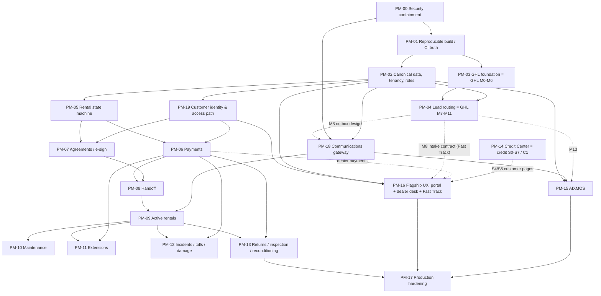

# TMMT ROADMAP — product milestones (PM-)

- **Date:** 2026-09-21 · **Canon:** `AIXMOS537/TMMT` `origin/master` @ `4cca6835` (Vercel `tmmt-ops`)
- **Companions:** `TMMT_MASTER_BUILD_SPEC.md` (the spec; section refs below are `§n` of it) and `TMMT_FLAGSHIP_READINESS_REPORT.md`.
- **Nature:** a plan, not a record of work. Nothing listed here has been started by writing it.

## 0. Naming and ownership rules

- Product milestones use the prefix **PM-** so they never collide with:
  - **GHL router M0–M13** (branches `feat/ghl-router-m*`, worktrees `C:\dev\wt-ghl-*`; plan `TMMT_GHL_ROUTER_IMPLEMENTATION_PLAN.md`)
  - **Credit S0–S7** (`docs/credit/CREDIT_ENGINE_AUDIT.md`) and the in-flight **Credit C1** engine repair (`C:\dev\wt-credit-c1`)
  - **Phase 2A security A1–A12** (`TMMT-PHASE-2/PHASE_2A_SECURITY_EXECUTION_PLAN.md`)
  - canon remediation IDs (C-01…C-24, F-13…F-18, T-01…T-03, G-01/G-02) and ONE_PROJECT_PLAN Phases 1–5.
- Where an active track owns the work, the PM milestone **references** it and adds nothing that competes with it. PM-03, PM-04 and PM-14 are reference-only milestones. GHL M-numbers and Credit S/C-numbers are quoted as the owning tracks define them and are **never renumbered** here.
- Every one of the 45 numbered defects (SPEC §28) and every SEC-xx finding maps to a PM milestone, an explicit backlog item below, a security workstream, a GHL milestone, a Credit milestone, an accepted limitation or an explicit deferred item: `docs/product/_review/DEFECT_TRACEABILITY.md` (0 orphans). KD-38 (PM-16a backlog) and SEC-20 (PM-17 gate) were added to this roadmap on 2026-09-22 so that nothing is unowned.
- Two milestones were added to the conceptual order because the dependency graph demands them:
  - **PM-18 Communications gateway** (the outbox drainer and consent at send time). Rentals, payments and the portal all need to message customers. Today nothing can send safely [spec §16].
  - **PM-19 Customer identity and access path.** The portal, e-sign and customer payments all need a signed-in customer. Today tier `none` is locked out [spec §2.1, KD-08].
- Every milestone inherits the Definition of Done [spec §31.2]. Every prod migration, prod config change, merge to master or live-automation switch-on needs **owner approval + the prod write baton**. Money, send, sign and prod deploy stay owner-gated.

## 1. Dependency graph

Dotted edges are dependencies on another track's milestone.

## 2. Execution order (waves)

| Wave | Milestones | Can run in parallel with |
|---|---|---|
| 0 | **PM-00** | the GHL and credit tracks keep going on their branches |
| 1 | **PM-01** | PM-03 (GHL M0–M2 merge/apply), credit C1 |
| 2 | **PM-02**, then **PM-19** | PM-03/PM-04 (GHL), PM-14 (credit) |
| 3 | **PM-05**, **PM-18** | PM-16a (portal shell, read-only status) |
| 4 | **PM-06**, **PM-07** | PM-16b (dealer desk read-only) |
| 5 | **PM-08**, **PM-09** | PM-15 (AIXMOS scoped tools) |
| 6 | **PM-10**, **PM-11**, **PM-12**, **PM-13** | PM-16c (portal rental/billing/agreements) |
| 7 | **PM-17** (plus continuous hardening from wave 1) | – |

Sizing (S/M/L) is a relative guess for planning, not a commitment.

## 3. Milestones

### PM-00 — Security containment · S–M · FIRST

- **Goal:** close or contain every P0/HIGH hazard, including latent ones that would switch on when other tracks land (GHL webhooks going live, middleware opened, signup used). Only small, reversible changes.
- **Depends on:** nothing.
- **Existing foundation:**
  - Profiles escalation already **REMEDIATED** on prod 2026-09-21 (2A-A1; ledger `20260921234148`).
  - `partner_acquisition` least-privilege policies already **REMEDIATED on prod 2026-09-22** (ledger `20260922005007`; prepared commit `620e100e` on `sec/partner-acquisition-rls`, not merged). Historical root cause: `authenticated ALL USING (true)`. Nothing in PM-00 touches those policies.
  - The prod write baton RPCs.
  - `payment_obligation_reconciliation` evidence CHECK.
  - `outbound-gate.ts` (fails closed).
  - The kill-switch env pattern (`GHL_AUTO_OPS`, `GHL_FORM_AUTO_CASE`).
- **Scope, split by who acts:**

  | Item | What | Who |
  |---|---|---|
  | 00-a | `partner_acquisition` (SEC-01/KD-01): the policy fix is **REMEDIATED on prod** (2026-09-22). Remaining follow-ups, **reference only**, owned by the `sec/partner-acquisition-rls` workstream: land branch `620e100e` on master, `KNOWN_UNAPPLIED` 54→53, `docs/security` record (TMMT-SEC-008). `internal_team` future access = product decision (owner). Hold PR #255 (feeds it) until the branch lands | other workstream + owner (merge) |
  | 00-b | AUTH-SIGNUP-001 — **OPEN / OWNER ACTION REQUIRED** (unverified): turn off GoTrue public signup (2A-A4a), later server-side invite (A4b). Containment ≠ tenant authorization; RLS must hold for a hostile authenticated account either way | owner (Phase 2A) |
  | 00-c | Remove the latent auto-merge / branch-delete in `session-autopilot.yml` (LATENT RISK: auto-merge off, recent merges human, master unprotected); keep `allow_auto_merge=false` | owner decision → small PR |
  | 00-d | `mission-daily.yml`: schedule defaults `audience=owner, notify=false` (or disable); fail on non-2xx / non-JSON. **Must land before PM-01 opens machine routes** (the crons' handlers do not run today; opening `/api/mission/*` re-arms the broadcast) | owner decision → small PR |
  | 00-e | GHL-set business state kill switches: `GHL_AUTO_OPS=false` and `GHL_FORM_AUTO_CASE=false` in Vercel env (V1, V4) **plus a one-line precedence fix** in `src/lib/ghl/handlers/form.ts:135-137` so a payload `create_case: true` cannot override the env `false` (SI-04; TMMT-SEC-007; GHL track reviews) | owner (prod config + baton) + code PR |
  | 00-f | GHL tag/event → payment path: never "Paid" from GHL; tag-only or amount-only events at most create an **unverified** record; no commission/token grant from them (V2/V2b, KD-05). Coordinate the file with the GHL track (webhook route) | code PR, coordinate GHL owner |
  | 00-g | Disable trigger `lead_to_active_customer` (KD-07) | prod baton |
  | 00-h | DNC/opt-out check before outbound GHL tag/field/stage writes and the email branch (SEC-08/KD-13). Use `assertOutboundAllowed`. Coordinate with GHL M8 so the gate moves into the gateway later | code PR, coordinate GHL owner |
  | 00-i | Fix the open redirect in `api/auth/callback` (`route.ts:18,32`) with a test for `/%5Cevil.com` (SEC-09) | code PR |
  | 00-j | `change_log` authenticated `ALL true` → staff-scoped (SEC-12) | migration + baton |
  | 00-k | Visibility only: record owner decisions on deployed edge `intake` v7 and `capture-drive` (GHL B-4/B-5) | owner via GHL track |

- **New build:** only guards, tests and config. No features.
- **Exit criteria:**
  - Each item is closed with evidence: a query result, a test, or an owner decision recorded by date.
  - `pg_policies` shows no authenticated `ALL true` on `partner_acquisition` or `change_log`.
  - A signup `POST` without an invite is refused, or the toggle is recorded off.
  - Neither workflow can merge, delete or broadcast.
  - A GHL fixture with `amount` + revenue tag creates no "Paid" row.
  - A DNC number blocks the tag write in a test.
  - The open-redirect test passes.
  - The trigger is disabled (catalog check).
- **Owner:** none for most items (this product lane), with 00-a (partner-acquisition workstream, landing only), 00-e/00-f/00-h/00-k (coordinate with the GHL track) and 00-b (Phase 2A). No PM-00 item re-does the two prod security fixes already applied (profiles, `partner_acquisition`).

### PM-01 — Reproducible build and CI truth · M

- **Goal:** make "green" mean something, and make prod reproducible from the repo before any schema work.
- **Depends on:** PM-00, in particular 00-d before the middleware change.
- **Existing foundation:**
  - `verify.yml`.
  - 11 PGlite rehearsals in `scripts/tests/sql`.
  - `migration-drift.test.ts`.
  - `supabase/schema/live-ledger-2026-09-07.tsv`.
  - GHL M2 (codifies the intake/GHL tables).
  - `middleware.test.ts`.
- **New build:**
  1. Machine-route fix. Today the auth middleware redirects every machine API to `/login`, so the Vercel crons' handlers never execute (`middleware.test.ts:237` pins it). Let `/api/cron/*`, `/api/audit/*`, `/api/mission/*` and `/api/ops/command` reach their own secret checks: 401 without a secret, never 307. Update the pinning test. **`/api/license/*` is split out** (SI-05): `heartbeat` has no secret and neither `heartbeat` nor `provision` has a rate limit, so it stays behind the middleware until the owner chooses (a) add a credential + `isRateLimitedDurable` first, or (b) keep it closed (TMMT-BUILD-001 default). **This is not an isolated one-line repair:** gate = ships only after 00-d (mission-daily safe) and together with or after item 2 (else the recompute runs twice).
  2. Remove the duplicate journey recompute (Vercel vs pg_cron). OWNER DECISION on which one stays.
  3. Wire the SQL rehearsals into CI: `profiles-access-columns` (2A-A3), `prod-write-baton`, `quarantine-unverified-payment-followups`, `agent-queue-migrations`, `g01`/`g02`. Make `automation-repairs` run with `--repaired`. The two path-arg scripts (`automation-migrations`, `classifier-migration`) have **undetermined targets** (SI-06): list them as `pending` with a reason until evidence is found; do not claim they run in CI.
  4. Reconcile ledger drift for everything outside GHL M2's scope. Covers the rental core, payments and credit-adjacent tables: a prod schema snapshot into the repo, a repo↔prod version map, and quarantine markers for staged/parked SQL. The landmine stays unapplied.
  5. Add `tsc` to `scripts/verify.sh`. Add `.gitattributes` LF for `*.ts`/`*.tsx`. Guard tests fail on zero targets. The `pii-guard` job fails when `PII_DENYLIST` is unset.
  6. Stale-comment clean-up (KD-41). Put the default-ACL REVOKE rule in the migration checklist (SEC-16).
- **Exit criteria:**
  - Both Vercel crons return 2xx with a secret and 401 without one. The KPI table gets a new row.
  - Rehearsals run in CI and fail the build on regression.
  - A fresh DB built from the repo baseline matches prod's table/policy/function inventory (diff report = empty or explained).
  - The Windows test failures are gone.
- **Owner:** none (product lane). It must not duplicate GHL M2's codification: split the table list with that track first.

### PM-02 — Canonical data, tenancy and roles · L

- **Goal:** one answer each for person, vehicle, rental, tenancy column and role source. These are owner decisions recorded as ADRs, then the smallest migrations that enforce them.
- **Depends on:** PM-01 (reproducible schema). It coordinates with GHL M5 (identity links) and M9 (isolation matrix).
- **Existing foundation:**
  - [SoR] rulings.
  - `is_org_member()`, `org_roles`.
  - `profiles` protected columns.
  - `vehicles` ↔ `fleet` bridge.
  - `client_journey`, `client_renter_status`.
  - `docs/saas/TENANT_ISOLATION_TEST_MATRIX.md`.
- **New build / decisions:**
  1. **OWNER DECISION** on the canonical vehicle table (`fleet` per SoR vs `vehicles` as the booking FK target). Mark the 43 `fleet` rows historical, or confirm which are live (the 21 'Rented' contradiction).
  2. Person spine direction: E.164-first matching. **Coordinated with GHL M5; do not build a competing identity table.**
  3. Tenancy: one column name, and resolve the `org_id`/`organization_id` duplication on `incoming_leads`.
  4. Roles: pick JWT or `profiles.role` as the source and sync the other. Bring `portal_role` under management or retire it. Take `investor` out of `is_internal_ops()`. Remove investor writes on `rental_ledger`.
  5. **Per-org staff scope** replacing global `is_staff()` on the `*_org_all` policies (SEC-03). This is the largest security change; phase it table-group by table-group, each with a two-org rehearsal.
  6. `org_roles` 42P17 recursion — **reference only: Phase 2A A12 owns the fix** (SI-09). PM-02 builds nothing here; the per-org helper in item 5 must work while A12 is open.
  7. Ghost tables (§9.5): for each, **OWNER DECISION** to create it (from the staged migration where one exists) or remove the code. Fix column drift (`amount_past_due`, `contact_email`, `vin`).
  8. Drop `insurance.login_*` columns.
  9. Staff-document signed URLs scoped by org.
- **Exit criteria:**
  - ADRs recorded.
  - A two-org rehearsal proves that staff of org A cannot read or write org B on every migrated table group.
  - No code path queries a non-existent table or column (a static check against the schema snapshot).
  - The operator tier works end to end.
- **Owner:** none (product lane). The identity pieces are shared with GHL M5 and the isolation matrix with GHL M9.

### PM-19 — Customer identity and access path · M

- **Goal:** a renter or credit client can sign in and see only their own records. Signed-out customers can reach the pages meant for them.
- **Depends on:** PM-02 (role source, per-person RLS pattern), PM-00 00-b (signup policy).
- **Existing foundation:**
  - `customer` JWT role and `profiles.role='customer'`.
  - `current_profile_email()` self-read policies on the credit tables.
  - `client_renter_status`, `/status/[token]` (staff-minted token link), `src/lib/client-self-service.ts`, `status/opt-in-actions.ts`.
  - Licence-upload single-use token pattern.
  - `signup-invite.ts`.
- **New build:**
  - Middleware: make `/intake*` and `/status/[token]` public (fix R3). This is **consistent with ONE_PROJECT_PLAN Phase 1's stated intent**.
  - A `customer` tier home (not `/no-access`).
  - Customer invitation or claim flow tied to an existing lead/booking. It must be server-issued, must integrate with Phase 2A A4b (the authoritative account-provisioning path) rather than fork it, and must not reopen AUTH-SIGNUP-001. Do not invent another auth system.
  - Per-person RLS, phased (SI-10): **interim key = the existing `current_profile_email()` policies** (email is trusted only because `profiles.email` is a protected column); the spine-keyed version is **BLOCKED on GHL M5 (identity links) / PM-02** and is not built here.
  - Fix operator home (R2), Dashboard link (R4) and portal nav leak (R5). Link or retire the orphaned screens (R6).
  - Current renter status/login behaviour (`/status/[token]` walled, tier `none` → `/no-access`) is **not** a customer access path; nothing in PM-19 is complete until the tier × route matrix test proves it.
- **Exit criteria:**
  - A tier × route matrix test in CI covers all 7 tiers plus signed-out.
  - A customer sees only their rows in a two-customer rehearsal.
  - No self-signup without an invite.
- **Owner:** none (product lane).

### PM-03 — GHL foundation (reference: GHL M0–M6)

- **Goal:** per GHL plan. Honest baseline, tenant holes closed, prod codified, connection registry, discovery, identity links, webhook inbox.
- **Depends on:** PM-01 for the shared CI rehearsal wiring (coordinate), plus the owner gates in that plan: M0–M2 approval, read-only PITs, locating the off-repo contacts job.
- **Existing foundation:** branches `feat/ghl-router-m0…m6` (none merged, none applied).
- **New build in this lane:** **none.** This roadmap adds no GHL schema or code.
- **Exit criteria:** as defined by the GHL track, including release blockers B-1…B-8 closed.
- **Owner:** **GHL router track.**

### PM-04 — Lead routing and universal intake (reference: GHL M7–M11)

- **Goal:** router core + simulator, universal intake + outbox design, isolation matrix in CI (M9, release blocker), first live intake (M10), migrate the other surfaces (M11). Closes the 8 unsafe public writers and ANON-TENANT-001.
- **Depends on:** PM-03, PM-02 (tenancy/identity decisions), owner answers D-1…D-10.
- **New build in this lane:** none.
- **Exit criteria:** GHL track's.
- **Owner:** **GHL router track.** PM-16 (Fast Track) and PM-18 (outbox) consume its M8 contract.

### PM-05 — Rental state machine · L

- **Goal:** one guarded transition function writing an append-only event log. It is the only writer of rental status [spec §10].
- **Depends on:** PM-02 (canonical vehicle and person), PM-00 00-g (trigger off), 00-e (GHL auto-ops off).
- **Existing foundation:**
  - `bookings` (typed, status CHECK, `bookings_no_overlap` EXCLUDE live).
  - `createBooking` / `placeHold` / `checkAvailability` / `enforceFloor` (tested).
  - `vehicle_events` enum.
  - `client_journey` recompute.
  - `rental_pricing_rules`.
  - The `payment_obligation_reconciliation` evidence-CHECK pattern.
- **New build:**
  - The transition function and event table.
  - RLS change: staff cannot UPDATE `bookings.status` directly.
  - Hold expiry.
  - Vehicle state derived from bookings and maintenance events.
  - GHL stage changes become **events only** (they can request, not set). Coordinate with GHL M6/M7.
  - `active_customers` / `former_customers` → read-only history (OWNER DECISION).
  - Desk rentals board on the new states.
- **Exit criteria:**
  - A rehearsal covers every allowed transition and rejects every forbidden one.
  - The overlap guard holds.
  - No code path or trigger writes a rental status outside the function (static check).
  - `partner_vehicle_rentals()` reads status, not the clock.
- **Owner:** none (product lane).

### PM-18 — Communications gateway · M

- **Goal:** customers can be messaged safely. A single path: stage → consent check at send → owner hold where required → one drainer → delivery write-back [spec §16]. **Queued ≠ delivered:** today 35 rows are queued and none has ever been delivered; the gateway is complete only when every message has a defined **triggering event, recipient, channel, consent/suppression check, queue state, delivery attempt, provider result, failure/retry policy, audit record and operator visibility** (tasks TMMT-COMM-001…006). Activating the dormant `mission-daily` job is never a shortcut for any of this.
- **Depends on:** PM-00 00-h, PM-02, **GHL M8 outbox design** (consume it, do not fork it). G-02 internal/customer separation (draft PR #243).
- **Existing foundation:**
  - `automation_outbox` (35 stuck rows to triage, not blast).
  - `outbound-gate.ts`.
  - `va-task-outbox.ts`, `/command/outbox` (orphaned UI).
  - SMS owner-hold (`auto-reply-policy.ts`).
  - `do_not_contact_numbers`.
  - Email gate.
  - `sendConversationMessage` / `sendSms` / `sendEmail` (orphaned senders).
- **New build:**
  - The drainer (a cloud-hosted job, not n8n on a laptop).
  - A GHL per-channel DND read.
  - DNC checks added to `on_new_lead` and `sweep_payment_due_notices` enqueue paths.
  - Delivery status write-back.
  - Rental/payment message types: payment due, agreement ready, handoff, return reminder. Collections copy must follow the mercy rules.
  - The consent regression test required by SoR §5.6.
  - Fail on missing config (FS-02).
- **Exit criteria:**
  - A DNC, opt-out or DND contact is never sent to (CI test).
  - The drainer is idempotent under retry.
  - The first customer send is switched on only by an owner decision with the baton.
- **Owner:** shared. The outbox **design** belongs to GHL M8; rental message types and the drainer operation belong to this lane.

### PM-06 — Payments · L

- **Goal:** processor-verified money. Nothing is "Paid" without evidence [spec §11].
- **Depends on:** PM-05, PM-19 (customer pays from the portal), **`TMMT_PAYMENT_ARCHITECTURE.md`** (to be written; processor decision = OWNER DECISION), PM-00 00-f.
- **Existing foundation:**
  - Stripe per-tenant webhook with signature + replay (`api/agent/stripe/webhook/[slug]`).
  - `payments` table (orphaned, typed).
  - `rental_ledger` entry types (deposit, deposit_return, payment, deduction, refund).
  - `payment_obligation_reconciliation`.
  - Org Stripe/Connect columns.
  - GHL checkout links (how money is taken today).
- **New build:**
  - One money table.
  - A unique processor event id.
  - The deposit (ʿarbūn) lifecycle.
  - Allocation with no interest.
  - `late_fee` with charity disposition, excluded from revenue and owner split.
  - Refunds, failures, disputes.
  - A daily reconciliation report.
  - Manual "paid" only with named verifier + evidence ref.
  - Commission/token grants only from verified payments.
  - Replace the date-only overdue sweep with a ledger-based one.
  - Mercy-in-collections policy (grace, hardship plans) ⚖️.
- **Exit criteria:** the money test matrix [spec §25.2] passes in CI, and a reconciliation report shows 0 unexplained differences on a test processor.
- **Owner:** none (product lane). Money switch-on is owner-gated.

### PM-07 — Agreements and e-sign · L

- **Goal:** agreements generated, signed by an authenticated customer, countersigned, versioned, audited [spec §12].
- **Depends on:** PM-05, PM-19, OWNER DECISION on the signing provider, ⚖️ legal review of the templates (rental; LTO as two documents under Ijārah).
- **Existing foundation:**
  - `contract_instances` (typed, orphaned).
  - `documents` (orphaned).
  - `lto_agreements`.
  - The private `staff-documents` bucket.
  - `document-actions.ts`.
- **New build:**
  - Templates and rendering with a content hash.
  - The signature ceremony.
  - Countersignature.
  - Versioned storage (stop delete-on-replace).
  - Customer-scoped bucket policy.
  - Airtable signature/document migration (SoR §6 step 3, ⚖️ FCRA). This is the step that lets Airtable be switched off.
- **Exit criteria:**
  - A signed agreement can be re-verified by hash.
  - An audit record exists per ceremony.
  - No anonymous signature path remains.
- **Owner:** none (product lane).

### PM-08 — Handoff · M

- **Goal:** READY_FOR_HANDOFF → ACTIVE only when signed + deposit verified + insurance verified + lot release approved, recorded by an authenticated staff member with photos.
- **Depends on:** PM-06, PM-07.
- **Existing foundation:**
  - `bookings.insurance_verified` / `lot_release_approved`.
  - `rental_insurance_selections`, `rental_insurance_products`.
  - `vehicle_handover` checklist.
  - `vehicle_media`, `vehicle_events` (turnover).
  - Open PR #251 (inspection walk-around photos).
- **New build:**
  - Staff-authenticated handover (revoke anon insert; this is the ANON-TENANT-001 item for this table, coordinated with GHL M1).
  - The insurance verification step.
  - The pickup checklist in the portal.
- **Exit criteria:** a handover cannot be recorded without the four preconditions (test), and anon insert is revoked.
- **Owner:** none.

### PM-09 — Active rentals · M

- **Goal:** the live rental board. Due payments, reminders, contact log pointers, status from events.
- **Depends on:** PM-08, PM-18.
- **Existing foundation:**
  - `/bookings` board.
  - `client_journey` good standing.
  - `sweep_payment_due_notices` (to be re-pointed through the gateway).
- **New build:** the active-rental view, reminders via PM-18, and a customer portal rental page (PM-16c).
- **Exit criteria:** every active rental shows vehicle, agreement, verified balance and next due date, from one source.
- **Owner:** none.

### PM-10 — Maintenance · M

- **Goal:** maintenance jobs drive vehicle state.
- **Depends on:** PM-09 (and PM-02 vehicle decision).
- **Existing foundation:** `maintenance_appointments`, `cases`, `vendor_jobs`, `/maintenance`, `/cases`, `/vendors`, `/workflow-vendors`, `(vendor)/vendor`.
- **New build:**
  - Maintenance → vehicle state transition.
  - One vendor table.
  - Service intervals.
  - Cost roll-up per vehicle.
  - Fix the double status-history trigger.
- **Exit criteria:** a vehicle in maintenance cannot be booked, and it returns to available only via inspection.
- **Owner:** none.

### PM-11 — Extensions · S–M

- **Goal:** an extension is a new priced segment on the same rental, with its own payment. No interest or fee-as-revenue.
- **Depends on:** PM-09, PM-06.
- **Existing foundation:** `bookings` + overlap guard, `rental_pricing_rules`, quote API.
- **New build:** the extension segment and transition. The GHL `extended` stage becomes an event request only.
- **Exit criteria:** an extension cannot overlap another booking, and it cannot be active without a verified payment or an approved exception.
- **Owner:** none.

### PM-12 — Incidents, tolls and damage · M

- **Goal:** record damage, incidents, tolls and violations against booking and vehicle, with fair, merciful recovery.
- **Depends on:** PM-09, PM-06.
- **Existing foundation:** `vehicle_damage_reports` (enum statuses), `vehicle_events`, `cases`, `vehicle_media`, PR #251 photos.
- **New build:**
  - A tolls/violations entity.
  - The incident flow.
  - Charge-back through PM-06 with owner approval.
  - ⚖️ review of recovery terms.
- **Exit criteria:** every charge links to evidence and an approval, and nothing is charged automatically.
- **Owner:** none.

### PM-13 — Returns, inspection and reconditioning · M

- **Goal:** RETURN_INITIATED → RETURNED → inspected → deposit settled → reconditioned → AVAILABLE.
- **Depends on:** PM-09, PM-06 (deposit settlement), PM-12 (damage).
- **Existing foundation:** `vehicle_handover` (Return), `vehicle_events.return_inspection`, `fleet_car_inspections`, `rental_ledger` `deposit_return`/`deduction`.
- **New build:** the return scheduling, inspection, deposit settlement and reconditioning states.
- **Exit criteria:** a vehicle becomes AVAILABLE only through inspection, and deposit settlement is ledgered with evidence.
- **Owner:** none.

### PM-14 — Credit Center (reference: credit S0–S7, C1)

- **Goal:** per the credit track. Grounded, case-based, reviewable dispute engine (C1), then S1…S7 (schema, parser, analysis, customer upload, customer review, case packet + booking, e2e proof).
- **Depends on:**
  - Owner inputs S0 (HOLD).
  - D-22b perform-vs-refer.
  - ⚖️ counsel before `croa_contracts_attorney_approved` flips.
  - PM-02 (org model for credit cases) and PM-19 (customer path for S4/S5).
- **New build in this lane:** none. PM-16 provides only the portal page that will host S4/S5.
- **Exit criteria:** credit track's, including the compliance flags in spec §18.3.
- **Owner:** **credit track (C1 in `wt-credit-c1`, then S-series).**

### PM-15 — AIXMOS · M–L

- **Goal:** AIXMOS agents act only through authenticated, scoped TMMT services, with confirm-gated actions [spec §19].
- **Depends on:** PM-02 (scoped services and roles), PM-18 (sends), **GHL M13** (read and action tools over `LeadRoutingService` / `GhlGateway`).
- **Existing foundation:**
  - SMS agent (owner-hold, kill switch, spend cap, PII redaction).
  - Ops AI.
  - Agent spine (`agent_definitions`/`agent_jobs`, scoped worker role).
  - Prequal lane.
  - `/pocket/agents` pause/resume.
- **New build:**
  - Voice agent: owner hold + no nil-UUID fallback (KD-27).
  - A cloud-reachable, authenticated model gateway, or cloud-only models for customer-facing paths (OWNER DECISION).
  - Agent registry and kill switch on the admin console.
  - Retire `aria/` and `apps/engine` (or quarantine them).
  - Fleet/maintenance/document helpers as NEW BUILD, draft-only.
- **Exit criteria:**
  - No agent path writes outside a named service.
  - Every action is attributed and reversible.
  - No customer-facing feature depends on a tailnet/localhost endpoint.
- **Owner:** shared with GHL M13 for lead tools.

### PM-16 — Flagship UX (customer portal, dealer desk, Fast Track) · L

- **Goal:** the three faces [spec §23] on one kit, with the owner-URGENT ports.
- **Depends on:** PM-19 and PM-02 (all sub-parts). PM-06 for billing/dealer payments; GHL M8 for Fast Track; credit S4/S5 for credit pages.
- **Existing foundation:**
  - Token `ui/*` kit (T01 landed as `9f6a0636`).
  - `BrandProvider`.
  - `/status/[token]` panel.
  - `(admin)` desk screens.
  - Rescued sources: TMMT-OS-ARCHIVE `(client)/client/*` (15), `(internal)/internal/dealer/*` (10), T07 Fast Track core (11 files), T08 dealer-admin invite flow.
- **New build, in slices:**
  - **16a (after PM-19):**
    - The URL-shape OWNER DECISION.
    - A portal shell with read-only status, documents upload and credit education.
    - One nav definition per face.
    - A toast/feedback component.
    - Dark mode on the credit face.
    - Backlog (added 2026-09-22 so KD-38 has an owner): `/learn/status` must stop inventing `AIX-STUB-` references — render an honest "not available yet" placeholder; the credit track owns any real content behind it.
  - **16b (after PM-02):** dealer desk read-only (inventory, leads) and the dealer-admin invite folded into `signup-invite.ts` (respect protected columns).
  - **16c (after PM-05…PM-09):** portal rental, billing, agreements, support pages; dealer payments/collections (after PM-06; mercy/no-riba rules).
  - **16d (after GHL M8):** the Fast Track port, with its `applications` migration **rewritten first**: org_id, staff-only read, no `WITH CHECK (true)`, REVOKE grants, durable limiter, baton.
  - Every port needs the Next 16 / React 19 / Tailwind 4 pass.
- **Exit criteria:**
  - Each page meets the DoD (mobile, four states, permissions, isolation).
  - No score or financing claims.
  - Nav generated from the tier map.
- **Owner:** none. **This is the open lane**: no active worktree owns the portal or dealer desk.

### PM-17 — Production hardening · M (continuous from wave 1)

- **Goal:** operate safely at more than one tenant [spec §26, §27, §32].
- **Depends on:** PM-13, PM-15, PM-16 for the final gate. Pieces start early.
- **Existing foundation:** Sentry, pg_cron history, audit_events, rollback runbook, prod write baton.
- **New build:**
  - Sentry PII scrubber.
  - Health screen: crons, the live GHL feed (7 h staleness + truncation alert until M5/M6 retire the poller), webhooks, outbox age, money reconciliation.
  - A non-production Supabase for E2E (GHL B-7).
  - E2E in CI.
  - Middleware → proxy convention and Sentry import migration.
  - Merge controls: plan upgrade or a separate merge identity with the baton checked in CI.
  - Backups/restore drill.
  - Retire `apps/engine`, `aria/`, the Airtable webhooks (after SoR §6).
  - Gate (added 2026-09-22 so SEC-20 has an owner): **PARTNER-TENANT-001** (caller-chosen tenant on partner telemetry, GHL B-8) must be closed by the GHL track **before the first external partner** is onboarded; PM-17 checks it, does not build it.
- **Exit criteria:** production readiness checklist [spec §32] all green, owner sign-off.
- **Owner:** none.

## 4. Milestone summary

| PM | Name | Size | Depends on | Owning track |
|---|---|---|---|---|
| PM-00 | Security containment | S–M | – | this lane + partner-acq workstream + Phase 2A + GHL (coordinate) |
| PM-01 | Reproducible build / CI truth | M | PM-00 | this lane (split tables with GHL M2) |
| PM-02 | Canonical data / tenancy / roles | L | PM-01 | this lane (+GHL M5/M9) |
| PM-19 | Customer identity & access path | M | PM-02 | this lane |
| PM-03 | GHL foundation | – | PM-01 | **GHL M0–M6** |
| PM-04 | Lead routing / intake | – | PM-03, PM-02 | **GHL M7–M11** |
| PM-05 | Rental state machine | L | PM-02, PM-00 | this lane |
| PM-18 | Communications gateway | M | PM-00, PM-02, GHL M8 | shared (GHL M8 design) |
| PM-06 | Payments | L | PM-05, PM-19, payment architecture doc | this lane |
| PM-07 | Agreements / e-sign | L | PM-05, PM-19 | this lane |
| PM-08 | Handoff | M | PM-06, PM-07 | this lane |
| PM-09 | Active rentals | M | PM-08, PM-18 | this lane |
| PM-10 | Maintenance | M | PM-09 | this lane |
| PM-11 | Extensions | S–M | PM-09, PM-06 | this lane |
| PM-12 | Incidents / tolls / damage | M | PM-09, PM-06 | this lane |
| PM-13 | Returns / inspection / reconditioning | M | PM-09, PM-06, PM-12 | this lane |
| PM-14 | Credit Center | – | S0, D-22b, counsel, PM-02, PM-19 | **credit S0–S7 / C1** |
| PM-15 | AIXMOS | M–L | PM-02, PM-18, GHL M13 | shared |
| PM-16 | Flagship UX | L | PM-19, PM-02 (+06, GHL M8, credit S4/S5) | this lane (open lane) |
| PM-17 | Production hardening | M | all | this lane |

## 5. Recommended FIRST implementation milestone: PM-00 Security containment

**Why PM-00 first:**

1. **Several hazards are latent and will switch on as other tracks succeed.**
   - GHL-set business state (V1) and GHL-tag payments (V2) have never fired only because no verified GHL webhook has ever arrived. GHL M6/M10 will change that.
   - The mission-daily broadcast is dormant only because middleware blocks it. PM-01's machine-route fix would re-arm it.
   - Signup may be open (AUTH-SIGNUP-001, unverified) while `change_log` is still open to any signed-in user; `partner_acquisition` is already remediated on prod but its branch has not landed.
   - Containing these now is cheap. Containing them after they fire means cleaning up data and messages already sent.
2. **Most of it is small and reversible.** It is owner toggles (signup, env kill switches, workflow defaults), one-file fixes with tests (open redirect, GHL payment guard, DNC check on tag writes), one trigger disable and one policy change. None of it needs a schema redesign.
3. **It does not compete with any active track.**
   - The `partner_acquisition` fix is done on prod; landing its branch stays with its own workstream. No PM-00 item touches those policies.
   - The GHL-file items are guards the GHL track can absorb into M6/M8.
   - Nothing touches credit files.
4. **Every later milestone assumes it.** A state machine, payments or a portal built on a database where GHL can set rental truth, a trigger can fabricate rentals and cross-tenant policies are open would be built on sand.

**First concrete step inside PM-00, in this order:**

1. Owner decisions: 00-b signup, 00-c session-autopilot, 00-d mission-daily, 00-e kill-switch env values.
2. The partner-acquisition workstream lands branch `620e100e` (00-a follow-up; the policy is already on prod).
3. One small code PR from this lane: 00-i open redirect + 00-f GHL payment guard + 00-h DNC check on outbound GHL writes + the 00-e V4 precedence fix, each with tests. The GHL track reviews the webhook-file changes.
4. Prod baton items: 00-g trigger disable and 00-j `change_log` policy.

**Then PM-01.** It is the first milestone that is purely this lane's own engineering. PM-02 cannot start until the repo can rebuild prod.
