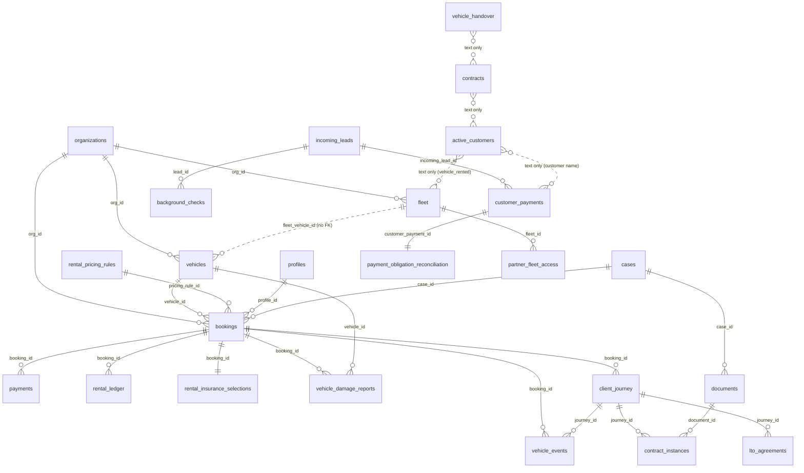

# E3 — Data model, rental state machine, payments, agreements/e-sign, fleet, system of record

Evidence worker E3 · 2026-09-21 · canon `AIXMOS537/TMMT` @ `4cca6835` (worktree `C:\dev\wt-master-extraction`) · prod Supabase `uapxakmlwnpfsftfeezx`.

Method: prod catalog reads only (`information_schema`, `pg_catalog`, `pg_policies`, `pg_trigger`, `pg_proc` definitions, `cron.job`, `storage.buckets`, `supabase_migrations.schema_migrations`) plus **aggregate** `count(*)` and `GROUP BY status` counts. No row contents, no PII, no writes. Code evidence = `grep` of `.from('<table>')` / `.rpc(...)` in `src/` + `supabase/functions/`. Row counts are exact `count(*)` taken 2026-09-21 and will drift (other sessions are writing today).

Status vocabulary: EXISTING/WORKING · EXISTING/PARTIAL · EXISTING/BROKEN · PLACEHOLDER · ORPHANED · LEGACY · PLANNED ONLY · MISSING · UNKNOWN.

---

## 0. Headline facts (verified, not inherited)

| Claim given to verify | Verdict | Evidence |
|---|---|---|
| bookings = 0 rows | **TRUE** | `count(*)=0`. First writer (`createBooking`, status `hold` only) exists in code since 2026-09-17. |
| rentals historically lived in `active_customers` and got overwritten | **CONSISTENT** | `active_customers` 35 rows, **all 35 `status='Removed'`**; no rental dates/ids linking to a booking; Airtable-shaped text columns (`vehicle_rented`, `payment_amount` text). A DB trigger (`lead_to_active_customer`) also inserts into it (see §2). |
| `people` is a GHL mirror, not a spine | **TRUE** | 1,210 rows; 1,205 have `ghl_contact_id` and no lead/customer link; only 2 link a lead, 2 link an active_customer. Written only by `linkFormToPerson` (`src/lib/people/upsert.ts`, called from `src/app/forms/actions.ts`, `src/app/workflow-actions.ts`). |
| fleet / active_customers are HISTORY (SQUARE ONE) | **DATA DISAGREES WITH THE DECISION** | `fleet.vehicle_status`: Rented 21 · Under Maintenance 5 · Available 4 · Coming Soon 3 · Retired 6 · null 4. Nothing in the DB marks these as historical; `bookings/actions.ts` still reads `fleet.vehicle_status` as live availability. |
| ~876 leads, 0 bookings | **TRUE (892 leads today)** | `incoming_leads` 892; `agent_status='NEW'` on **all 892**; `status` null on 759. |
| twilio/cal/stripe unset on all orgs | **TRUE** | `organizations` 9 rows: `stripe_customer_id`, `stripe_connect_account_id`, `twilio_inbound_number`, `cal_com_event_link` null on **9/9**. |
| packages = entitlements not a price book | **CONSISTENT** | `packages` 10 rows, `package_entitlements` 94; prod migration `packages_price_columns` (2026-09-01) added price columns, but no billing-interval / checkout wiring found in code paths examined. Not re-audited in depth here (E-other). |

---

## 1. Data model (prod catalog)

All public tables have RLS **on** (checked `relrowsecurity` for every table listed). "Pol" = number of policies. "Code" = files that call `.from('<table>')`.

### 1.1 Rental core

| Entity | Table | Rows | Key columns | FKs | Pol | Code (reads/writes) | Status |
|---|---|---|---|---|---|---|---|
| Reservation/booking | `bookings` | **0** | `ref_code` (unique), `status` text CHECK `hold|confirmed|active|completed|cancelled|no_show`, `starts_at/ends_at`, `vehicle_id`, `quoted_*_cents`, `pricing_rule_id`, `insurance_coverage_source`, `insurance_verified`, `lot_release_approved`, discount-approval cols, `org_id` | vehicles, profiles, cases, rental_pricing_rules, organizations | 4 | W: `src/lib/rental-pricing/create-booking.ts:152` (insert `hold`); R: `src/app/(admin)/bookings/actions.ts:107,264`; RPC `partner_vehicle_rentals()` | EXISTING/PARTIAL (hold-only writer, never used) |
| Double-booking guard | `bookings_no_overlap` EXCLUDE gist (`vehicle_id =`, `tstzrange &&`, where status in hold/confirmed/active) | — | — | — | — | `create-booking.ts` treats SQLSTATE 23P01 as conflict | EXISTING/WORKING (applied on prod as `bookings_no_double_booking` v20260917200051). `BOOKING_GUARD_NOTE` in code still says "until it is applied" — stale comment. |
| Vehicle (booking FK target) | `vehicles` | 27 | `label, make, model, year, vin, plate` (unique), `daily_rate`, `weekly_rate`, `tier` (enum economy/mid/luxury), `active`, `fleet_vehicle_id` | organizations (no FK to fleet on `fleet_vehicle_id`) | 3 | R/W `bookings/actions.ts` (`addVehicleToBoard` inserts from fleet), R `src/lib/fleet/public-fleet.ts:37` | EXISTING/PARTIAL — **all 27 `active=false`**, all 27 bridged to fleet |
| Vehicle (operational) | `fleet` | 43 | Airtable export: `vehicle_status` text (free), `partner_name` text, `partner_percentage`, `weekly_prices[]`, `lowest_possible_price`, `mileage`, `last_maintenance_date`, many Airtable link-as-text cols (`contracts`, `active_customers`, `maintenance_appointments`...), `vin`, `license_plate`, `retail_status`, `acquisition_cost`, `list_price` | organizations, ventures | 1 | R `bookings/actions.ts`; W `src/app/(admin)/interfaces/vehicles/page.tsx:135` (`adminUpsert` status), RPC `get_partner_fleet` | LEGACY (Airtable-shaped) but still read as live |
| Rental (de facto) | `active_customers` | 35 (all `Removed`) | text: `customer_name, contact_phone, contact_email, vehicle_rented, status, repo_status, payment_amount, payment_frequency, tickets...`; `rental_start_date`; license image paths + upload token | organizations, ventures | 1 | W `src/app/(admin)/customers/page.tsx:69` (`adminUpsert`), `src/app/forms/license-upload-actions.ts`, `src/app/api/webhooks/ghl/route.ts:211-219` (service_notes append), **DB trigger `lead_to_active_customer`** | LEGACY / EXISTING/BROKEN (see §3.6 bug) |
| Former rental | `former_customers` | 1 | text copy of the above + `reason_for_removal` | org, venture | 1 | `src/app/(admin)/former-customers/page.tsx` | LEGACY |
| Journey | `client_journey` | 35 | `program_track` enum (renter/credit/lto/operator...), `booking_id`, `vehicle_id` (no FK), `good_standing*`, `lto_eligible`, `ghl_contact_id`, `customer_email` | bookings, profiles, organizations | ? | `src/lib/client-journey/{queries,recompute}.ts`, `src/app/status/opt-in-actions.ts`, `src/lib/client-self-service.ts`; cron `recompute_all_journeys()` 04:30 | EXISTING/PARTIAL (derived; no booking rows to derive from) |
| Contract (legacy) | `contracts` | 2 | `contract_status`, `signatures_customer_staff` jsonb (Airtable attachment shape), `contract_pdf_storage_path`, `start/end_date` (CHECK end>=start) | org, venture | 1 | `src/app/(admin)/document-actions.ts:83,127` (PDF upload), `src/lib/rental-write-validation.ts:16` | LEGACY — 2 rows, **0 with a PDF** |
| Contract (new model) | `contract_instances` | 0 | `journey_id`, `contract_type` enum (rental_agreement / lto_purchase_agreement / vehicle_turnover / vehicle_exchange / operator_license), `status`, `document_id`, `signed_at` | client_journey, documents | 3 | **none** | ORPHANED |
| LTO agreement | `lto_agreements` | 0 | `journey_id, vehicle_id, vin, weekly_buyout_cents, term_weeks, status, signed_at` | client_journey | 3 | R only `src/lib/client-journey/queries.ts:89` | PLACEHOLDER |
| Documents | `documents` | 0 | `case_id, kind, title, storage_path, visibility` | cases (CASCADE), profiles | 1 (admin only) | **none via `.from`** | ORPHANED |
| Handover (pickup/return) | `vehicle_handover` | 1 | checklist booleans, `odometer_reading`, `fuel_level`, `customer_signature` text, `handover_type` Pickup/Return, text links | organizations | 2 incl. **`anon_insert_handovers` INSERT to anon WITH CHECK (true)** | W `src/app/forms/actions.ts:563` (`submitHandover`) public form `src/app/forms/handover/page.tsx` | EXISTING/PARTIAL |
| Vehicle event | `vehicle_events` | 0 | enum `turnover|exchange|return_inspection|lto_start|lto_complete` | bookings, cases, client_journey | 5 | none | ORPHANED |
| Damage | `vehicle_damage_reports` | 0 | `severity` enum, `status` enum `reported|in_review|repair_scheduled|resolved` | cases, bookings, vehicles, profiles | 5 | none via `.from` | ORPHANED |
| Vehicle media | `vehicle_media` | 0 | storage path + `visible_to_client` | — | 5 | bucket policy only | ORPHANED |
| Maintenance | `maintenance_appointments` | 4 (2 Completed, 2 Scheduled) | Airtable text links | org | 1 | dealer analytics only | LEGACY |
| Inspection | `fleet_car_inspections` 18 · `customer_inspection_photos` 1 · `vehicle_onboarding_inspections` 0 | Airtable-shaped | org | 1–3 | no rental-flow writer found | LEGACY / ORPHANED |
| Insurance | `insurance` 24 · `rental_insurance_products` 6 · `rental_insurance_selections` 0 | `insurance` has **`login_email`, `login_password`, `login_phone` columns** (0 of 24 currently populated — checked as boolean aggregate only) | — | 1 / 1 / 5 | `rental_insurance_products` R only | LEGACY / PLACEHOLDER. The credential columns should be dropped (SoR doc §6 step 3 already says so). |
| Pricing | `rental_pricing_rules` | 10 | tier/make/model/year → daily/weekly/deposit cents | org | 4 | R `src/lib/rental-pricing/queries.ts:36` | EXISTING/WORKING (read by quote) |
| Tolls / violations | — | — | only `fleet.tickets`, `active_customers.tickets/ticket_balance_status` free text | — | — | — | MISSING |
| Extensions | — | — | no table; `canonical_renter_stage` has `extended`; `vehicle_events` has no extension type | — | — | — | MISSING |
| Returns | — | — | only `vehicle_handover.handover_type='Return'`, `vehicle_events.return_inspection` (0 rows) | — | — | — | MISSING as a first-class entity |
| Deposit | — | — | `bookings.quoted_deposit_cents`, `rental_pricing_rules.deposit_cents`, `rental_ledger.entry_type deposit/deposit_return` | — | — | — | MISSING as a collected object |

### 1.2 People / leads / applications

| Table | Rows | Notes | Code | Status |
|---|---|---|---|---|
| `incoming_leads` | 892 | `status` free text (Airtable), `agent_status` CHECK `NEW|CONTACTED|QUALIFIED|BOOKED|CLOSED|LOST|HUMAN_HANDOFF`, `stripe_payment_intent_id` (0 set), UTM/source, `org_id` **and** `organization_id` (both FK → organizations; duplicate tenancy columns) | 28 `.from` refs; 7 triggers (auto-assign, validate, affiliate, intake capture, on_new_lead → `automation_outbox`, `lead_to_active_customer`, leadnet clock) | EXISTING/WORKING (as lead store) |
| `ghl_contacts` | 1,656 | GHL mirror; trigger `promote_ghl_contact` creates `incoming_leads` rows (DNC-gated, round-robin) | `src/lib/ghl/handlers/contact.ts`, `opportunity-stage.ts:222` | EXISTING/WORKING |
| `people` | 1,210 | see §0 | `src/lib/people/upsert.ts` | LEGACY snapshot |
| `parties` | 0 | dealer-desk identity | — | ORPHANED |
| `background_checks` | 299 | screening + license paths; `lead_id` FK added | 2 refs | EXISTING/PARTIAL |
| `customer_intake_forms` 5 · `form_submissions` 4 · `intake_events` 908 | intake capture | | | EXISTING/WORKING |
| `crm_sync_records` | 6 (booked/rejected 3, active_renter/verified 2, inquiry/verified 1; last write 2026-06-03) | GHL stage → canonical stage | 14 refs | EXISTING/PARTIAL (dormant) |
| `program_applications` 0 · `dealer_applications` 0 · `financing_applications` 0 | | | 5 / 0 / 3 refs | PLACEHOLDER |
| `applications` (Fast Track) | **does not exist in prod** | rescued SQL only (§7) | none in canon | MISSING / rescued-only |

"Customer" as an entity: **there is no `customers` table.** Customer identity is split across `incoming_leads`, `ghl_contacts`, `people`, `active_customers`, `former_customers`, `background_checks`, `profiles` (3 rows), `client_journey.customer_email`, `bookings.customer_email`, `rental_ledger.customer_email`. Joins are by lower-cased email text, not FK.

### 1.3 Money

| Table | Rows | Notes | Status |
|---|---|---|---|
| `customer_payments` | 31 | Airtable-shaped: `payment_status` text (Overdue 25, Paid 1, Written Off 1, null 4), `payment_method` text (Stripe 28, Zelle 2, Credit 1), `amount` numeric, `amout_past_due` **(typo column)** text, `invoice_receipt_attachment` (**0 of 31** have one), `product_code`, `incoming_lead_id`. Unique only on `airtable_id`. Admin-only RLS. | EXISTING/PARTIAL |
| `customer_payments_snapshot_20260706` | 31 | backup copy | LEGACY |
| `payment_obligation_reconciliation` | 31 | one row per customer_payment, **all `state='unverified'`**; CHECK requires `verified_by`+`evidence_ref` when `verified_owed_at` set. RLS on, 0 policies. | EXISTING/PARTIAL (gate exists, nobody has verified) |
| `payments` | **0** | `booking_id, amount_cents, status` text, `provider`, `external_id` (**not unique**). No code writes it. `payment_status` enum (`pending|authorized|captured|failed|refunded`) exists but is **used by no column**. | ORPHANED |
| `rental_ledger` | 3 (all `expense`, source `team`, May 2026) | `entry_type` enum deposit/deposit_return/payment/deduction/expense/refund/insurance_premium; `status` enum; client-read policy; **investor role may INSERT/UPDATE** (`rental_ledger_investor_insert/update`) | EXISTING/PARTIAL |
| `deals` 0 · `deal_payments` 0 | dealer desk | ORPHANED in prod data |
| `credit_payment_schedule` 0 · `credit_billing_plans` 0 | credit | PLACEHOLDER |
| `bills` 8 · `expenses` 34 · `garage_ledger` 10 · `money_meter_*` · `tmmt_token_*` | business-side money | out of rental scope |

### 1.4 Tenancy, partners, tasks, audit, GHL

- `organizations` 9 (Stripe/Twilio/Cal columns null on all), `organization_licenses` 5, `organization_domains` 2, `ventures` 1. Tenancy columns: most tables have `org_id`; `incoming_leads` has both `org_id` and `organization_id`; `rental_ledger`, `parties`, `deals`, `journey_checkpoints` use `organization_id`. `promote_ghl_contact` hard-codes fallback org `8e651b25-…`.
- Partners: `partners` 2; `partner_fleet_access`, `partner_tenants`, `partner_licenses`, `partner_install_tokens`, `partner_referrals`, `partner_acquisition` etc. all 0. Vehicle owner is free text `fleet.partner_name` + `fleet.partner_percentage`. No `vehicle_owners` / `owner_agreements` table (SoR doc: "to be built") → MISSING.
- Tasks: `tasks` 0 (CHECK To Do/In Progress/Done/Blocked); real work queue is `exec_va_tasks` 19,097 (+ remediation/quarantine side tables). `clickup_tasks` 0.
- Audit: `audit_events` 3,895; `change_log` 2; `program_audit_log` 0; `partner_audit_events` 0.
- GHL: `ghl_contacts` 1,656, `ghl_webhook_events` 0 (idempotency store, RLS no policy), `ghl_appointments` 0, `ghl_form_submissions` 0, `sync_events` 33.
- Outbox: `automation_outbox` 35 (fed by `on_new_lead`, `sweep_payment_due_notices`). Known: no drainer.

### 1.5 Code → table drift

Code references tables that **do not exist in prod** (each call returns a PostgREST error at runtime):
`ops_messages`, `ops_threads` (`src/app/ops-actions.ts`, `src/lib/queries.ts`), `ops_locations` (`src/lib/routing/*`, `src/app/api/webhooks/airtable/locations/route.ts`), `pocket_referral_codes`, `pocket_referral_earnings` (`src/lib/referrals.ts`), `activity_logs` (`src/lib/intake/unified.ts`, `src/lib/ops-command/execute.ts`), `investor_updates`, `engagement_change_requests`, `client_engagements` (`src/lib/engagement.ts`; staged migration exists), `dispatch_loads` (`src/lib/routing/execute.ts`), `lead_routes` (`src/lib/lead-pool.ts`), `lead_pool`, `company_policies`, `do_not_contact_emails` (staged, `src/lib/email/outbound-email-gate.ts`).

Column drift (code vs prod):
- `active_customers.email` — **does not exist** (column is `contact_email`), queried at `src/app/api/webhooks/ghl/route.ts:211`.
- `customer_payments.amount_past_due` — **does not exist** (column is `amout_past_due`), inserted at `src/lib/ghl-payment-sync.ts` balance-row insert.
- `vin_number` form fields in `src/app/(admin)/customers/page.tsx:126`, `former-customers/page.tsx:70`, `partner/page.tsx:20` — prod columns are `vin`.

Tables with no `.from()` in code (orphans, rental-relevant): `payments`, `contract_instances`, `documents`, `vehicle_events`, `vehicle_damage_reports`, `vehicle_media`, `vehicle_onboarding_inspections`, `rental_insurance_selections`, `parties`, `deals`, `deal_payments`, `customer_vehicles`, `customer_services`(1 ref), `tasks`, `insurance`, `former_customers` (page only), `maintenance_appointments` (dealer only).

Duplicate concepts:
- **Vehicle**: `fleet` (43, Airtable, status text, owner split) ↔ `vehicles` (27, booking FK target, all inactive) bridged by `vehicles.fleet_vehicle_id` (no FK constraint). Availability read from `fleet.vehicle_status`; booking FK points at `vehicles`. Also `customer_vehicles` (detailing, 0), `units` (dispatch, 3).
- **Person**: `incoming_leads` / `ghl_contacts` / `people` / `parties` / `active_customers` / `former_customers` / `profiles` / `portal_clients`(0) / `dispute_clients`(0).
- **Rental**: `active_customers` (text) ↔ `bookings` (typed, 0) ↔ `client_journey` ↔ `crm_sync_records.canonical_stage` ↔ `cases`.
- **Payment**: `customer_payments` (text status) ↔ `payments` (0) ↔ `rental_ledger` ↔ `deal_payments` ↔ `credit_payment_schedule`.
- **Contract**: `contracts` (Airtable) ↔ `contract_instances` ↔ `lto_agreements` ↔ `documents`.
- **Booking status vocabularies**: `bookings.status` CHECK (`hold…no_show`) vs unused enum `booking_status` (`inquiry|quoted|confirmed|active|completed|cancelled`) vs `canonical_renter_stage` enum (13 values) vs `incoming_leads.agent_status` vs free-text `incoming_leads.status` vs free-text `active_customers.status` vs `partner_vehicle_rentals()` date-derived `stage`.

### 1.6 Repo ↔ prod ledger drift

- Prod `schema_migrations`: **279** rows (20260512183507 → 20260922000642). Repo `supabase/migrations/*.sql`: **89** files, plus 12 `_staged/*_STAGED.sql` (NOT applied; `20260904010000_generate_va_tasks_idempotent_STAGED.sql` is the known landmine — must not be applied).
- Same migration, different version: e.g. repo `20260916235900_bookings_no_double_booking` = prod `20260917200051`; repo `20260917000100_fleet_to_vehicles_bridge_resume` = prod `20260917200633`; `profiles_protect_access_columns` repo 20260917160000 vs prod 20260921234148.
- Prod-only (no repo file seen at this SHA): `partner_status_overview_security_invoker`, `change_log_from_airtable_retirement`, `partner_acquisition_supply_side`, `partner_acquisition_public_intake_policy`, `fix_v_partner_pipeline_security_invoker`, `revoke_anon_execute_on_internal_helpers`, `remote_schema_baseline`, and ~190 earlier ones.
- **The repo cannot rebuild the rental core**: no `CREATE TABLE` in any repo migration for `bookings`, `payments`, `rental_ledger`, `vehicles`, `fleet`, `active_customers`, `customer_payments`, `contract_instances`, `lto_agreements`, `rental_pricing_rules`, `crm_sync_records`, `client_journey`, `documents`, `contracts`, `vehicle_handover` (only `people` has one). Only `supabase/schema/live-ledger-2026-09-07.tsv` records them.

### 1.7 Rental-core ERD (prod FKs as they are)

Solid lines = real FKs (all attached to tables with 0 rows except client_journey 35). Dotted = Airtable-era text links carrying the only historical rental data.

---

## 2. Rental state machine

**Verdict: there is no rental state machine.** There is a typed booking table whose only written state is `hold`, a date-derived stage in one RPC, a GHL-driven canonical stage, and several free-text status columns. No transition function, no transition table, no DB guard on status changes (only the overlap EXCLUDE and the CHECK list of allowed values).

Who sets rental-ish status today:
- `bookings.status='hold'` — `createBooking` (`src/lib/rental-pricing/create-booking.ts:157`), staff-gated `placeHold` (`src/app/(admin)/bookings/actions.ts:222`). Nothing sets confirmed/active/completed/cancelled/no_show (grep found none). Staff with `bookings_staff_all` RLS can UPDATE any status directly — no transition guard.
- `fleet.vehicle_status` — free text, set by any staff via `adminUpsert("fleet", {vehicle_status})` (`src/app/(admin)/interfaces/vehicles/page.tsx:135`), no link to bookings.
- `active_customers.status` — free text via `adminUpsert` (`customers/page.tsx:69`) **and** DB trigger `lead_to_active_customer`: when `incoming_leads.status` becomes `'Contracting'` it inserts an `active_customers` row with `status='Active'` (dedupe by email or name) — no vehicle, no payment, no contract required.
- `crm_sync_records.canonical_stage` — from GHL stage names (§6).
- `partner_vehicle_rentals()` — stage `unpaired/upcoming/active/returned` computed from `now()` vs booking dates, ignoring `bookings.status`.
- `client_journey.good_standing`, `lto_eligible` — nightly `recompute_all_journeys()`.

| Target state | Existing equivalent | Who sets it | Status |
|---|---|---|---|
| APPROVED | `background_checks.eligibility_status` / `decision_events` (s3_03), `incoming_leads.status` text | staff decision RPC (7-arg decideBgCheck, per memory — not re-verified here) | EXISTING/PARTIAL |
| VEHICLE SELECTED | `bookings.vehicle_id` at hold time; `appointments.preferred_vehicle_make_model` text | `createBooking` | EXISTING/PARTIAL (merged into HOLD) |
| RESERVED | `bookings.status='confirmed'` (allowed), `canonical_renter_stage='booked'` | nobody in code; GHL stage can set `booked` on crm_sync | MISSING (TMMT) / GHL-only |
| HOLD | `bookings.status='hold'` | `createBooking` | EXISTING/WORKING (0 rows) |
| AGREEMENT READY | `contract_instances.status` | nobody | ORPHANED |
| SIGNED | `contract_instances.signed_at`, `lto_agreements.signed_at`, `contracts.signed_date` | nobody (contracts: Airtable import) | MISSING |
| DEPOSIT PAID | `rental_ledger` entry_type `deposit` completed; `payments.status` | manual `post_ledger` ops command writes `completed` immediately; `payments` never written | MISSING (no proof chain) |
| READY FOR HANDOFF | `bookings.insurance_verified` + `lot_release_approved`, `rental_insurance_selections.lot_release_approved` | always written false; nothing sets true | PLACEHOLDER |
| ACTIVE RENTAL | `bookings.status='active'`, `active_customers.status='Active'`, `fleet.vehicle_status='Rented'`, `canonical_renter_stage='active_renter'`, `partner_vehicle_rentals` stage `active` | trigger on lead status; staff text edit; GHL stage | EXISTING/BROKEN (4 disagreeing sources) |
| EXTENDED | `canonical_renter_stage='extended'` | GHL stage only | GHL-only / MISSING in TMMT |
| MAINTENANCE | `fleet.vehicle_status='Under Maintenance'`, `maintenance_appointments` | staff text | LEGACY |
| INCIDENT | `vehicle_damage_reports` (0), `canonical_renter_stage='escalation'`, `incidents` (dispatch, 0) | nobody / GHL | ORPHANED |
| RETURN INITIATED | `canonical_renter_stage='return_due'` | GHL stage only | GHL-only |
| RETURNED | `bookings.status='completed'`, `vehicle_handover.handover_type='Return'`, `incoming_leads.status='vehicle returned'` (17 rows), `canonical_renter_stage='returned'` | public handover form; free text; GHL | EXISTING/PARTIAL, unlinked |
| FINAL INSPECTION | `vehicle_events.return_inspection`, `fleet_car_inspections` | nobody / Airtable import | ORPHANED / LEGACY |
| RECONDITIONING | — | — | MISSING |
| AVAILABLE | `fleet.vehicle_status='Available'`, `vehicles.active` | staff text; `addVehicleToBoard` | EXISTING/PARTIAL, not tied to booking end |

Unguarded status writes / invalid transitions:
1. `lead_to_active_customer` trigger: lead text status → rental "Active" with no booking, vehicle id, contract, or payment.
2. `adminUpsert` on `fleet`, `active_customers`, `customer_payments` sets any string status (no CHECK on those columns).
3. `bookings` status update by staff RLS has no transition function; `no_show` and `cancelled` can be set from any state.
4. GHL stage → `crm_sync_records.canonical_stage` → auto-verified (§6) → case status changes; can mark `active_renter`/`returned` without any booking.
5. `vehicle_handover` anon INSERT `WITH CHECK (true)` — anyone can create a "Completed" pickup/return record.
6. `sweep_overdue_payments` (cron 13:00 daily) sets `customer_payments.payment_status='Overdue'` whenever `next_payment_due_date <= today`, regardless of whether a payment arrived — this is why 25/31 are Overdue.

---

## 3. Payments

### 3.1 Stripe
- Package `stripe@^22.2.0`. One route: `POST /api/agent/stripe/webhook/[slug]` (`src/app/api/agent/stripe/webhook/[slug]/route.ts`).
  - Signature: `stripe.webhooks.constructEvent` with per-tenant `STRIPE_WEBHOOK_SECRET_<SLUG>` → EXISTING/WORKING (verification is correct; unsigned → 401 before DB).
  - Replay: `seenWebhookEvent` keyed on `event.id` against `audit_events` action `stripe.payment_collected`.
  - Handles only `payment_intent.succeeded`: updates `incoming_leads.agent_status='CLOSED'` where `stripe_payment_intent_id = pi.id` and writes an audit row. **Writes no payment record** (not `payments`, not `customer_payments`, not `rental_ledger`).
  - No code creates PaymentIntents/Checkout Sessions/Customers (no `stripe.paymentIntents.create`, `checkout.sessions.create` found). `incoming_leads.stripe_payment_intent_id` is null on 892/892. Org Stripe columns null on 9/9.
  - Status: **EXISTING/PARTIAL (receiver only, never fed)**. No refunds, disputes, `payment_intent.payment_failed`, invoices, or subscriptions handled.
- `organizations.stripe_connect_account_id` / `connect_charges_enabled` exist → PLANNED ONLY.

### 3.2 GHL payments — **the "GHL tag creates payment records" claim is TRUE**
`src/app/api/webhooks/ghl/route.ts:136-137` → `recordGhlPayment` (`src/lib/ghl-payment-sync.ts`):
- `shouldRecordPayment` returns true if the event name contains `payment|invoice|subscription|order` or `checkout.completed`, **or if any tag is in `REVENUE_TAGS`** (`member-97`, `kit-ordered-ops(-kit)`, `kit-ordered-dealer-bundle`, `credit-guidance-active`, `credit-consult-booked`, `build-*-deposit`, `build-ecosystem-consult`).
- It **inserts a `customer_payments` row**. `payment_status='Paid'` when amount>0 and "collected" = (event name looks like a payment) OR (body carries an explicit `amount` > 0). A tag alone with no amount → `Pending` at the tag's hard-coded amount.
- So a GHL workflow that sends `{event:"order…"}` or any `amount` with a tag produces a **Paid** row with no processor id check. Auth: `verifyGhlWebhook` (shared header secret or HMAC) + `consumeGhlEventId` replay.
- Downstream on that row: `grantMonthlyTokensForPayment` (token top-up) and `recordCollectedReferral` (affiliate commission) — both fire off the GHL-sourced "collected" flag.
- Idempotency: `ilike('notes', '%[ref:<transaction_id|order_id|payment_id|charge_id|invoice_id>]%')` — string match on a free-text column, no unique constraint; if the payload has none of those keys, **no dedupe**.
- **Bug (EXISTING/BROKEN):** the high-ticket balance insert writes column `amount_past_due`, which does not exist (`amout_past_due` in prod). The insert's error is not checked, so the "Pending balance" row is silently never created.
- **Bug (EXISTING/BROKEN):** the same route looks up `active_customers` by `.ilike("email", …)`; the column is `contact_email`, so the lookup errors and falls through to `incoming_leads`.
- The GHL opportunity-stage path maps GHL stages onto `canonical_renter_stage` values including `payment_pending` and `booked` (§6); no payment row is written by that path.
- `/api/webhooks/ghl/overdue` (`x-ghl-secret`): inbound overdue signal → `sync_events` + adds GHL tag `payment-overdue`. Direction is TMMT/n8n → GHL.

### 3.3 Manual payments
- `src/app/(admin)/interfaces/payments/page.tsx`: staff create/edit `customer_payments` via `adminUpsert` and drag between `Paid|Pending|Overdue` (kanban). No evidence field needed; `invoice_receipt_attachment` optional (0/31 populated).
- Ops command `post_ledger` (`src/lib/ops-command/execute.ts:223-240`) inserts `rental_ledger` rows with `status='completed'` right away, `source='team'`.
- `payment_obligation_reconciliation` (migration `quarantine_unverified_payment_followups`, 2026-09-16): a verification layer with an evidence CHECK. All 31 rows are `unverified`. `payment_status` is not driven by it.

### 3.4 Deposits, recurring, refunds, failed, duplicates
- Deposits: quoted only (`bookings.quoted_deposit_cents`, pricing rules). No collection. The only "deposit" writes are GHL `build-*-deposit` tags (business-services revenue, not rental). **MISSING** for rentals.
- Recurring: `customer_payments.payment_frequency/payment_plan` text; `member-97` tag rows per GHL event; cron `sweep_payment_due_notices` queues "payment due today" SMS to `automation_outbox` (no drainer) → PLACEHOLDER. `credit_payment_schedule` 0.
- Refunds: `rental_ledger.entry_type refund` and `payment_status` enum `refunded` exist; no code path → MISSING.
- Failed payments: none handled (Stripe route ignores other events) → MISSING.
- Duplicate protection: Stripe = event-id replay gate (audit_events); GHL = event-id gate + notes `ilike`; DB unique constraints on money tables = only `customer_payments.airtable_id`, `bookings.ref_code`, `deals.ref_code`. `payments.external_id` **not unique**.

### 3.5 What currently counts as PROOF OF PAYMENT
Precisely: **nothing in the system requires processor-verified proof.**
- A `customer_payments.payment_status='Paid'` value is the only "paid" signal the app reads (`customer_payments_queue`, `v_collections_truth`, `v_customer_standing`). It can be set by (a) a staff click, (b) a GHL webhook with a payment-sounding event name or an `amount`, (c) Airtable import history.
- The Stripe webhook is signature-verified but records only a lead status + an audit row; no amount lands in any ledger the app reads.
- `payment_obligation_reconciliation` is the only structure that demands evidence (`verified_by` + `evidence_ref`), and it has 0 verified rows.
- Receipts: 0/31 rows carry one.
- Today's data: 1 `Paid`, 25 `Overdue` (produced by the cron date sweep, not by evidence), 1 written off, 4 null.

---

## 4. Agreements and e-sign — verdict: **MISSING (a typed-name placeholder only)**

- No e-sign provider: no DocuSign / Dropbox Sign / HelloSign / SignWell / PandaDoc SDK or API calls; no signature-canvas library.
- No document generation: no `pdf-lib`, `jspdf`, `@react-pdf`, `pdfkit`, `puppeteer` imports in `src/`. No templates rendered to PDF.
- Contract PDFs: `uploadContractPdf` (`src/app/(admin)/document-actions.ts:69`) — staff upload a finished PDF into bucket **`staff-documents`** at a per-contract key; `upsert:false` but the **previous file is deleted** on replace → no versioning. 0 of 2 `contracts` rows have a PDF.
- "Signature" today: `vehicle_handover.customer_signature` = text input "Type your full legal name as signature" (`src/app/forms/handover/page.tsx:133`), zod `min(1).max(200)`, on a public form writing through an anon-INSERT policy. No identity binding, IP, timestamp-of-consent, document hash, or copy of the agreed text. 1 row, `sig=false`.
- `contract_instances` (typed contract model with `signed_at`, `document_id`) and `lto_agreements.signed_at`: 0 rows, no writer → ORPHANED.
- `contracts.signatures_customer_staff` jsonb = Airtable attachment shape; the SoR doc (§4A) records that real signatures exist **only in Airtable**.
- Storage buckets (all private): `staff-documents` (policy: `is_staff()` for select/insert/update/delete), `vehicle-media` (staff all; client read only where `vehicle_media.visible_to_client` and email matches — `vehicle_media` has 0 rows), `program-documents` (staff or platform admin). No bucket for customer-signed agreements.
- Acceptance records: none for rental agreements. (Credit side has `credit_education_acknowledgments` 0 rows — out of scope.)

---

## 5. Fleet — verdict: **Airtable-era data with a thin new booking-board layer; not a working operational model**

| Capability | Where | Rows | Real? |
|---|---|---|---|
| Inventory | `fleet` 43 / `vehicles` 27 (bridged, all inactive) | 43 / 27 | LEGACY data; `vehicles` PARTIAL |
| Availability | `checkAvailability()` (`src/lib/rental-pricing/availability.ts`) over `bookings` + `fleet.vehicle_status`; DB EXCLUDE | 0 bookings | EXISTING/PARTIAL (logic real, never exercised) |
| Assignment | `bookings.vehicle_id`; text `active_customers.vehicle_rented`, `fleet.customer` | 0 / text | PARTIAL |
| Status | `fleet.vehicle_status` free text (Rented 21 …) | — | LEGACY, contradicts SQUARE ONE |
| Mileage | `fleet.mileage`, handover `odometer_reading`, inspection odometer | static | LEGACY |
| Maintenance | `maintenance_appointments` 4, `fleet.last_maintenance_date`, text `vehicle_maintenance_records` | 4 | LEGACY |
| Inspection | `fleet_car_inspections` 18, `vehicle_onboarding_inspections` 0, `customer_inspection_photos` 1 | | LEGACY / ORPHANED |
| Damage | `vehicle_damage_reports` 0 | 0 | ORPHANED |
| Utilization | none (no booking history) | — | MISSING |
| Service history | text columns only | — | LEGACY |
| Documents | `fleet.registration`/`car_inspection_photos` jsonb (Airtable attachments); `vehicle_media` 0 | | LEGACY |
| Owner / split | `fleet.partner_name` text, `partner_percentage` | 7/43 populated (per SoR doc) | MISSING as entity |
| Pricing | `fleet.weekly_prices[]`/`lowest_possible_price` **and** `vehicles.daily_rate/weekly_rate` **and** `rental_pricing_rules` | | Three price sources; `readFleetRate`/`enforceFloor` reconcile them at quote time |
| Public listing | `src/lib/fleet/public-fleet.ts` (anon `vehicles_anon_browse` where active) | 0 active | EXISTING, shows nothing |

Anon exposure: `vehicles` anon SELECT where `active=true` (column grants limited by migration `vehicles_anon_column_grants`).

---

## 6. System of record

Canonical doc: `docs/SYSTEM_OF_RECORD.md` — byte-identical in `wt-master-extraction`, `wt-ghl-m3m4`, `wt-credit-c1` (md5 `1cf9932a…`, last commit `fa17ac31` 2026-09-01, "declare Supabase the system of record"). Its rulings: Supabase = SoR for person (to be rebuilt), vehicle (`fleet`), rental (`active_customers` "today", to be promoted), payments ("processor is the money truth; Supabase holds the relationship"); GHL = conversations + attribution only; Airtable = only place signatures and licence/paystub PII exist. Rule §5.2: **"GHL never sets business state."**

| Domain | Intended SoR (doc) | What the code actually does | Conflict |
|---|---|---|---|
| Person | Supabase `person` (not built) | split across 8+ tables; `people` stale | MISSING spine |
| Lead | Supabase `incoming_leads` | GHL contact → trigger `promote_ghl_contact` creates leads; app writes | aligned |
| Rental stage | Supabase | **GHL opportunity stage → `crm_sync_records.canonical_stage` → `runGhlStageAutoOps` calls `applyVerifiedSync(verifiedBy:"ghl_auto_ops")`** — marks the sync `verified`, creates/advances a `cases` row, assigns staff, runs routing. Enabled by default: `isGhlAutoOpsEnabled()` = `GHL_AUTO_OPS !== "false"`; every built-in stage rule has `auto_apply: true` (`src/lib/ops-command/stage-rules.ts`). Verified rows feed `renter_pipeline_status` → `client_renter_status` (the renter's own status view). | **Direct violation of §5.2**: a GHL stage is rental truth for the client portal and case status, with the human verification step bypassed. |
| Stage mapping | — | `resolveCanonicalStage` falls back to `inquiry` for every stage if `GHL_PIPELINE_STAGE_MAP_JSON` unset (SoR Hazard 2) | silent mislabel |
| Active rental | Supabase | `lead_to_active_customer` trigger turns lead text status `Contracting` into an `Active` rental row | text status = rental truth |
| Payment | Processor + Supabase relationship | GHL tag / event name creates `customer_payments` `Paid`/`Pending`; Stripe webhook writes no money row; staff can set Paid by hand; a cron sets Overdue by date | processor is not consulted anywhere; GHL is de facto payment SoR |
| Commission / tokens | Supabase | fire off the GHL-derived "collected" flag | depends on the GHL claim |
| Vehicle | Supabase `fleet` | booking FK points to `vehicles`; status still in `fleet` | two tables |
| Contract / signature | Airtable → Supabase (URGENT) | Supabase holds 2 stub contracts, 0 PDFs, 0 instances | Airtable still sole holder |
| Documents / PII | Airtable → Supabase Storage | buckets exist; `documents` 0 rows | not migrated |
| Overdue signal | Supabase | `/api/webhooks/ghl/overdue` tags GHL `payment-overdue`; `sweep_overdue_payments` stamps Supabase | two overdue definitions |
| Consent | Supabase `do_not_contact_numbers` (78 rows) | `promote_ghl_contact` also honours GHL `dnd` | aligned (fail-closed intent) |

---

## 7. Rescued migrations (from `C:\TechHaus-Archive\TMMT\rescue-2026-09-21\`, SQL read only)

| File | Creates | In canon repo? | In prod? | Notes |
|---|---|---|---|---|
| `07-fast-track-overlay/.../20260825000000_fast_track_applications.sql` | `public.applications` (job/program applications: `opening_slug, kind, status, full_name, email, phone, snapshot, answers, cover_letter`), RLS: **public INSERT WITH CHECK (true)**, authenticated SELECT all | No (no file, no `.from('applications')`) | **No** | If ported: the SELECT policy lets any signed-in user read every applicant; the public insert has no length caps (prod lead tables use capped anon inserts). Needs the prod baton. |
| `08-tmmt-os-4th-history-stale/.../0033_dealer_instance_inventory.sql` | `fleet`, `incoming_leads`, `maintenance_appointments` (minimal subsets, `is_staff()` RLS) | No | Tables exist in prod with **different shapes** (`vin` vs rescued `vin_number`, int vs numeric year) | The header says apply only on a dedicated DEALER project, never TMMT prod. `create table if not exists` would no-op on prod. Treat as a reference for the dealer instance. The canon UI's `vin_number` fields line up with this file, not with prod. |
| `10-aix-credit-dispute-REQUIRES-REVIEW/.../20260707140000_applications_funding.sql` | enums `credit_application_status`, `funding_handoff_status`; tables `credit_applications`, `lender_data_points`, `funding_handoffs`, `client_application_profiles`; all FK → `credit_profiles` | No | **No** — and `credit_profiles` **does not exist in prod** either, so it would fail as written | Prod's nearest entities: `financing_applications` (0), `credit_funding_sessions` (1), `program_applications` (0). |

---

## 8. Other hazards spotted in passing (facts only)

- `rental_ledger` RLS allows role `investor` to INSERT and UPDATE ledger rows (`rental_ledger_investor_insert/update`).
- `vehicle_handover` anon INSERT `WITH CHECK (true)` with no length caps.
- `insurance` table carries `login_email/login_password/login_phone` columns (empty today).
- `payment_obligation_reconciliation`, `ghl_webhook_events`, `garage_ledger`, `tmmt_token_ledger`, `partner_*` tokens/licences: RLS on with 0 policies (service-role only).
- The comment `BOOKING_GUARD_NOTE` in `create-booking.ts` is stale: the EXCLUDE constraint is live.
